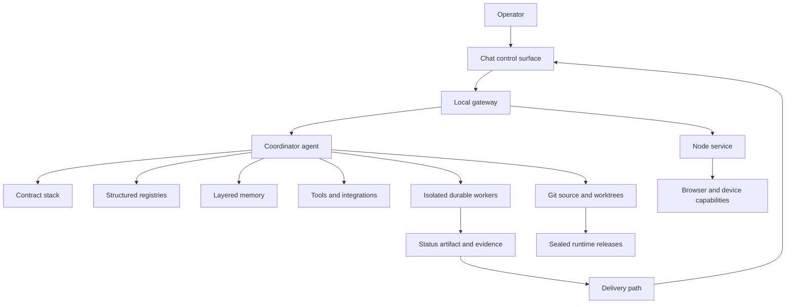

# OpenClaw Control Plane

A reference architecture for turning a local OpenClaw installation into a supervised,
durable, and auditable agent system.

OpenClaw gives you an agent runtime: a gateway, chat channels, tools, sessions, workers,
skills, plugins, scheduling, and injectable workspace files. It deliberately takes no
position on approvals, source authority, durability, privacy, or release discipline.
Those are operator decisions. This repository documents one complete set of answers —
the contracts, artifacts, and mechanics that turn a capable agent into a system whose
claims you can check.

If you have never heard of OpenClaw, start with
[start here](docs/00-start-here.md). It explains the whole system from first principles
before any policy concept appears.

## System at a glance



The central idea is separation of concerns. Policy does not masquerade as current fact.
A convenient folder does not become source of truth. A message saying "working" does not
become durable state. A passing unit test does not become live acceptance. A memory cue
does not become approval authority.

## What is policy and what needs runtime support

Some behaviours described here are policy: instructions an operator writes, which any
capable agent can be asked to follow. Others need the runtime itself to enforce them, and
no amount of Markdown will conjure a feature the installed build does not implement. Several
of the strongest guarantees in this repository — the acknowledgement barrier, write leases,
the active-lane index, approval boundaries — fall into the second group.

Read every capability claim with that distinction in mind. A version string does not tell
you which of these a given build has; only checking does.

Chapters label capability provenance where they make a capability claim:

| Level | Meaning |
|---|---|
| **policy-only** | model instructions and operator discipline |
| **helper-backed** | enforced by local scripts and schemas |
| **runtime-backed** | implemented by the runtime itself |
| **live-proven** | a status an operator reaches by verifying a capability against their own installation and keeping dated evidence inside a freshness window; no document can confer it |

The first three say where a capability has to be implemented, which is a property of the
design and therefore transferable. The fourth is about one installation, so it is recorded
on a status row rather than asserted in a table.
[Capability provenance](docs/03-capability-provenance.md) carries the full matrix,
including what an adopter must supply manually where the runtime does not help. Read it
before assuming any behaviour here is free.

## Reading paths

| You are | Read |
|---|---|
| **New to OpenClaw** | [00 start here](docs/00-start-here.md) → [01 glossary](docs/01-glossary.md) → [02 why a control plane](docs/02-why-a-control-plane.md) → [04 system architecture](docs/04-system-architecture.md) |
| **Adopting the model** | [03 capability provenance](docs/03-capability-provenance.md) → [17 adoption guide](docs/17-adoption-guide.md) → [05 policy](docs/05-policy-and-authority.md) → [06 execution](docs/06-execution-and-durable-lanes.md) → [07 worked example](docs/07-worked-example.md) |
| **Auditing claims** | [03 capability provenance](docs/03-capability-provenance.md) → [15 evidence and audit](docs/15-evidence-audit-and-verification.md) → [10 releases and promotion](docs/10-runtime-releases-and-promotion.md) → [16 security and trust model](docs/16-security-and-trust-model.md) |

## Documentation map

| # | Chapter | Covers |
|---|---|---|
| 00 | [Start here](docs/00-start-here.md) | what OpenClaw is, end to end, for a first-time reader |
| 01 | [Glossary and conventions](docs/01-glossary.md) | every term the rest of the repository uses |
| 02 | [Why a control plane](docs/02-why-a-control-plane.md) | the failure catalogue each rule exists to prevent |
| 03 | [Capability provenance](docs/03-capability-provenance.md) | policy-only vs helper vs runtime vs live-proven |
| 04 | [System architecture](docs/04-system-architecture.md) | layers, control loops, trust boundaries |
| 05 | [Policy and authority](docs/05-policy-and-authority.md) | precedence, approval classes, standing directives |
| 06 | [Execution and durable lanes](docs/06-execution-and-durable-lanes.md) | modes, promotion, leases, checkpoints, resume |
| 07 | [A worked example](docs/07-worked-example.md) | one request traced through every stage |
| 08 | [Memory and context](docs/08-memory-and-context.md) | tiers, sensitivity, retrieval, writes, rollover |
| 09 | [Source layout and artifacts](docs/09-source-layout-and-artifacts.md) | namespaces, worktrees, retention |
| 10 | [Runtime, releases, and promotion](docs/10-runtime-releases-and-promotion.md) | build, seal, promote, converge, roll back |
| 11 | [Integrations and capability routing](docs/11-integrations-and-capability-routing.md) | routes, probes, readback, fallbacks |
| 12 | [Scheduling and background work](docs/12-scheduling-and-background-work.md) | two scheduler layers and their reconciliation |
| 13 | [Delivery and the control surface](docs/13-delivery-and-control-surface.md) | acknowledgement, receipts, queue, relay |
| 14 | [Guards, health, and restoration](docs/14-guards-health-and-restoration.md) | guard pattern, health classes, containment |
| 15 | [Evidence, audit, and verification](docs/15-evidence-audit-and-verification.md) | event log, audit hook, contract tests |
| 16 | [Security and trust model](docs/16-security-and-trust-model.md) | injection boundary, secrets, sandboxing, blast radius |
| 17 | [Adoption guide](docs/17-adoption-guide.md) | levels 0-4, minimum file set, sizing |
| 18 | [Architecture evolution](docs/18-architecture-evolution.md) | how the model got here, and what is still moving |

Reusable starting points live in [`templates/`](templates/), machine-readable examples in
[`examples/`](examples/), their contracts in [`schemas/`](schemas/), and standalone Mermaid
sources in [`diagrams/`](diagrams/).

## Repository layout

```text
.
├── diagrams/       # Mermaid sources for the system schematics
├── docs/           # the architecture and operating guide
├── examples/       # example registries, status records, and receipts
├── schemas/        # machine-readable contracts for the examples
├── scripts/        # repository checks
├── templates/      # compact policy stack for adaptation
└── tests/          # structural tests
```

The patterns here are written to transfer: they assume no particular chat platform, operating
system, or hosting provider.

## Quick start

1. Read [start here](docs/00-start-here.md) and [why a control plane](docs/02-why-a-control-plane.md).
2. Read [capability provenance](docs/03-capability-provenance.md) so you know what your
   runtime gives you and what you must supply.
3. Begin at Level 0 in the [adoption guide](docs/17-adoption-guide.md). Do not start by
   copying the whole stack.
4. Copy `templates/*.example.md` into your own workspace and replace every angle-bracket
   placeholder locally.
5. Define your trust model and approval classes *before* enabling any write tool.
6. Add only the integration routes you can probe and verify.
7. Run the repository checks:

```bash
python3 scripts/validate_repo.py
python3 -m unittest discover -s tests -p 'test_*.py'
```

## Design principles

1. **Authority is explicit.** Each reusable concept has exactly one owner.
2. **Facts are probed.** Generated summaries never override structured state or live evidence.
3. **Side effects are classified.** Approval depends on the operation, not on a keyword.
4. **Long work is durable.** Identity, ownership, checkpoints, and a delivery path exist
   before deep work begins.
5. **Source stays singular.** Worktrees, mirrors, artifacts, backups, and runtime releases
   have distinct roles.
6. **Live acceptance is earned.** Persisted state, loaded definitions, running processes,
   and observable behaviour must all agree.
7. **Memory is layered.** Sensitivity is a per-file attribute, not a per-tier assumption.
8. **Claims match evidence.** Completion is tied to an acceptance predicate, and the
   provenance of every capability is stated rather than implied.

## Limitations

- This is **not** a multi-tenant security boundary. It assumes one trusted operator on one
  host. Granting access to additional operators requires a redesign, not a configuration
  change. See [security and trust model](docs/16-security-and-trust-model.md).
- Templates cannot create runtime features your installed build does not implement. Where
  the runtime does not enforce a guarantee, manual discipline has to stand in for it, and
  the result is weaker. [Capability provenance](docs/03-capability-provenance.md) says which
  guarantees those are.
- The examples are intentionally incomplete. Treat them as schemas and patterns, not as
  production defaults.
- Operational cost is real: immutable releases accumulate, scheduler histories accumulate,
  and always-loaded contracts consume context budget on every turn.

## License

MIT. See [LICENSE](LICENSE).
