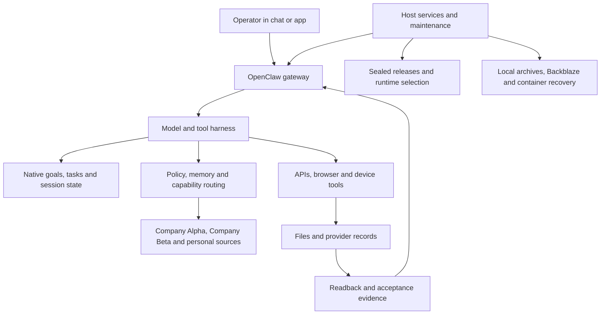

# OpenClaw Control Plane

A reproducible reference for a customized **OpenClaw 2026.9.3** installation: runtime
changes, substantial agent instructions, integration routing, release management and
host operations for a persistent single-operator assistant.

The aim is practical. An operator should be able to ask for useful work in ordinary
language, leave a task running, return through the same conversation and inspect what
actually happened. The assistant should know which sources and accounts to use, carry
unfinished work across context changes and verify the resulting files or provider
records before saying it is done.

Company Alpha, Company Beta and the Personal Data Project are consistent example
identities. Their procedures remain substantial; accounts, host paths and data are
supplied by the adopter.

## How it works



Start with [the introduction](docs/00-start-here.md) for the complete request flow.

## What is included

- **The complete runtime delta:** 477 changed paths from the official release,
  including regression tests. The reconstruction helper verifies the patch checksum
  and resulting Git tree. Production source is unchanged from the reference deployment;
  two labels in one test fixture are normalized.
- **Identity and working policy:** IDENTITY, AGENTS, SOUL, USER, TOOLS, WRITING,
  bootstrap and memory templates covering the assistant persona and defaults,
  initiative, approval, source authority, tool selection, writing, long work and
  verification. The [identity template](templates/IDENTITY.example.md) preserves the
  source installation's role, defaults and authority boundary with fictional names.
- **Workspace implementation:** capability routing and adapters, release activation,
  guarded maintenance, backup supervision and supporting contracts and tests.
- **Configuration and adoption guidance:** model preferences, context behavior,
  source layout, account setup, operational definitions and acceptance steps.

The runtime [manifest](runtime/manifest.json) pins official commit
`1391f7cd2d40ab5bbcf2f5f831d3a64f520e72d7`, custom lineage
`f31686e33ce3fa8564cecf97e3f36f39a69f57dd`, the public reconstruction tree and Node.js
24.16.0 / pnpm 12.3.4. A version label alone does not identify these custom changes.

## Start using the reference

Read the [adoption guide](docs/17-adoption-guide.md) before installing. It separates
source reconstruction, workspace setup, account connection, host installation and
actual user-path acceptance. The [runtime package](runtime/README.md) gives the exact
clone, check, apply and build commands. Installation begins in a separate workspace;
changing an existing service is a later explicit step.

Repository checks use Python's standard library:

```bash
python3 scripts/validate_repo.py
python3 -m unittest discover -s tests -p 'test_*.py'
```

These checks establish repository consistency. Runtime tests, fixture tests for host
helpers and adoption acceptance are separate evidence.

## Reading guide

| Chapter | Purpose |
|---|---|
| [00 Start here](docs/00-start-here.md) | Follow an ordinary request through the system. |
| [01 Glossary](docs/01-glossary.md) | Understand the terminology. |
| [02 Why a control plane](docs/02-why-a-control-plane.md) | See the failures each design choice addresses. |
| [03 Capability provenance](docs/03-capability-provenance.md) | Separate instructions, code and live proof. |
| [04 System architecture](docs/04-system-architecture.md) | Understand ownership between layers. |
| [05 Policy and authority](docs/05-policy-and-authority.md) | Read the instruction hierarchy. |
| [06 Execution and durable lanes](docs/06-execution-and-durable-lanes.md) | Follow native tasks, goals, yields and continuation. |
| [07 Worked example](docs/07-worked-example.md) | Trace a calendar request through source retrieval and readback. |
| [08 Memory and context](docs/08-memory-and-context.md) | Understand retrieval, bootstrap budgets and compaction. |
| [09 Source layout and artifacts](docs/09-source-layout-and-artifacts.md) | Keep source, working data, runtime state and recovery distinct. |
| [10 Runtime releases and promotion](docs/10-runtime-releases-and-promotion.md) | Build, seal, activate and recover a release. |
| [11 Integrations and capability routing](docs/11-integrations-and-capability-routing.md) | Verify routes for the intended account and operation. |
| [12 Scheduling and background work](docs/12-scheduling-and-background-work.md) | Understand native cron and host scheduler ownership. |
| [13 Delivery and the control surface](docs/13-delivery-and-control-surface.md) | Separate task completion from visible delivery. |
| [14 Guards, health and restoration](docs/14-guards-health-and-restoration.md) | Interpret health, containment and recovery evidence. |
| [15 Evidence, audit and verification](docs/15-evidence-audit-and-verification.md) | Match each claim to its actual proof. |
| [16 Security and trust model](docs/16-security-and-trust-model.md) | Define credentials, audience and tool boundaries. |
| [17 Adoption guide](docs/17-adoption-guide.md) | Reconstruct and qualify an installation. |
| [18 Architecture evolution](docs/18-architecture-evolution.md) | Understand the direction and tradeoffs. |
| [19 Host operations and backups](docs/19-host-operations-and-backups.md) | Cover maintenance, Backblaze, Docker/OrbStack and adjacent software. |
| [20 Runtime source changes](docs/20-runtime-source-changes.md) | Inspect the complete patch and source map. |

## Scope and evidence

The reference favors one trusted operator and a macOS host. Core runtime and routing
mechanisms are reusable elsewhere; launchd, Apple applications, native permissions and
Backblaze procedures require platform-specific adaptation.

Policy guides the model. Helpers enforce their own checked operations. Runtime code
implements task and session mechanics. **Live-proven** means an adopter has verified
that behavior on their own installation; importing this repository does not confer
that status. A successful build does not prove account refresh, background device
delivery or a recoverable backup.

MIT licensed. See [LICENSE](LICENSE) and the runtime's
[third-party notices](runtime/THIRD_PARTY_NOTICES.md).
