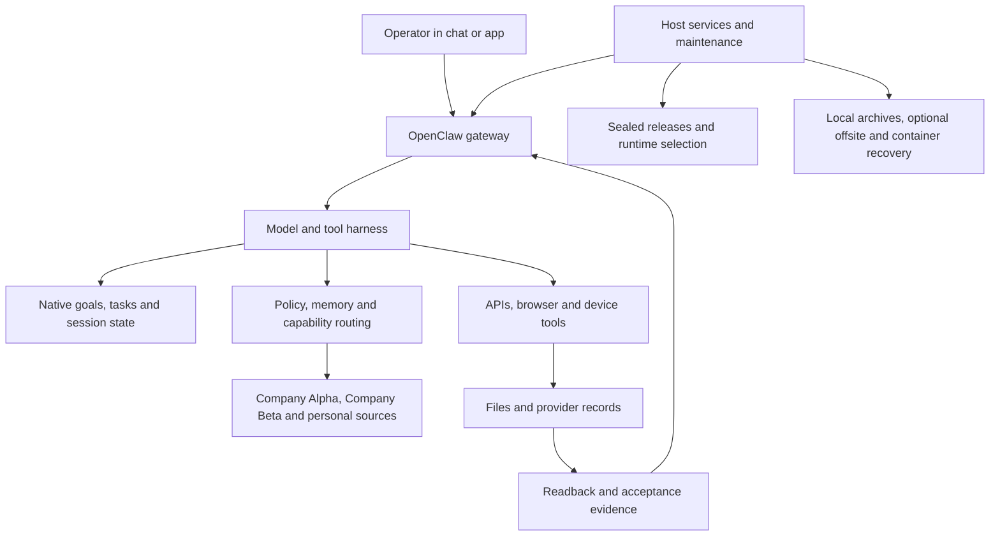

# OpenClaw Control Plane

A reproducible reference for a customized **OpenClaw** installation: runtime
changes, substantial agent instructions, integration routing, release management and
host operations for a persistent single-operator assistant.

The aim is practical. An operator should be able to ask for useful work in ordinary
language, leave a task running, return through the same conversation and inspect what
actually happened. The assistant should know which sources and accounts to use, carry
unfinished work across context changes and verify the resulting files or provider
records before saying it is done.

Company Alpha, Company Beta and the Personal Data Project are consistent example
identities. Their procedures remain substantial; accounts, host paths and data are
supplied by the adopter.

The current installed Gateway and Node source reference is
[`4ce35c658e465161d98dce988729558b55030d22`](runtime/README.md#october-7-continuity-browser-confidentiality-and-authorized-outcomes).
Actual native activation and independent same-generation loaded-source, health and
protected-state readback passed. Both signed companions605 have exact installed
inventory and live bundled-worker source identity readbacks. The preceding57b public
source, baa18/364/753 actual deployments and complete earlier companion histories
remain preserved. Source and installation evidence does not close all ordinary-use
outcomes; fresh local and all five exact-head hosted public checks remain required.

The dated predecessor installed Gateway and Node source reference was
[`57b8a6d654649d3efa13d44a0fe9e3212188c440`](runtime/README.md#october-6-original-task-restart-and-scheduled-context-continuity).
One normal build/stage/seal, native activation and independent loaded-source,
health and protected-state readback passed. The successor preserves original CUI
restart continuity, accepted restart cancellation and full eligible scheduled-task
instructions unless light context is explicitly selected. Signed companions 603
remain 470392 and all 19 ordinary-use outcomes remain open. The dated 1887
intermediate installation and complete preceding qualification history are retained.
Fresh public local and exact-head hosted qualification are required separately.

The dated predecessor installed Gateway and Node source reference was
`34ae633fbd5f5cf90277adb58eda2ba56d929bd8`, with separately qualified native parent-task
context and original-outcome completion protocol. See the
[dated predecessor source qualification](runtime/README.md#october-6-native-parent-task-context-and-completion-protocol).
Normal activation and exact loaded-generation readback are separate from ordinary
account, browser, Discord and task acceptance; all nineteen outcomes remain open.

The dated predecessor installed Gateway and Node source reference was
`1214d0ff7999bfbf0b548701d5ae6a9486236b6a`, with separately qualified original-task
continuation and requester tool recovery. See the
[dated predecessor source qualification](runtime/README.md#october-6-original-task-continuation-and-requester-tool-recovery).
Normal activation and exact loaded-generation readback are separate from ordinary
account, browser, Discord and task acceptance; all nineteen outcomes remain open.

The dated predecessor installed Gateway source reference was
`2d8406b58affbeed037ec2d739704fa835d31e05`, tree
`9448813217d29446d3a412bf0d594c08a39395a8`. Its 28-path successor covers complete
meeting finalization, exact private-task transcript recovery and tool-aware
owner-authorized host maintenance. The full normal build, staging, offline import
and seal passed, followed by one activation at 21:50:10 UTC and independent
same-generation health and protected-state readback. The generic policy template
carries the original outcome through
implementation, verification and authorized delivery. This public revision requires
normal local qualification and all five exact-head hosted checks. See the
[dated predecessor runtime qualification](runtime/README.md#october-5-authorized-follow-through-and-complete-meeting-finalization).

The preceding dated installed Gateway projection was `eb0ae40d72f2004a83a484b89084f2f337239039`,
source tree `39a8e0354e4dcd6260ae3dfad88c1706d312c11b`. Its twelve-path
successor lets explicitly repair-capable command jobs make one native repair
attempt inside the original authority and deadline; a fresh deterministic command
owns the final result. Source qualification, build, stage, seal, activation and
loaded-source health checks passed. Actual adaptive-job effects, capacity
restoration and ordinary-use acceptance remain separate. Both Mac hosts retain
signed companion603 from `470392c53831b43342ddf7795d04e41638742589`.
UI PR54 is not installed. The [runtime qualification](runtime/README.md#october-5-command-repair-with-deterministic-verification)
retains prior recall and installation evidence with their original limits and
the open nineteen-item acceptance matrix.

The dated October 3 source reference is `04adc9cec81f56cfe6fc8b418178b719099f1a1c`,
source tree `18f6cc162cab880dbe2f07ccb2220f7937fa5251`. It includes the
foreground shortcut repair and the qualified browser registration collision fix.
At that checkpoint both Mac companions ran signed build 601; Mini shortcut replacement and saved-alias
Apple Passwords unlock passed. The Gateway then ran this corrected source with
health and protected settings verified. Normal native-browser registration passed;
browser login, Bitwarden reuse and genuine spoken-audio/minutes remain pending.
The [runtime qualification](runtime/README.md#october-3-foreground-shortcuts-and-browser-bootstrap-migration)
keeps those source, installation and ordinary-use scopes separate.

The dated build 600 source reference is `dfcb9c9410f4bde9a6bab69437050aa76d4d6b4e`,
source tree `6c7f113dda8684378c7a7810add963178a6674f2`. Its two auth-bootstrap
changes let the local Mac credential reader validate core Gateway settings without
being blocked by unrelated newer channel metadata. The existing credential,
signed-parent, private-pipe and whole-config checks remain.

Mini companion build 600 and its matching worker passed normal packaging,
installation/readiness and signed local-auth acceptance. Opaque entry unlocked the
normal Apple Passwords landing; vault-item retrieval and Bitwarden reuse are not
claimed. An October 3, 18:18 UTC readback accepted MacBook build 600 in its
existing remote mode and one native metadata command; credential acceptance remains
separate. The [runtime qualification](runtime/README.md#october-3-mac-companion-authentication-bootstrap)
records the scoped source and host evidence. That dated acceptance retained the Gateway source below.

At the dated build 600 checkpoint, the Gateway successor was
`219dead0bc0ebbe8ab2c255677c8d65d1a6b8b59`,
source tree `b76fabfb1a1e5abffa3fa2fa61394c5f2bdcec9c`. It changes 45 paths
since the earlier published reference `3e7d6ada7440d2094891e1b3964241e64f585c09`.

Configured Discord voice following can now record a followed participant's call
and post meeting notes and action items when the visit ends. Received speech
finishes processing before the notes are finalized. An explicit leave finalizes
that recording once and keeps following paused for the same visit; a real new
visit or move can resume it. Completed workers return to their original logical
conversation after a yielded run. Visible tasks use natural progress messages,
and Discord automation notices omit internal inspection footers while retaining
useful results and controls.

The final integrated native build, including the UI, passed. Readonly staging,
the offline import and candidate seal passed. The isolated Discord startup profile
measured 297.6 MiB peak RSS against a 45.5 MiB baseline; this is an entrypoint
measurement, not running Gateway or combined-plugin memory. One activation installed this exact source
at 15:24:40 UTC on October 3 without rollback. Loaded services, health/readiness
and protected-state readback passed. Voice following and its minutes destination
were configured on the same healthy Gateway; fresh spoken-audio and minutes
delivery remain pending. Current-process capture, context and dated
conversation custody readback passed; interrupted work is preserved, not claimed
resumed. A naturally scheduled Discord announcement matched its summary and omitted
the Inspect section. Exact-public-head hosted checks remain required. Earlier
website, MCP and conversation acceptance records keep their dated scope and were
not repeated for this activation.

## How it works


```mermaid
flowchart TD
    Operator[Operator in chat or app] --> Gateway[OpenClaw gateway]
    Gateway --> Runtime[Model and tool harness]
    Runtime --> Native[Native goals, tasks and session state]
    Runtime --> Workspace[Policy, memory and capability routing]
    Workspace --> Sources[Company Alpha, Company Beta and personal sources]
    Runtime --> Tools[APIs, browser and device tools]
    Tools --> Effects[Files and provider records]
    Effects --> Evidence[Readback and acceptance evidence]
    Evidence --> Gateway
    Host[Host services and maintenance] --> Gateway
    Host --> Releases[Sealed releases and runtime selection]
    Host --> Recovery[Local archives, optional offsite and container recovery]
```

Start with [the introduction](docs/00-start-here.md) for the complete request flow.

## What is included

- **The complete runtime delta:** all changed paths from the pinned official release,
  including regression tests. The reconstruction helper verifies the patch checksum
  and resulting Git tree. Production source is unchanged from the pinned source;
  two labels in one test fixture are normalized.
- **Identity and working policy:** IDENTITY, AGENTS, SOUL, USER, TOOLS, WRITING,
  bootstrap and memory templates covering the assistant persona and defaults,
  initiative, approval, source authority, tool selection, writing, long work and
  verification. The [identity template](templates/IDENTITY.example.md) preserves the
  source installation's role, defaults and authority boundary with fictional names.
- **Workspace implementation:** capability routing and adapters, release activation,
  guarded maintenance, backup supervision and supporting contracts and tests.
- **Configuration and adoption guidance:** model preferences, context behavior,
  source layout, account setup, operational definitions and acceptance steps.

The runtime [manifest](runtime/manifest.json) is the authority for the official tag,
custom source commit, normalized tree, patch checksum and exact Node.js/pnpm
versions. CI reads those values from the same manifest and verifies the annotated
tag and reconstructed tree before running the source checks and build. A version
label alone does not identify the custom changes.

The [September 30 source map](docs/20-runtime-source-changes.md#september-30-recovery-steering-and-delivery)
describes reference `30ea139bacf0ec56c5f07fe3eb35c27341f47fed`. Follow-up messages can
reach the current execution after recovery publishes its exact owner. Original
requester authority and child-result delivery survive restart and cleanup without
replaying committed work. Discord thread and voice lookup follow the configured
account and channel policy. Native verification keeps ownership of child processes
until cleanup finishes.

The complete patch still covers the pinned official release through this reference.
Its final review includes 129 changed paths since the September 29 reference,
including all 107 changes since the deployed `d10b9c4` predecessor. Dialogue and
automation defaults use GPT-6.1 Sol at Max, with manual Ultra and no automatic
fallback. The [runtime qualification](runtime/README.md#september-30-recovery-steering-and-delivery)
records the source checks, all 18 requester-wake and 32 voice E2E cases, and the
reviewed complete aggregate build. Source and fixture results have separate scope
from an actual channel reply, spoken meeting or provider account interaction.

On September 30, native activation selected the exact `30ea` source and verified both loaded services, health and readiness. Fresh checks preserved configuration, all 28 job definitions, auth orders, approvals, schemas, original session IDs and goal hashes. A new capture verified the current gateway process. This is activation and preservation evidence: ordinary-use steering consistency, process-offline Discord catch-up, account workflows, spoken meeting minutes and the next natural Journal cycle remain separate acceptance checks.

The [September 29 source map](docs/20-runtime-source-changes.md#september-29-continuation-and-activity-corrections)
describes the September 29 reference `4e8c6dc647b164b00f798c85154eac539e891e3f`: preserved task ownership
and steering, bounded Activity recaps, child-result continuation, structured
provider-failure handling, useful progress updates and preemptible maintenance
during yielded idle periods, canonical retained-task-result lookup and summary sizing
that charges only content sent to the summary model. Admitted runs retain their
existing ownership through required preparation and terminal persistence. Premature
normal WebSocket closure retains the existing bounded transport-recovery path. Declared OpenAI reasoning capabilities now expose Max for new models, with optional Max-based Ultra orchestration. It also
retains the earlier voice controls, native credential entry and recovery corrections. Source implementation and tests do not prove
that a gateway, companion or account interaction has been upgraded. The manifest
records exported source and deployed component identities separately: a source
candidate can be newer than the active gateway. Each new installation requires its
own loaded-process and user-path evidence; earlier acceptance retains its dated scope.

The [runtime package](runtime/README.md) preserves earlier repair and acceptance
records under their original source identities. Those historical results do not
qualify a newer manifest, native app or installation.

## Start using the reference

Read the [adoption guide](docs/17-adoption-guide.md) before installing. It separates
source reconstruction, workspace setup, account connection, host installation and
actual user-path acceptance. The [runtime package](runtime/README.md) gives the exact
clone, check, apply and build commands. Installation begins in a separate workspace;
changing an existing service is a later explicit step.

Repository checks use Python's standard library:

```bash
python3 scripts/validate_repo.py
python3 -m unittest discover -s tests -p 'test_*.py'
```

These checks establish repository consistency. Runtime tests, fixture tests for host
helpers and adoption acceptance are separate evidence.

## Reading guide

| Chapter | Purpose |
|---|---|
| [00 Start here](docs/00-start-here.md) | Follow an ordinary request through the system. |
| [01 Glossary](docs/01-glossary.md) | Understand the terminology. |
| [02 Why a control plane](docs/02-why-a-control-plane.md) | See the failures each design choice addresses. |
| [03 Capability provenance](docs/03-capability-provenance.md) | Separate instructions, code and live proof. |
| [04 System architecture](docs/04-system-architecture.md) | Understand ownership between layers. |
| [05 Policy and authority](docs/05-policy-and-authority.md) | Read the instruction hierarchy. |
| [06 Execution and durable lanes](docs/06-execution-and-durable-lanes.md) | Follow native tasks, goals, yields and continuation. |
| [07 Worked example](docs/07-worked-example.md) | Trace a calendar request through source retrieval and readback. |
| [08 Memory and context](docs/08-memory-and-context.md) | Understand retrieval, bootstrap budgets and compaction. |
| [09 Source layout and artifacts](docs/09-source-layout-and-artifacts.md) | Keep source, working data, runtime state and recovery distinct. |
| [10 Runtime releases and promotion](docs/10-runtime-releases-and-promotion.md) | Build, seal, activate and recover a release. |
| [11 Integrations and capability routing](docs/11-integrations-and-capability-routing.md) | Verify routes for the intended account and operation. |
| [12 Scheduling and background work](docs/12-scheduling-and-background-work.md) | Understand native cron and host scheduler ownership. |
| [13 Delivery and the control surface](docs/13-delivery-and-control-surface.md) | Separate task completion from visible delivery. |
| [14 Guards, health and restoration](docs/14-guards-health-and-restoration.md) | Interpret health, containment and recovery evidence. |
| [15 Evidence, audit and verification](docs/15-evidence-audit-and-verification.md) | Match each claim to its actual proof. |
| [16 Security and trust model](docs/16-security-and-trust-model.md) | Define credentials, audience and tool boundaries. |
| [17 Adoption guide](docs/17-adoption-guide.md) | Reconstruct and qualify an installation. |
| [18 Architecture evolution](docs/18-architecture-evolution.md) | Understand the direction and tradeoffs. |
| [19 Host operations and backups](docs/19-host-operations-and-backups.md) | Cover maintenance, optional historical Backblaze templates, Docker/OrbStack and adjacent software. |
| [20 Runtime source changes](docs/20-runtime-source-changes.md) | Inspect the complete patch and source map. |

## Scope and evidence

The reference favors one trusted operator and a macOS host. Core runtime and routing
mechanisms are reusable elsewhere; launchd, Apple applications, native permissions and
Backblaze procedures require platform-specific adaptation.

Policy guides the model. Helpers enforce their own checked operations. Runtime code
implements task and session mechanics. **Live-proven** means an adopter has verified
that behavior on their own installation; importing this repository does not confer
that status. A successful build does not prove account refresh, background device
delivery or a recoverable backup.

MIT licensed. See [LICENSE](LICENSE) and the runtime's
[third-party notices](runtime/THIRD_PARTY_NOTICES.md).
