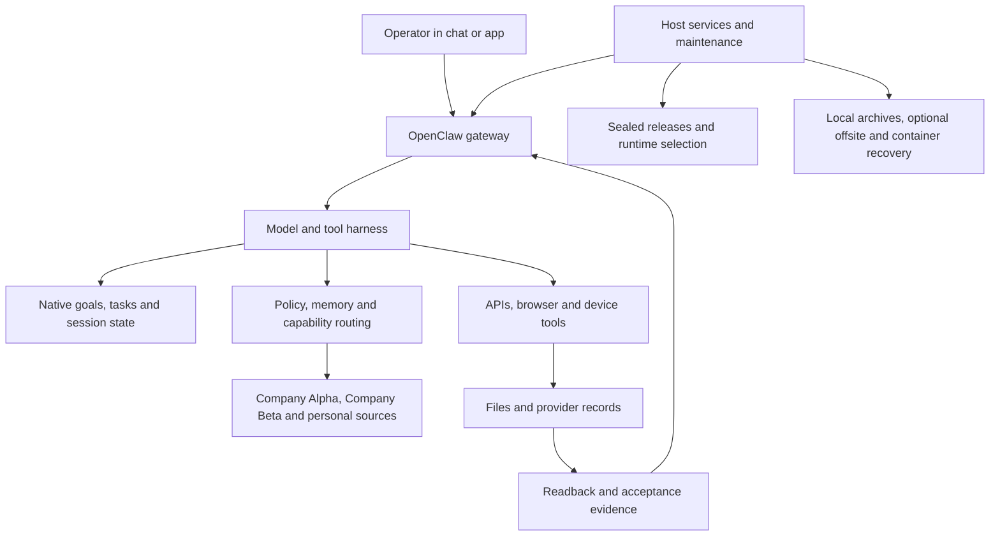

# OpenClaw Control Plane

A reproducible reference for a customized **OpenClaw** installation: runtime
changes, substantial agent instructions, integration routing, release management and
host operations for a persistent single-operator assistant.

The aim is practical. An operator should be able to ask for useful work in ordinary
language, leave a task running, return through the same conversation and inspect what
actually happened. The assistant should know which sources and accounts to use, carry
unfinished work across context changes and verify the resulting files or provider
records before saying it is done.

Company Alpha, Company Beta and the Personal Data Project are consistent example
identities. Their procedures remain substantial; accounts, host paths and data are
supplied by the adopter.

The October 3 reference source is `3e7d6ada7440d2094891e1b3964241e64f585c09`.
It adds two explicit expected browser actions to one regression fixture after
hosted follow-up checks exposed a stale action list. The native index owner passed
21 cases; extension test types, changed-file formatting/lint and normal hooks passed.
Every production blob and mode matches installed source
`c066ce9ce642ae830eec9a2de74b59cf19c66d7e`; no runtime rebuild or reinstall occurred.
The exported reference spans 123 paths since `ab9bbc63194b02f4e523f39855f70522882678b0`.
It keeps protected browser credentials inside the native consumer, carries the
authenticated UI requester's MCP scope through admitted work, preserves large tool
results for native reads, and returns completed child work to the same logical
conversation after its physical execution changes. Completed response checkpoints
prevent a late synthetic input from interrupting final persistence. Voice output
filters standalone nonspeech markers; summaries order valid timestamped copies
without rewriting raw history.

Installed production is the 122-path successor extending `ab9bbc63194b02f4e523f39855f70522882678b0`.
All 43 native gates are covered by 39 fresh checks and four successful compiler
checks retained after exact input exclusion and custody verification. Scoped
behavior contains 238 cases across nine owners: 20 fresh voice cases and 218
unchanged cases from the preceding invocation.

Installed source `c066ce9ce642ae830eec9a2de74b59cf19c66d7e` passed the native build,
staging, offline validation and seal.
One activation selected it on October 3 at 03:13:40 UTC, without rollback.
Loaded services, health/readiness, current-process capture and original task custody
passed. Export reconstruction matched all 45,030 committed entries, allowing only
the two established Company Alpha fixture substitutions.

A controlled installed operator check completed one hidden child, returned its
private result through native announcement, resumed the original parent and read
back one actual Discord result. GPT-6.1 Sol at Max and no fallback were preserved;
no polling rescue or substitute turn was used. This is bounded completion evidence,
not fresh human-origin Discord acceptance. An initial saved-alias website
authentication attempt was rejected and remains failed history. After the supported
verifier repair, native saved-review login, a September UTC report, protected reload
and one indexed refresh passed; owned tabs were closed. Token-boundary uncertainty
and unavailable historical prices remain; no accounting-close or MCP/Control UI
acceptance is claimed. Exact-head hosted qualification stays separate. Portable
model/compaction preferences and dated companion evidence retain their previous scope.


## How it works


```mermaid
flowchart TD
    Operator[Operator in chat or app] --> Gateway[OpenClaw gateway]
    Gateway --> Runtime[Model and tool harness]
    Runtime --> Native[Native goals, tasks and session state]
    Runtime --> Workspace[Policy, memory and capability routing]
    Workspace --> Sources[Company Alpha, Company Beta and personal sources]
    Runtime --> Tools[APIs, browser and device tools]
    Tools --> Effects[Files and provider records]
    Effects --> Evidence[Readback and acceptance evidence]
    Evidence --> Gateway
    Host[Host services and maintenance] --> Gateway
    Host --> Releases[Sealed releases and runtime selection]
    Host --> Recovery[Local archives, optional offsite and container recovery]
```

Start with [the introduction](docs/00-start-here.md) for the complete request flow.

## What is included

- **The complete runtime delta:** all changed paths from the pinned official release,
  including regression tests. The reconstruction helper verifies the patch checksum
  and resulting Git tree. Production source is unchanged from the pinned source;
  two labels in one test fixture are normalized.
- **Identity and working policy:** IDENTITY, AGENTS, SOUL, USER, TOOLS, WRITING,
  bootstrap and memory templates covering the assistant persona and defaults,
  initiative, approval, source authority, tool selection, writing, long work and
  verification. The [identity template](templates/IDENTITY.example.md) preserves the
  source installation's role, defaults and authority boundary with fictional names.
- **Workspace implementation:** capability routing and adapters, release activation,
  guarded maintenance, backup supervision and supporting contracts and tests.
- **Configuration and adoption guidance:** model preferences, context behavior,
  source layout, account setup, operational definitions and acceptance steps.

The runtime [manifest](runtime/manifest.json) is the authority for the official tag,
custom source commit, normalized tree, patch checksum and exact Node.js/pnpm
versions. CI reads those values from the same manifest and verifies the annotated
tag and reconstructed tree before running the source checks and build. A version
label alone does not identify the custom changes.

The [September 30 source map](docs/20-runtime-source-changes.md#september-30-recovery-steering-and-delivery)
describes reference `30ea139bacf0ec56c5f07fe3eb35c27341f47fed`. Follow-up messages can
reach the current execution after recovery publishes its exact owner. Original
requester authority and child-result delivery survive restart and cleanup without
replaying committed work. Discord thread and voice lookup follow the configured
account and channel policy. Native verification keeps ownership of child processes
until cleanup finishes.

The complete patch still covers the pinned official release through this reference.
Its final review includes 129 changed paths since the September 29 reference,
including all 107 changes since the deployed `d10b9c4` predecessor. Dialogue and
automation defaults use GPT-6.1 Sol at Max, with manual Ultra and no automatic
fallback. The [runtime qualification](runtime/README.md#september-30-recovery-steering-and-delivery)
records the source checks, all 18 requester-wake and 32 voice E2E cases, and the
reviewed complete aggregate build. Source and fixture results have separate scope
from an actual channel reply, spoken meeting or provider account interaction.

On September 30, native activation selected the exact `30ea` source and verified both loaded services, health and readiness. Fresh checks preserved configuration, all 28 job definitions, auth orders, approvals, schemas, original session IDs and goal hashes. A new capture verified the current gateway process. This is activation and preservation evidence: ordinary-use steering consistency, process-offline Discord catch-up, account workflows, spoken meeting minutes and the next natural Journal cycle remain separate acceptance checks.

The [September 29 source map](docs/20-runtime-source-changes.md#september-29-continuation-and-activity-corrections)
describes the September 29 reference `4e8c6dc647b164b00f798c85154eac539e891e3f`: preserved task ownership
and steering, bounded Activity recaps, child-result continuation, structured
provider-failure handling, useful progress updates and preemptible maintenance
during yielded idle periods, canonical retained-task-result lookup and summary sizing
that charges only content sent to the summary model. Admitted runs retain their
existing ownership through required preparation and terminal persistence. Premature
normal WebSocket closure retains the existing bounded transport-recovery path. Declared OpenAI reasoning capabilities now expose Max for new models, with optional Max-based Ultra orchestration. It also
retains the earlier voice controls, native credential entry and recovery corrections. Source implementation and tests do not prove
that a gateway, companion or account interaction has been upgraded. The manifest
records exported source and deployed component identities separately: a source
candidate can be newer than the active gateway. Each new installation requires its
own loaded-process and user-path evidence; earlier acceptance retains its dated scope.

The [runtime package](runtime/README.md) preserves earlier repair and acceptance
records under their original source identities. Those historical results do not
qualify a newer manifest, native app or installation.

## Start using the reference

Read the [adoption guide](docs/17-adoption-guide.md) before installing. It separates
source reconstruction, workspace setup, account connection, host installation and
actual user-path acceptance. The [runtime package](runtime/README.md) gives the exact
clone, check, apply and build commands. Installation begins in a separate workspace;
changing an existing service is a later explicit step.

Repository checks use Python's standard library:

```bash
python3 scripts/validate_repo.py
python3 -m unittest discover -s tests -p 'test_*.py'
```

These checks establish repository consistency. Runtime tests, fixture tests for host
helpers and adoption acceptance are separate evidence.

## Reading guide

| Chapter | Purpose |
|---|---|
| [00 Start here](docs/00-start-here.md) | Follow an ordinary request through the system. |
| [01 Glossary](docs/01-glossary.md) | Understand the terminology. |
| [02 Why a control plane](docs/02-why-a-control-plane.md) | See the failures each design choice addresses. |
| [03 Capability provenance](docs/03-capability-provenance.md) | Separate instructions, code and live proof. |
| [04 System architecture](docs/04-system-architecture.md) | Understand ownership between layers. |
| [05 Policy and authority](docs/05-policy-and-authority.md) | Read the instruction hierarchy. |
| [06 Execution and durable lanes](docs/06-execution-and-durable-lanes.md) | Follow native tasks, goals, yields and continuation. |
| [07 Worked example](docs/07-worked-example.md) | Trace a calendar request through source retrieval and readback. |
| [08 Memory and context](docs/08-memory-and-context.md) | Understand retrieval, bootstrap budgets and compaction. |
| [09 Source layout and artifacts](docs/09-source-layout-and-artifacts.md) | Keep source, working data, runtime state and recovery distinct. |
| [10 Runtime releases and promotion](docs/10-runtime-releases-and-promotion.md) | Build, seal, activate and recover a release. |
| [11 Integrations and capability routing](docs/11-integrations-and-capability-routing.md) | Verify routes for the intended account and operation. |
| [12 Scheduling and background work](docs/12-scheduling-and-background-work.md) | Understand native cron and host scheduler ownership. |
| [13 Delivery and the control surface](docs/13-delivery-and-control-surface.md) | Separate task completion from visible delivery. |
| [14 Guards, health and restoration](docs/14-guards-health-and-restoration.md) | Interpret health, containment and recovery evidence. |
| [15 Evidence, audit and verification](docs/15-evidence-audit-and-verification.md) | Match each claim to its actual proof. |
| [16 Security and trust model](docs/16-security-and-trust-model.md) | Define credentials, audience and tool boundaries. |
| [17 Adoption guide](docs/17-adoption-guide.md) | Reconstruct and qualify an installation. |
| [18 Architecture evolution](docs/18-architecture-evolution.md) | Understand the direction and tradeoffs. |
| [19 Host operations and backups](docs/19-host-operations-and-backups.md) | Cover maintenance, optional historical Backblaze templates, Docker/OrbStack and adjacent software. |
| [20 Runtime source changes](docs/20-runtime-source-changes.md) | Inspect the complete patch and source map. |

## Scope and evidence

The reference favors one trusted operator and a macOS host. Core runtime and routing
mechanisms are reusable elsewhere; launchd, Apple applications, native permissions and
Backblaze procedures require platform-specific adaptation.

Policy guides the model. Helpers enforce their own checked operations. Runtime code
implements task and session mechanics. **Live-proven** means an adopter has verified
that behavior on their own installation; importing this repository does not confer
that status. A successful build does not prove account refresh, background device
delivery or a recoverable backup.

MIT licensed. See [LICENSE](LICENSE) and the runtime's
[third-party notices](runtime/THIRD_PARTY_NOTICES.md).
