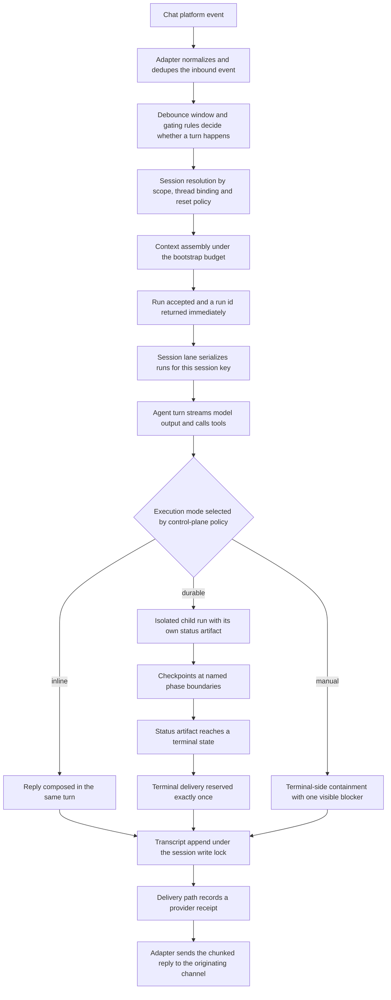
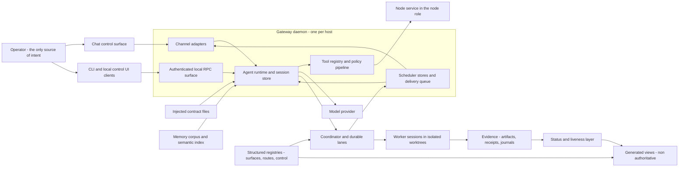

# Start here

This repository describes an operating model for a local-first AI agent runtime called
OpenClaw, together with the **control plane** an operator builds on top of it: the layer of
rules, records, and gates deciding what the agent may do, where the work runs, and what counts
as proof that it happened. A runtime on its own takes no position on any of that, which is how
an agent holding a shell, a filesystem, and a chat account can do exactly the right thing in
the wrong place and report success. This chapter is the descriptive half of the answer — what
the runtime is, what it is made of, where its state lives, and what happens between a message
arriving and an answer coming back — and it assumes no prior knowledge.

Policy and approvals appear only in later chapters; the failures that motivate them are
catalogued in [why a control plane](02-why-a-control-plane.md). Notation — placeholder paths
such as `<runtime-dir>` — is defined in the [glossary](01-glossary.md).

## What a local-first agent runtime is

A local-first agent runtime is a process you run on a machine you control, which connects a
language model to what that machine can reach: files, shell commands, browser sessions,
scheduled jobs, chat accounts, and attached devices. The assistant is not a site you visit. It
is a daemon with a state directory.

The problem it solves is authority and continuity in one place. An assistant confined to one
application cannot act across the rest of the machine; one split across several has no single
transcript, no single credential store, and no single answer to "what is running right now". A
local-first runtime collapses those into one process that owns the connections, one directory
that owns the state, and one identity the model acts as. The cost is equally concrete: the
host becomes a component with uptime, storage, backup, and upgrade obligations, and the
operator owns all of them. Most of this repository exists because those obligations turn out
to be the hard part.

## The gateway process

The gateway is the runtime: a single long-lived daemon, one per host, normally started by a
user-level service manager configured to restart it on exit and to start it on boot, so it
returns after a crash or reboot. It renames its own process so it is identifiable in a
process listing. It owns four things:

- **All channel connections.** It is the only process permitted to open a given messaging
  provider session — an invariant, not a convention, since two processes sharing one session
  produce duplicated inbound events and interleaved replies.
- **The agent loop**, in-process. Model calls and tool calls happen inside the gateway.
- **All authoritative state.** Sessions, transcripts, tasks, scheduled jobs, device pairings,
  and approvals are persisted by the gateway; clients hold none of it.
- **One local port**, carrying both a WebSocket control protocol and HTTP surfaces.

The port binds loopback by default, meaning it accepts connections only from the machine
itself. That default is a posture: it keeps the control plane off the network until the
operator deliberately widens it, and makes remote reach an explicit act with its own approval
path rather than a side effect of starting the service. Being able to open the socket is never
the same as being allowed to use it.

The WebSocket protocol has a fixed shape. The first frame must be a connect frame; anything
else is closed immediately, before authentication is evaluated, so a client speaking the wrong
protocol is rejected without the server doing any work on its behalf. The connection then
carries remote procedure calls — a request paired with exactly one response — alongside events
the server pushes without being asked, and the handshake returns a snapshot of presence and
health plus discovery metadata naming the methods and events this build supports. Three frame
kinds are the whole vocabulary:

```text
client -> server   {"type": "req",   "id": <n>, "method": <name>, "params": { ... }}
server -> client   {"type": "res",   "id": <n>, "ok": <bool>, "payload": { ... } | "error": { ... }}
server -> client   {"type": "event", "event": <name>, "payload": { ... }, "seq": <n>}
```

Events carry sequence numbers and are never replayed, so a client that notices a gap in the
sequence re-fetches state rather than waiting for a redelivery that will not come. Methods with
side effects require idempotency keys — caller-supplied strings identifying one logical request
— and are de-duplicated by a short-lived server cache, so retrying a request whose response was
never seen cannot run the work twice. The surface is large but generated rather than
hand-maintained: typed definitions are the source of truth, JSON Schema is generated from them
and native client models from that, so a protocol change that skips regeneration breaks clients
loudly rather than drifting. The same port serves HTTP: a control UI with its own origin
checks, an agent-editable canvas host, an inference API in the common chat-completions shape, a
tool-invocation endpoint, an endpoint speaking the Model Context Protocol (MCP) — the standard
by which one process offers tools to a model running in another — and plugin-registered routes,
all behind origin checking, rate limiting, and per-route scopes.

Two admission gates stand in front of every connection, and neither substitutes for the other:
a shared secret gates the connection, and device pairing gates the identity behind it. A client
presents a device identity on connect and signs a challenge the server issues; the gateway pins
the platform and device family that were approved, so a client whose declared identity
attributes change has to pair again instead of reconnecting quietly as something else, and
rotating a token inside an existing pairing record cannot promote a peripheral into an
operator. Loopback connections may auto-approve pairing; connections arriving over a LAN or an
overlay network never do, even from the same host. The reasoning behind those defaults is in
[security and trust model](16-security-and-trust-model.md).

## The node service

The node service is the second supervised process, and deliberately not a second gateway. It
is a peripheral agent: it connects to the *same* WebSocket server as every other client but
declares the `node` role during the handshake, along with a device identity, a capability
list, and the command surface it offers — canvas, camera, screen recording, location,
notifications, device control, and shell execution. Nodes never receive chat messages.
Messages land on the gateway; the gateway forwards only tool and execution calls, and only
when the agent selects that host. Approval for shell execution on a node is enforced on the
node side against its own approvals store, and the scope required escalates with what the node
declares: no commands needs pairing scope, non-execution commands need write scope, shell
execution needs admin scope. The separation buys three things. Peripherals and remote execution
sit behind their own process boundary, identity, and approval scope, so a compromised or
misbehaving peripheral cannot reach further than the commands it declared. The gateway stays
the single authority for state even when work happens on another machine — a boundary drawn
explicitly in [system architecture](04-system-architecture.md). And a node can be restarted or
re-paired without touching the conversation layer at all.

## Channels and adapters

A **channel adapter** is an extension package that turns one messaging platform into a surface
the agent appears on. Each ships a manifest declaring its identifier, the channel identifiers
it provides, and which environment variables carry its credentials. Adapters supply inbound
event handling, outbound sending with per-platform length limits and chunking, typing
indicators, acknowledgement reactions, allowlist and mention gating, and thread binding.

The set of known channels is not an enumeration in core. Core discovers channel identifiers at
runtime from bundled plugin manifests, with a generated catalog naming the official subset —
so adding a channel package adds a channel, and core is never edited to learn about a new
surface. Many extension packages ship with the runtime, and a substantial minority of them
declare a chat channel: consumer messengers, team chat, IRC- and Matrix-style networks, and a
built-in web chat on the gateway's own port. A **chat surface** is a route, not a home. It is
where an operator addresses the agent and where results are delivered, and it holds no
authoritative state — so losing a surface loses reachability, never history, and any rule
about what the agent may do belongs to the gateway, never to the app the message arrived in.
What may legitimately appear on such a surface, and what proves that it arrived, is the subject
of [delivery and the control surface](13-delivery-and-control-surface.md).

## Sessions and agent turns

A **session** is the durable conversation unit: a session key naming it, a transcript file
holding the messages, a **trajectory sidecar** recording the run's internal steps beside that
transcript, and a row in a per-agent session index. Routing decides which session an inbound
message joins, and it is one of the few settings with a privacy consequence attached directly
to it. Direct messages share a single session by default, which is safe only for a single-user
install: with more than one correspondent, one person's conversation becomes context in
another's, so a multi-user install must switch to per-peer or per-channel-and-peer isolation.
Group chats and rooms are isolated from each other. Thread-bound conversations get their own
session, with the platform thread identifier appended as a suffix to the session id. Scheduled
runs start a fresh session, and webhooks are isolated per hook. Sessions reset on a daily
boundary, on an idle timer, or on an explicit command, and a maintenance policy prunes old
ones — without a reset boundary, a long-running conversation accumulates history until context
assembly has no room left for the actual task.

An **agent turn** is one accepted request travelling through the loop: intake, context
assembly, model inference, tool execution, streaming reply, persistence. Acceptance is
asynchronous — the runtime persists session metadata and returns a run identifier immediately,
and completion is observed by subscribing to the lifecycle stream or by a separate wait call
whose timeout does not stop the run. The split matters because the caller's patience and the
run's lifetime are different clocks: a client that gives up waiting has not cancelled anything.
A running turn emits three streams — lifecycle events, assistant text deltas, and tool events —
and is bounded by two independent timeouts, a total run timeout and an idle watchdog that
aborts when no stream chunks arrive within a window. They catch different failures: a run that
is slow overall, and a run that has silently stopped producing anything at all.

Two structural guarantees keep turns from colliding. **Lane serialization**: a lane is a queue
admitting one run at a time, and all runs for one session key share a lane, so two messages
arriving in the same conversation cannot interleave tool calls or transcript writes. **The
session write lock**: transcript writes take a file-based, process-aware, non-reentrant lock,
and every path that rewrites, compacts, or truncates a transcript takes the same lock — a
transcript rewritten by one process while another appends to it is corrupted, not merely out
of order.

## Four extension points

Tools, skills, plugins, and MCP servers are frequently conflated. They are four different
things.

| Extension point | What it is | Where it lives | What it changes |
|---|---|---|---|
| **Tool** | One callable capability exposed to the model, with a typed signature | Core tool catalog, or contributed by a plugin or MCP server | What the model can *do* in a turn |
| **Skill** | A named bundle of procedure and instruction, snapshotted into a run at start | A skills directory in the release or configured by the operator | How the model *approaches* a class of task |
| **Plugin** | An extension package registering typed capabilities against the plugin API | Bundled or installed extension roots | What the runtime *is* |
| **MCP server** | An external tool source spoken to over a standard protocol, via stdio or HTTP | A separate process or endpoint, mounted as a tool source | Which *external* tools appear in the catalog |

The core catalog groups its tools into sections — files, runtime and process control, web,
memory, sessions, UI, messaging, automation, nodes, subagents, and media generation — with four
selectable profiles, minimal, coding, messaging and full, deciding which of them are live for a
given run. Every call from every source passes a policy pipeline before
executing: allow and deny matching, filesystem path policy, workspace-root guards, and
owner-only gating. Shell execution passes an additional approval gate whose decisions persist.
The pipeline is common on purpose, so a tool contributed by a plugin or an external server is
never on a softer footing than a core one.

Plugins are why core stays small. A plugin registers against typed capability slots — text
inference, CLI-backed inference, speech, realtime transcription and voice, media
understanding, image, music and video generation, web fetch, web search, and messaging
channels — and may also contribute hooks, tools, commands, services, and HTTP routes. The
runtime classifies each loaded plugin by what it *actually registered* at load time rather
than by what its manifest claims, so a plugin that declares a capability and registers nothing
is detectable. Loading is a lazy pipeline, so startup does not materialize plugin runtimes
nothing asked for. MCP servers, by contrast, are mounted as tool sources rather than
installed, and the gateway exposes its own MCP endpoint so it can be a tool source for
something else. See
[integrations and capability routing](11-integrations-and-capability-routing.md).

## Workers and subagent sessions

A turn can delegate. When it does, the runtime spawns a **subagent session**: a child session
with its own session key, run identifier, transcript, and context. The parent does not share
its context window with the child and does not see the child's intermediate reasoning; it
observes progress through recorded state and lifecycle events. A **worker** is a subagent
session doing defined delegated work under a named entrypoint. Workers are how long or risky
work leaves the conversation. It moves into a **durable lane** — a separately spawned child run
with its own identity, an on-disk **status artifact** recording what it is doing and how far it
has got, and a declared set of paths it is allowed to write — while the conversation degrades
to a control surface carrying only an acknowledgement, periodic checkpoints, and one final
result. A chat turn cannot survive a restart; a status artifact on disk can, which is the whole
reason the split exists.

Two details matter already. Child sessions receive a reduced set of injected contract files
rather than the full parent set, so a delegated run cannot read its way into authority its
parent did not have. And fan-out is deliberately constrained — one worker by default, with a
small ceiling — because concurrent workers writing to overlapping paths is precisely the
failure the ownership model in
[execution and durable lanes](06-execution-and-durable-lanes.md) exists to prevent.

## The runtime state directory

Everything authoritative lives under one directory, written here as `<runtime-dir>`.

| Path | Holds | Engine |
|---|---|---|
| `<runtime-dir>/<config>.json`, plus `.last-good` and `…<timestamp>.bak` siblings | Bind address, port, auth mode, channel entries, agent defaults, plugin entries, tool policy, session policy, and a versioned metadata block naming the last version that wrote it; alongside a known-good copy and dated snapshots taken before edits | JSON |
| `<runtime-dir>/agents/<agent-id>/sessions/` | One session index, one transcript per session, one trajectory sidecar per session, and a pointer file per trajectory. Filenames are opaque identifiers, optionally suffixed for thread-bound sessions | JSON index plus JSONL |
| `<runtime-dir>/tasks/`, `<runtime-dir>/flows/` | Registries of detached runs and flows, with audit, retention, reconciliation, and owner-access modules | SQLite, WAL |
| `<runtime-dir>/cron/` | Scheduled job definitions, job state, a scheduler database, per-execution run logs | JSON, SQLite, JSONL |
| `<runtime-dir>/delivery-queue/` and `…/failed/` | Outbound deliveries awaiting send, and retained records for ones that never landed | JSON per delivery |
| `<runtime-dir>/memory/<agent-id>.sqlite` | Derived memory index: file records, line-ranged chunks, embeddings, full-text index | SQLite |
| `<runtime-dir>/devices/`, `<runtime-dir>/nodes/`, `<runtime-dir>/approvals/` | Pending and paired client devices and nodes, local node identity, and persisted execution-approval decisions | JSON |
| `<runtime-dir>/credentials/`, `<runtime-dir>/secrets/`, `<runtime-dir>/.env` | Credential material for providers and channels, referenced by name from configuration rather than inlined into it | mixed |
| `<runtime-dir>/logs/` | Gateway and node standard output and error, incident records, stability records | text and JSONL |
| `<releases-root>/<release-id>/`, `<runtime-dir>/current` | The release store — one immutable directory per sealed build — and the pointer resolving which one is live | read-only tree, symlink |

Three properties matter later. Clients hold no authoritative state — every list a control UI
shows is a query against the gateway, so losing a client loses a view and never a fact. Storage
engine follows churn: high-churn registries use SQLite with write-ahead logging, which lets
readers keep reading while a writer commits, whereas conversations stay a JSON index plus
append-only per-session files in JSON Lines form — one JSON object per line — because a
transcript is naturally append-only and stays readable with ordinary tools on the day something
has gone wrong. And the release store is separate and immutable: promoting a build publishes a
new release directory and repoints at it, never mutating one in place.

Several of these directories have a chapter of their own — scheduled jobs in
[scheduling and background work](12-scheduling-and-background-work.md), the delivery queue in
[delivery and the control surface](13-delivery-and-control-surface.md), the memory index in
[memory and context](08-memory-and-context.md), and the release store in
[releases and promotion](10-runtime-releases-and-promotion.md). Credentials are handled by
reference throughout: configuration names the source a credential comes from and never the
value it holds, which is what lets configuration be inspected freely. See
[security and trust model](16-security-and-trust-model.md).

## Contract injection and the bootstrap budget

The runtime assembles part of every system prompt from Markdown files it reads out of a
workspace directory. These are the **contract files**: the operator's standing instructions to
the agent, and the control plane's primary instrument. The workspace root holding them, written
here as `<workspace-root>`, is a different directory from the runtime state directory — one
holds what the operator wrote, the other holds what the runtime recorded, and keeping them
apart is what makes the first shareable and the second private.

A **fixed, hard-coded, ordered list of filenames** is resolved relative to the configured
workspace root. It is a constant in the runtime rather than a directory scan, so dropping a new
file into the workspace does not silently add it to every prompt from then on. Each file is
read through path guards with a hard per-file byte ceiling, so one file that grew without
anyone noticing cannot crowd out the others; a missing file is recorded as missing rather than
failing the run, because a contract stack that refuses to start when an optional file was
renamed is worse than one that reports the gap. Results are cached per session key. Filters
then run in order: a session filter reduces subagent and scheduled-job sessions to a smaller
allowlist, a context-mode filter drops the set entirely for lightweight runs, and hook
overrides may substitute files. Whatever survives is packed into context blocks.

A **bootstrap budget** is the character limit applied to that packing — one limit per file,
one across all injected files together. It exists because injected contract text is charged
against the same context window as the actual task. Without a budget, contracts grow until
they crowd out the work, and the failure is invisible: the model simply has less room and
nobody sees where it went. Over-budget files are not dropped: the runtime splits content
roughly three-quarters head and one-quarter tail and inserts an inline marker naming the file,
the kept character count, and the original length, so the model knows it is reading a partial
document and can read the rest directly. What to keep in always-loaded files and what to move
behind on-demand reads is covered in [memory and context](08-memory-and-context.md) and
[policy and authority](05-policy-and-authority.md).

## The end-to-end request path

Everything above meets here. An inbound message crosses the channel adapter, the gateway,
session resolution, context assembly, the agent loop, and the delivery path before an answer
appears; the diagram below names each hop in order, and the same journey is traced stage by
stage, with the artifact each one leaves behind, in [a worked example](07-worked-example.md).

Four details in that path are easy to miss. Dedupe is keyed by channel, account, peer, session,
and message identifier, so a provider replaying its backlog after a reconnect does not produce
a second turn. Debounce batches rapid consecutive messages from one sender into a single turn
and threads the reply to the latest of them, so someone typing three lines in a row gets one
answer rather than three overlapping ones. Acceptance is asynchronous: a run identifier comes
back before any work completes. And the **execution mode** — whether the work runs inline in
the reply turn, moves into a durable lane, or is handed back for the operator to run
themselves — is chosen once, up front, by control-plane policy rather than drifting as the turn
proceeds. The selection procedure and the reason a silent change of mode is treated as a defect
are in [execution and durable lanes](06-execution-and-durable-lanes.md).



Source: [`diagrams/request-path.mmd`](../diagrams/request-path.mmd).

The same system drawn as a topology rather than a sequence, with the control-plane layers
around the runtime. Two things in it are worth noticing before the later chapters explain them:
the operator is the only source of intent, and the generated views have arrows coming in and
none going out, because a rendered view is a reading of the structured layers and never a
source for them.



Source: [`diagrams/system-context.mmd`](../diagrams/system-context.mmd).

## Stock runtime versus a maintained fork

OpenClaw supplies the substrate. It takes no position on approvals, source-of-truth,
durability, or release discipline — those are operator decisions, and the layer built on top of
them is the control plane this chapter opened with. The architecture described here does not
assume a stock install: it assumes a maintained fork of the runtime, in which much of that
control plane has migrated out of policy files and into runtime modules.

That is why every capability in this repository carries a label naming how it is actually
backed. The same sentence in a contract file means something different depending on what
enforces it, and the labels are how this repository says which case a reader is in.

| Label | Where the behaviour lives | What happens when the agent does not cooperate |
|---|---|---|
| **policy-only** | Text in a contract file the agent reads | Nothing enforces it; the failure is silent omission |
| **helper-backed** | A checked-in script, gate, or validator outside the model | It holds whenever the helper is actually invoked, on the right target |
| **runtime-backed** | Code inside the agent runtime itself | It holds regardless of compliance, across crashes and concurrency |
| **live-proven** | Any of the above, additionally exercised end to end against the boundary it protects, with dated evidence | A claim about proof rather than an implementation level; it lapses when the evidence goes stale |

Read [capability provenance](03-capability-provenance.md) before assuming any behaviour
described here comes free with a stock build.

## Where to go next

The next chapter is the [glossary](01-glossary.md), which fixes the vocabulary every later
chapter assumes; after that the repository splits into three reading paths, and any of them can
be read on its own.

**Newcomer** — [glossary](01-glossary.md), [why a control plane](02-why-a-control-plane.md),
[system architecture](04-system-architecture.md), [worked example](07-worked-example.md).

**Adopter** — [capability provenance](03-capability-provenance.md) first, to see what you
would have to build; then [policy](05-policy-and-authority.md),
[execution](06-execution-and-durable-lanes.md), [memory](08-memory-and-context.md),
[source layout](09-source-layout-and-artifacts.md),
[releases](10-runtime-releases-and-promotion.md),
[integrations](11-integrations-and-capability-routing.md),
[scheduling](12-scheduling-and-background-work.md),
[delivery](13-delivery-and-control-surface.md), and the [adoption guide](17-adoption-guide.md).

**Auditor** — [capability provenance](03-capability-provenance.md),
[guards and health](14-guards-health-and-restoration.md),
[evidence](15-evidence-audit-and-verification.md), [security](16-security-and-trust-model.md),
[evolution](18-architecture-evolution.md).
