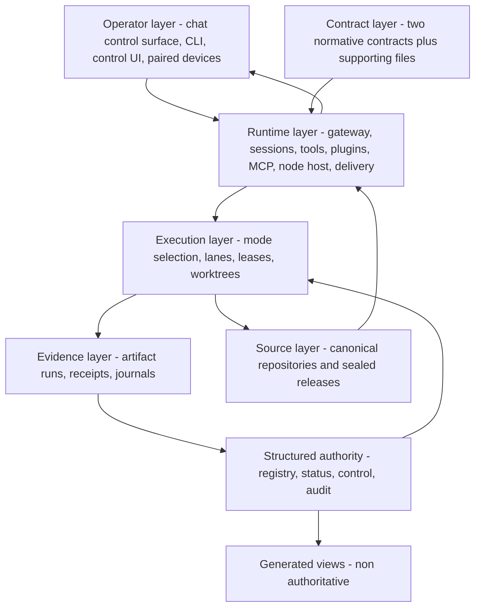

# System architecture

The system described here is an agent runtime on a machine the operator controls, driven
mostly from a chat surface, with a control plane built around it. This chapter is the map:
which layer owns which decision, how a request crosses those layers, and where the trust
boundaries sit. Ownership is the point. A rule with no named owner drifts, because nobody
can say which component was supposed to enforce it, and a failure with no named owner is
rediscovered from scratch every time it recurs. There are seven layers; each owns one kind
of decision, and each is defined as much by what it must *not* own. If the gateway, session,
and tool model is unfamiliar, read [start here](00-start-here.md) first — this chapter
assumes it.

| Layer | Owns | Must not own |
|---|---|---|
| Operator | Intent, approval tokens, standing directives | Execution mechanics, factual state |
| Runtime | Process lifecycle, sessions, tools, transport, scheduling | Approval semantics, source-of-truth claims |
| Contract | Normative behaviour and execution mechanics | Current facts, live inventory |
| Structured authority | Current facts, routes, enforcement parameters | Normative rules, prose narrative |
| Execution | Mode selection, lanes, ownership, write boundaries | Delivery guarantees, evidence retention |
| Evidence | Artifacts, receipts, journals, event history | Live authority over behaviour |
| Source | Canonical repositories, worktrees, releases, archives | Runtime state, mutable operational data |

## System context



Related diagram: [`diagrams/system-context.mmd`](../diagrams/system-context.mmd), which draws the
same system component by component rather than by layer.

## Operator layer

The operator is the only source of intent. Approval tokens, standing directives, and stop
instructions are valid only in the operator's own current message. Quoted assistant text
never supplies intent, and neither does the agent's inference about what the operator
probably meant — otherwise a system that quotes itself, or reads its own earlier
acknowledgement back into context, can manufacture its own authorization. The chat surface
is a control surface, not a workspace: it carries acknowledgements, checkpoints, and one
final result per unit of work, while the work itself happens elsewhere. Other clients — a
command-line interface, a local control UI, paired desktop or mobile clients — attach to the
same runtime and hold no authoritative state of their own, so every list they display is a
query answered by the gateway rather than a local copy that can go stale.

## Runtime layer

One long-lived gateway process per host owns every messaging surface, runs the agent loop
in-process, and is the sole authority for session and task state. One process per host is an
invariant rather than a preference: two processes sharing one messaging session produce
duplicated inbound events and interleaved replies. Clients attach over an authenticated
local socket, and the same local port also serves HTTP surfaces. The runtime supplies
substrate only — process lifecycle, session resolution, the tool registry and its policy
pipeline, plugin tool sources, MCP servers (external tool sources mounted over a standard
protocol), a peripheral node host, scheduling, and outbound delivery. It takes no position
on approvals, source-of-truth, durability, or release discipline. Those are the control
plane's job, and the fact that the substrate is silent on them is exactly why the rest of
this repository exists.

In the reference implementation much of the control plane is implemented *inside* a
maintained runtime fork: lane ownership, the acknowledgement barrier, approval-boundary
preservation, and closeout reconciliation are all **runtime-backed** there. What a stock
build leaves in their place differs by mechanism, and the difference matters. Lane ownership
has no stock substitute at all — a session list enumerates sessions, it does not arbitrate
who may write — so an adopter builds a lane registry or does without the guarantee. The
other three degrade to **policy-only**: the behaviour is still describable as a rule, it is
simply no longer enforced. Bootstrap budgets run the other way again, being configuration
rather than absent machinery: a build supplies them wherever it exposes bootstrap and
context settings, so an adopter tunes a budget instead of inventing one. That spread decides
whether a rule in this chapter is a guarantee or a request, so read
[capability provenance](03-capability-provenance.md) before assuming any behaviour described
here is reproducible without equivalent code.

## Contract layer

Markdown contracts are read from the workspace root and injected into the system prompt at
the start of a run. Two are normative: one owns behaviour, one owns execution mechanics, and
the rest inform without overriding. Three properties of the injection path matter more than
the file list. The set of injected filenames is fixed in the runtime rather than discovered
by scanning, so dropping a new file into the workspace does not silently add it to every
prompt. Packing is bounded by a per-file and a total character budget, with truncation that
announces itself in the text, because injected contract text is charged against the same
context window as the task — without a budget, contracts grow until they crowd out the work,
and nobody sees where the room went. And delegated subagent and scheduled-job sessions
receive a reduced allowlist rather than the full parent set, so a background job does not
inherit the whole policy surface to do one narrow thing. Ranking and load model: [policy and
authority](05-policy-and-authority.md) and [memory and context](08-memory-and-context.md).

## Structured authority layer

Factual truth deliberately does not live in prose. A fact written into a paragraph cannot be
validated, cannot be diffed usefully, and tends to be restated in a second paragraph that
then drifts from the first. So current facts live in machine-readable files, split four ways
by how they change:

```text
<workspace-root>/
  registry/   durable facts, changed by deliberate edit: topology, surfaces,
              integration routes, probes, storage roots
  status/     observed state, changed by observation and probes: capability
              readiness, live bindings, known issues, heartbeat
  control/    enforcement parameters, changed by policy decision: delegation
              policy, checkpoint rules, worker entrypoints, scheduler
              inventory, root-drift classification
  audit/      history, append-only: incident records and an event log
```

The split matters because the four have different authors and different failure modes. A
stale registry row is a wrong belief about topology; a stale status row is a wrong belief
about readiness; a wrong control value silently changes behaviour everywhere at once.
Collapsing them into one "config" directory makes all three indistinguishable.

Two rules keep the layer safe. First, JSON is canonical, and any YAML or Markdown mirror is
labelled non-authoritative in its own header; human-readable dashboards are regenerated
under a machine-checked do-not-edit banner, and a stale view is repaired at its source
rather than patched in place, since patching the rendering leaves the next regeneration to
silently undo the fix. Second, a registry row is evidence, not permission: it records that a
route or surface legitimately exists and authorizes nothing, so a `ready` row can never
stand in for an approval.

## Execution layer

Before any side effect, exactly one execution mode is selected and persisted: inline, a
*durable isolated lane*, or terminal-side manual containment. A durable lane is a separately
spawned child run that outlives the chat turn which started it, and establishing one is an
ordered sequence, not a flag. It resolves a named surface through the registry to a canonical
source root; verifies a *worktree* — a separate working directory attached to that same
repository, giving the lane an isolated place to write — against that root; attaches a
branch; writes a *status artifact*, the on-disk record that is the lane's authoritative
state; and only then emits exactly one visible acknowledgement.

Ownership is a *lease*, not a convention: a time- and identity-bound claim that answers "who
owns this right now" from an authenticated record rather than from a file that happens to
look live. Mutation rights are bound by compare-and-set, meaning a write is admitted only if
the ownership record still holds exactly the value the writer last read — so a second writer
that acquired ownership in between is detected instead of overwriting. See [execution and
durable lanes](06-execution-and-durable-lanes.md).

## Evidence layer

Every run of consequence writes a durable artifact tree of status, receipts, phase records,
and proofs, because anything that exists only inside a running process is assumed lost the
moment that process ends. Operations with a wide blast radius — that is, whose effects reach
far and are hard to reverse — additionally write a hash-chained journal: sequentially
numbered event files, each carrying the digest of the previous one, where every read
re-verifies naming, sequence, chain, and digest before an append is permitted, so a
tampered or truncated history fails loudly instead of continuing. Beside it sits a small
append-only workspace event log. Artifacts carry producer, target, freshness, acceptance
predicate, and retention class — see [evidence, audit, and
verification](15-evidence-audit-and-verification.md).

## Source layer

Source is separated from mutable state, shared infrastructure, and archives at the namespace
level. Within a project, only the canonical repository and its task worktrees are source.
Sealed releases — release directories made read-only once their contents are proven equal to
the source they were built from — along with artifact trees, mirrors, and archives are all
marked never-source, so an edit cannot land in a copy that no history will ever see. See
[source layout and artifacts](09-source-layout-and-artifacts.md).

## Three control loops

Three loops run continuously, sharing components but with different owners and clocks.

**Request loop.**

```text
inbound message -> channel adapter -> gateway -> session resolution
  -> contract injection under budget -> agent turn
  -> execution-mode decision: inline, durable lane, or manual containment
  -> tools, or lane establishment and handoff -> reply or acknowledgement
  -> delivery receipt recorded
```

The loop is bounded by a hard wall-clock budget on the inbound worker, with a safe-remaining
threshold and a declared list of long phase kinds that force a durable lane *before*
execution starts rather than after the work reveals its size. Below the threshold with no
completed handoff, the correct action is one visible blocker — never a fresh spawn inside an
expiring worker, which is the case most likely to leave a half-established lane that nobody
owns. Expanded version: [`diagrams/request-path.mmd`](../diagrams/request-path.mmd).

**Durable lane loop.**

```text
lane established: surface resolved, worktree verified, status written,
  one acknowledgement
  -> checkpoints on cadence and at named phase boundaries
  -> approval wait, resumed in the same lane
  -> terminal state written to the status artifact
  -> closeout gate -> one visible final proven by a provider receipt
  -> delivery obligation cleared
```

Ordering is the guarantee, and both orderings answer a specific failure. The status artifact
reaches a terminal state before the final is sent, so a crash in between leaves a record to
recover from rather than an announcement with nothing behind it. The acknowledgement must
land before any checkpoint or final may be delivered, so an operator never receives an
update about work they were never told had started. Expanded version:
[`diagrams/durable-lane.mmd`](../diagrams/durable-lane.mmd), which draws the same loop as a state
machine, including the collision and orphaned-lease branches this sketch leaves out.

**Fact publication loop.** An observation or a probe updates the canonical structured layer;
a generator then rewrites the human-readable views under a do-not-edit banner; and a reader
who needs to know which file owns a fact consults a short authority index that maps each
kind of fact to its canonical layer, rather than trusting whichever rendering they happened
to open. The loop runs in one direction only. A generated view never feeds back into the
canonical layer, and hand-editing one is a defect whether or not the edited content happened
to be right, because the next regeneration will discard it and the interval between is a
period where two sources disagree.

## Trust boundaries

| Boundary | What crosses | What must be proven |
|---|---|---|
| Operator to agent | Intent, approval tokens, directives | The token is in the operator's own current message |
| Client or device to gateway | Connection, requests | Shared-secret authentication and device pairing, each proven independently of the other |
| Gateway to node or device layer | Tool and shell-execution invocations | Node-side approval, at a scope that escalates with the declared command surface |
| Plugin to runtime | Capabilities, hooks, routes | Registration observed at load, not merely declared in a manifest |
| MCP server to tool registry | Externally supplied tools | The same tool-policy pipeline and execution-approval gate as core tools |
| Agent to filesystem | Writes | Inside the workspace boundary, or a declared verified repository or worktree |
| Scheduler to chat surface | Scheduled delivery | The named exception covers only that job's own result to its own configured destination |
| Agent to external system | Mutations | Route resolved through the registry; account or workspace route is a hard predicate |
| Runtime configuration to approval model | Permissive execution settings | Nothing — permissiveness never satisfies an approval token |

Three of these are commonly left implicit and are worth stating outright.

- **Node and device layer.** A node is a peripheral, not a second gateway. It never receives
  chat messages; the gateway forwards only tool and execution calls, and the node enforces
  its own approvals against its own store, so remote execution sits behind a second process
  boundary and a second identity. The required scope escalates with what the node is asked
  to do: a request carrying no commands needs only pairing scope, non-execution commands
  need write scope, and shell execution needs administrative scope. Pairing metadata is
  pinned, so a device whose identity attributes change must re-pair rather than reconnect
  quietly with new properties, and token rotation happens inside the durable pairing record
  so rotating a credential cannot promote a node into an operator.
- **Plugins and MCP servers.** Everything beyond the core is an extension: model providers,
  media pipelines, memory backends, and the chat channels themselves. Capability shape is
  computed from what a plugin actually registered, which makes a plugin that claims a
  capability and registers nothing detectable. MCP servers mount as additional tool sources;
  being external is not a widened envelope.
- **Scheduler-owned delivery.** A scheduled job sending its own stored result to its own
  configured destination is a named standing exception listing what it does not authorize.
  It is not a general grant of outbound send — see [scheduling and background work](12-scheduling-and-background-work.md).

## Failure containment

The recurring failure this architecture defends against is not a crash. It is a silent
duplicate, a silent drop, or a stale artifact mistaken for live state. The concrete failure
classes behind each of the five rules below are catalogued in [why a control
plane](02-why-a-control-plane.md).

1. **Fail closed on unproven state.** When identity, ownership, provenance, or approval
   cannot be positively proven, the run stops and emits one narrow blocker instead of
   guessing. An unmatched path during cleanup classifies as a blocker, not as residue.
2. **Collisions perform no writes.** A contended lease returns a typed collision and one
   deduplicated blocker, so two owners cannot half-apply a change between them.
3. **Budgets cap blast radius.** A lifecycle action must first claim a permit — one unit of
   a budget declared in advance — against a named counter. Exhausting the budget raises
   instead of retrying, turning a retry storm into a bounded, visible stop.
4. **Isolation is the default.** Scheduled work runs in isolated sessions with per-job tool
   allowlists and timeouts; each lane writes in its own verified worktree.
5. **Nothing is destroyed to recover.** Failed deliveries move to a retained failure
   directory, displaced ownership records are archived rather than overwritten, and a
   deprecated authority becomes a labelled shim instead of being deleted. Recovery resolves
   from receipts, not from replayed side effects.

Stale state is contained by demotion rather than trust: an on-disk artifact still reading as
executing is recovery evidence, never proof that a lane is live.

## Health is reported separately from task state

Task state answers "what happened to this unit of work". A health class answers "can this
system be trusted with the next one". Collapsing them produces the two worst reporting
failures: a green result over a degraded substrate, and a healthy system reported as broken
because one lane is blocked. The separation is structural.

- The durable status artifact carries `state` and `health` as distinct fields. A lane can be
  complete while the runtime is degraded, and the runtime can be healthy while the lane is
  blocked.
- Capability readiness, known issues, and containment live in the status layer with their
  own freshness classes, so a contained degradation stays auditable over time instead of
  being rediscovered every week.
- For scheduled work, transport success is not domain success. An absent terminal marker
  interprets as unknown and escalates, rather than being demoted to a pass because the job
  exited zero. Absence of complaint is not evidence of health either: health claims carry a
  freshness window, and past that window the claim is stale, not true.

Health classes, freshness windows, and the containment protocol are detailed in [guards,
health, and restoration](14-guards-health-and-restoration.md); the state and class
vocabularies are enumerated in [policy and authority](05-policy-and-authority.md).

Where this leads: [policy and authority](05-policy-and-authority.md) takes the contract and
structured-authority layers apart in detail — precedence, the operator control vocabulary,
and the approval classes that decide what a request is permitted to do — and [execution and
durable lanes](06-execution-and-durable-lanes.md) does the same for the execution layer.
