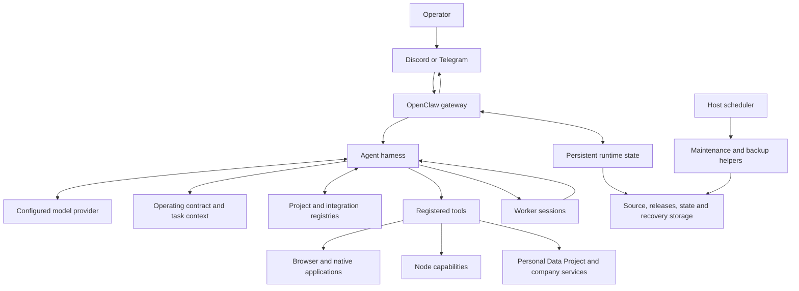

# System architecture

The system serves one operator across several work domains. The gateway and harness manage execution; a compact instruction contract governs behavior; registries identify the correct sources and accounts; host operations preserve the installation around them.

The standalone [system context diagram](../diagrams/system-context.mmd) contains the same responsibilities. The important boundary is between deciding what work should happen and proving what actually happened.

## A single behavioral authority

`AGENTS.md` owns behavior, authorization, routing, lifecycle and source-of-truth policy. `IDENTITY.md` defines the assistant's name, assistant and automation-host role, and concise defaults. `SOUL.md` shapes voice, `USER.md` records preferences and `MEMORY.md` points to useful retained context. `TOOLS.md` supplies detailed mechanics when needed. Those supporting files cannot independently expand authority or impose a competing operating policy.

The files present on disk are not necessarily the files injected into a particular turn. Runtime code, session type and configuration determine the actual context. A bootstrap manifest is advisory unless the runtime explicitly consumes it as configuration. See [policy](05-policy-and-authority.md) and [memory](08-memory-and-context.md).

## Execution belongs to the runtime

A request enters through its authenticated route. The harness assembles context and exposes available tools. The agent can work directly or delegate independent investigation to workers. A parent may yield while a child continues; the completion path must return control to the requester without treating that yield as an empty failed answer.

Substantial work retains a goal or task identity and enough progress to continue. The operator can steer it without needing to restate the whole objective. Progress messages describe useful milestones; native execution records retain the detailed lifecycle and accounting.

The runtime's databases and APIs own current execution state. Legacy workspace lane files or generated summaries may be useful historical evidence, but their existence does not make them active schedulers or authoritative task registries. [Execution](06-execution-and-durable-lanes.md) describes the implemented boundaries.

## Sources and destinations remain explicit

Company Alpha, Company Beta and the Personal Data Project have distinct canonical sources and account routes. Retrieval relevance is not destination authority: finding a document in one account does not authorize writing there.

Each project keeps its own repository and worktree pool. The control workspace coordinates projects without becoming their source repository. The personal-data service is a separate integration that may expose structured, read-only context; its data production and domain acceptance remain owned by that service.

The same separation applies to native applications. A browser tab or Apple Calendar event belongs to a verified profile or calendar. A successful click or returned identifier must be checked against that destination. [Integration routing](11-integrations-and-capability-routing.md) gives the procedure.

## Operations continue outside conversations

The OpenClaw scheduler handles its persisted job definitions and delivery routes. Host launch services handle selected maintenance, integrity and backup work independently. Keeping these layers separate makes it possible to inspect a broken runtime without depending on the model itself.

A job's command, interpreter, environment, state directory and account references form one execution contract. Changing any of them can invalidate older evidence associated with the same job ID. Configuration registries help locate the contract; current scheduler and installed service definitions determine what will run.

Storage separates editable source, built releases, mutable state, generated artifacts and backups. The container engine owns another data store. A cloud backup client's enrollment, upload completion and restore verification are separate milestones. These systems need explicit coverage and retention rather than an assumption that backing up the workspace captures the whole installation.

## Release boundaries

Develop and test source in an isolated checkout. Build a self-contained candidate with pinned tools, verify its contents, record its identity and activate it through the checked lifecycle path. Preserve a verified prior state and stop on ambiguous ownership or incomplete activation evidence.

Source tests prove properties of the implementation. An activation receipt binds a deployed generation. A channel test proves an observed user path. None substitutes for all the others. [Runtime releases](10-runtime-releases-and-promotion.md) and [verification](15-evidence-audit-and-verification.md) explain the relevant evidence.

## What the design is intended to achieve

The assistant should combine initiative with accurate source selection, keep substantial work moving, and give the operator a clear result or a specific unresolved dependency. It should preserve enough context and operational state to recover from interruption, while keeping secrets and unrelated private material out of replies and shared artifacts.

This is a reference for an operator-controlled installation. It does not establish multi-tenant isolation, universal unattended reliability or guaranteed external delivery. Those properties require their own design and evidence.
