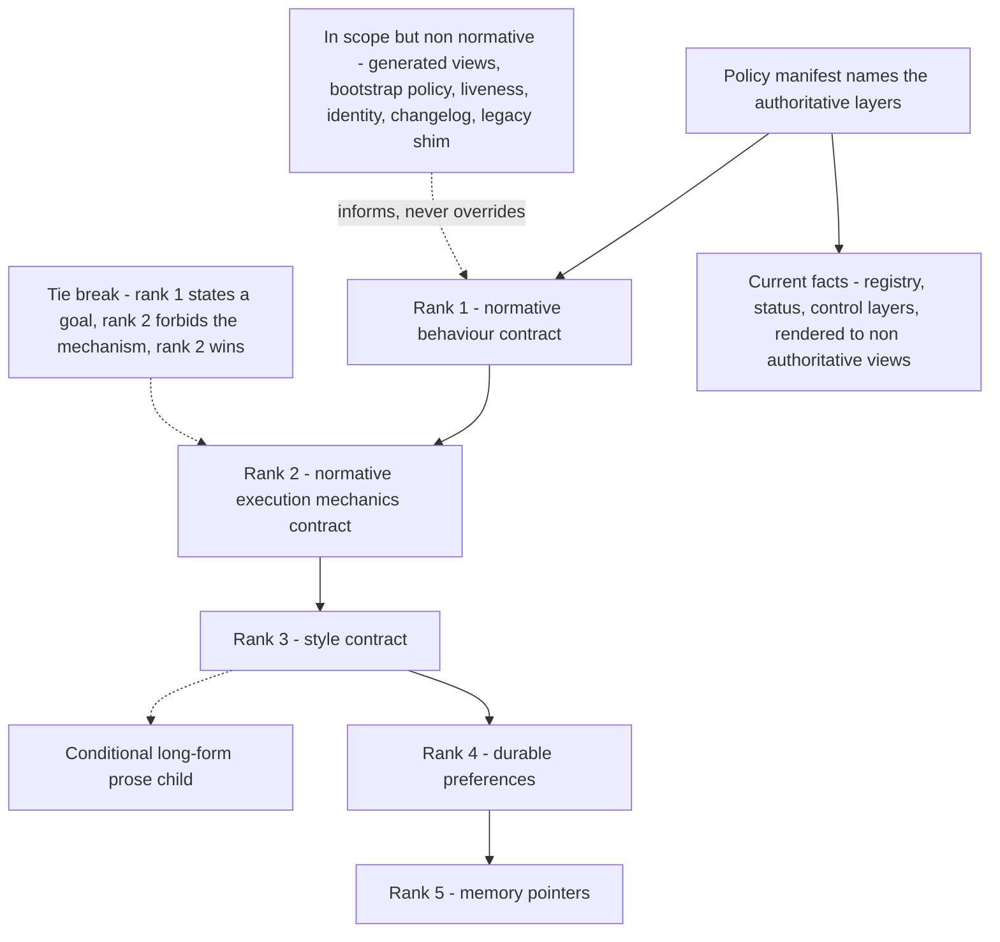

# Policy and authority

An agent that can change files, run commands, and send messages needs a written answer to one
question before it does anything: when two instructions point in different directions, which one
wins? This chapter describes how that answer is made deterministic instead of being left to
whichever instruction the model happened to weigh most heavily on that turn. It matters because
the same answer has to hold in a delegated child session, in a scheduled job nobody is watching,
and on a first turn with no conversation history to fall back on. This chapter is about *who
decides*; how the resulting work actually runs is [execution and durable
lanes](06-execution-and-durable-lanes.md).

Behaviour is governed by a small set of plain Markdown **contract files** kept in the
control-plane workspace and injected verbatim into the agent's system prompt at the start of a
run. Two of them are *normative* — binding on live behaviour. One owns behaviour: approvals,
routing, task lifecycle, operator interaction, and how to read a source of truth. The other owns
execution mechanics: tool state, filesystem boundaries, repository and worktree identity, and
completion verification. Every other file in the workspace either informs those two or declares,
in its own text, that it carries no authority at all. What follows is the ordering between them
and the rules that keep the ordering from eroding.

## Authority resolution

Precedence is a ladder with a fixed number of rungs, a documented tie-break, and a side annex of
files that inform without overriding.

Expanded version: [`diagrams/authority-resolution.mmd`](../diagrams/authority-resolution.mmd), which
adds the single-owner fan from each fact domain to the layer that owns it.

## The five-rank precedence ladder

| Rank | Contract | Owns | Carries no authority over |
|---|---|---|---|
| 1 | Normative behaviour | Approvals, routing, task lifecycle, operator interaction, source-of-truth interpretation | Mechanisms the rank-2 contract forbids |
| 2 | Normative execution mechanics | Tool state, host routing, filesystem boundaries, repo and worktree identity, approval mapping, completion verification | Voice and presentation defaults |
| 3 | Style | Tone, presentation defaults, the chat-surface presentation profile | Approvals, delivery mechanics, factual claims |
| 4 | Durable preferences | Stable context, working preferences, preferred output forms | Any policy or approval decision |
| 5 | Memory pointers | Pointers to owning sources and a few uniquely valuable cues | Canonical policy, approvals, runtime fact |

Without a declared order, conflicts resolve by accident — by which file sounded more emphatic, or
which happened to sit closer to the end of the prompt. That is not reproducible across sessions,
which makes every approval boundary negotiable in practice. Four rules make the ladder
deterministic instead.

- **Lower never overrides higher.** A rank-4 preference cannot loosen a rank-1 gate; a rank-5
  cue cannot establish a fact. Otherwise a preference written for convenience quietly becomes a
  policy exemption.
- **No authority by implication.** In-scope but non-normative files — generated views, the
  bootstrap policy, the liveness snapshot, the identity stub, the changelog, a legacy shim —
  inform without overriding, and never become normative because they happened to be loaded.
  Each writes that negative claim into its own text, so the boundary survives being read out of
  context.
- **Goal versus mechanism.** When rank 1 states a goal and rank 2 forbids the proposed
  mechanism, rank 2 wins. The goal is not cancelled; a permitted mechanism is found or the work
  stops at a named boundary. Without this tie-break, an ambitious goal statement becomes an
  argument for bypassing a mechanical safeguard.
- **One owner per concept.** Exactly one in-scope file owns each reusable concept; mirrors
  elsewhere are pointer-only, and the registry records an owner file per row. Two full copies of
  a rule drift apart, and the reader who finds one copy has no way to know the other exists — so
  a contradiction becomes something the system can hold indefinitely without noticing.

## The self-sufficiency invariant

If live behaviour would otherwise depend on a runbook, a script, a test, a memory subfile, or a
style side-file, the minimum authoritative rule must appear in one of the two normative
contracts **first**. Supporting material may elaborate or supply mechanics; it may never supply
missing authority. A contract that defers a gate with "see the runbook" is a defect: it makes
correct behaviour depend on a file a delegated session or a scheduled job may never load. The
invariant is what lets a fresh session, holding only the injected contracts, behave correctly
on its first turn.

## Four domains that must not collapse

Precedence settles which file wins a conflict. A separate discipline settles what kind of claim a
file is allowed to make at all. Four kinds of statement live in a control plane — what is
currently true of the machine, what the operator durably prefers, what is binding policy, and
what someone has merely proposed — and each has exactly one canonical owner. They collapse
easily, because all four are written in the same Markdown by the same hand on the same afternoon,
and the resulting sentence reads the same whether it is a fact, a wish, or a rule.

| Domain | Canonical owner | Failure when collapsed |
|---|---|---|
| Current fact | Structured registry, status, and control layers | Prose drifts into an unfalsifiable claim about the machine |
| Durable preference | The preference contract | A preference is enforced as if it were policy |
| Normative policy | The two normative contracts | Rules accumulate in files nobody reads at decision time |
| Proposal | Anything explicitly labelled a proposal | A wish is executed as though it had been approved |

Two prohibitions hold the separation: facts are never rewritten to fit a desired architecture,
and a contradiction is never resolved by hiding it in a lower-precedence file.

## The contract registry

A minimal stack of five files is a teaching example, not the shape a working control plane
converges on. A working registry carries substantially more rows than that, and the extras are
the ones that make authority legible. Each row records a role, a default-load tier — always,
conditional, never — a sensitivity rating, and an owner file; roles only are described here.

| Role | Authority | Typical load tier |
|---|---|---|
| Normative behaviour contract | Rank 1 | Always |
| Normative execution mechanics contract | Rank 2 | Always |
| Style contract | Rank 3, voice and presentation only | Always |
| Long-form prose child of the style contract | Style-only, scoped out of specs, runbooks, and control-plane artifacts unless explicitly activated | Conditional |
| Durable preference contract | Rank 4, no policy authority | Always |
| Memory pointer layer | Rank 5, pointers only | Always |
| Identity stub | Identity and defaults only, outside the ladder | Always |
| Generated capability, index, and liveness views | Non-authoritative, banner names the canonical source | Conditional |
| Policy changelog | Historical audit only | Never |
| Machine-readable policy manifest | Versions the kernel, names the authoritative layers, records cutover state and a fresh-session flag | Never |
| Bootstrap policy and its manifest | Declared load intent, documentation and lint target | Conditional |
| Legacy compatibility shim | Declared non-authoritative pointer to the canonical layers | Never |
| Higher-sensitivity memory sources | Read on demand only | Conditional |

Four properties matter more than its size.

- **Load tier and sensitivity are independent axes.** Whether a file is worth loading by default
  and how narrowly its contents should be exposed are separate questions, and collapsing them
  gets one of the two wrong. A file can be low-sensitivity and conditional, or medium-sensitivity
  and always-loaded; the always-plus-high-sensitivity cell is deliberately empty, so nothing
  narrow-scoped rides along in every prompt merely because it was convenient to load — see
  [memory and context](08-memory-and-context.md).
- **The registry is not the loader.** It is documentation and a lint target, which in the
  vocabulary of [capability provenance](03-capability-provenance.md) makes it **policy-only**.
  What reaches the model is a fixed injected filename set packed under character budgets
  (**runtime-backed** here). Declared tiers and injected reality can diverge, and the registry
  says so in its own text rather than pretending otherwise. A registry that claimed to be the
  loader would be worse than no registry: it would make the divergence invisible.
- **Bootstrap convenience is firewalled.** Default-loading a file never promotes a
  lower-precedence or non-normative file into live authority; being in the prompt is not the
  same as being authoritative.
- **Loading successfully is not news.** A clean start is internal-only: the agent answers the
  question that was asked rather than reporting that its contracts loaded and no blocker was
  found. The glossary calls the marker that permits this a *quiet-success token*. Startup
  narration costs the operator attention on every single turn and trains them to skim exactly
  the channel a real blocker would arrive on.

## Operator control vocabulary

The operator moves the agent between postures with a small fixed vocabulary rather than with
free-form encouragement. The set is deliberately tiny, because a vocabulary an operator has to
look up is one they will paraphrase, and a paraphrase cannot be matched. Two of the entries below
refer to machinery described in [execution and durable lanes](06-execution-and-durable-lanes.md):
a *lane* is one unit of isolated long-running work, and its *status artifact* is the on-disk
record that holds that work's authoritative state.

| Directive | Means | Does not grant |
|---|---|---|
| `stop` | Terminal for the run. Spawn identity is preserved, the status artifact goes to cancelled, late output is suppressed | It is not a pause and not a rollback |
| `draft-only` | The default posture: produce plans and drafts, mutate nothing, send nothing | — |
| `active-operator` | The operator is present; proactive local execution is allowed inside boundaries that already exist | No mutation class or destination that was not already permitted |
| `GO` | Bounded, reversible mutation inside the request's envelope | No high-risk work, no outbound send |
| `STRONG GO` | Exact-scope higher-risk mutation after a reviewed plan | No outbound send |
| `SEND` | Outbound external communication | No mutation |

Outbound send is always a separate axis from mutation approval and is never implied by `GO` or
`STRONG GO`. The two risks are genuinely different: a bounded local change can be inspected and
reverted, while a message that reaches another person cannot be recalled and may be acted on
before anyone notices it was wrong. Treating mutation approval as implying send permission would
mean the cheapest approval to obtain silently carried the most expensive consequence.

One narrow exception is structural rather than granted: a reply bound to the current origin
message, the current requester, and the exact originating channel is a current-requester
response and consumes no send token, because answering the person who just asked is the
conversation itself rather than a new outbound act. Any identity or target mismatch — a
different recipient, a different channel, a different thread — reclassifies it as external
outbound and the send gate applies again.

## Three conditions before any action

Approval is only one of the three things a tool call needs, and collapsing them into a single
notion of "can I do this" produces the most common wasted turn there is: an agent retrying a call
that was never going to succeed. The mechanics contract requires all three to be evaluated, in
this order, before any action.

| Condition | Question it answers | Typical reason it is false |
|---|---|---|
| Available | Is this tool present in the session's catalog at all? | The capability is not installed, or a delegated session runs with a reduced tool allowlist |
| Authorized | Does the route it would use resolve to a declared destination and a named credential reference such as `<credential-ref>`? | The route is not in the registry, or its credential reference is absent |
| Approval-satisfied | Does the current posture or an issued token cover this specific action? | The action mutates and no `GO` has been given |

When any one of them is false the rule is to name the exact missing condition and stop, never to
retry. A blind retry against an absent credential reference is indistinguishable from the outside
from a transient network failure: the operator learns nothing, the log fills with identical
entries, and the single fact that would have resolved it in seconds is the one thing never said.

## Execution classes

Requests are sorted into four classes by two properties of the action itself — its *blast radius*,
meaning how far its effects reach, and its reversibility — rather than by keywords in the request.
Keyword routing fails in both directions: it blocks a harmless request that happens to contain the
word "delete", and it waves through a catastrophic one phrased politely. The class then determines
which token, if any, the work needs.

| Class | Scope | Token |
|---|---|---|
| A | Read-only discovery, planning, analysis, command-block generation | None |
| B | Bounded, reversible, low-blast-radius mutation, including adjacent work needed for correctness | `GO` |
| C | Exact-scope higher-risk delegable work, after a reviewed plan | `STRONG GO` |
| D | Terminal-side or manual containment: the human acts, the agent prepares | Not delegable |

A class-C plan states six fields before approval: target and action, blast radius, backup or
rollback or stop condition, verification predicate, exclusions, and the artifact or log path.
The six are not bureaucracy. Each one is a question that becomes unanswerable once execution has
started — what exactly was touched, how far it could reach, how to get back, how anyone will know
it worked, what was deliberately left alone, and where the evidence will be found.

Class D — *terminal-side*, meaning performed by the operator at their own terminal rather than by
the agent — covers cases where bounded execution cannot be established, where the control path is
itself unsafe, or where a human-only boundary applies: consent, custody of secrets, legal
authority, movement of funds. It is a destination for work the agent should not own, not a way of
declining to help; the agent still does the class-A preparation that makes the human's step short.

### The scoped-repair shorthand

A class-C approval may be given in a shorthand form that names a surface or object rather than
a finished plan. Naming the envelope authorizes agent-owned bounded conversion inside it:
read-only discovery, synthesis of the exact plan, recording of the required fields, then
execution — without a second round trip, so long as the work stays inside that envelope.

Two rules keep the shorthand honest. Once it is given, emitting a generic manual-containment
offload is a defect: the shorthand exists to avoid bouncing a bounded repair back to the
operator. And missing plan fields in the first message are never grounds for refusal when
read-only discovery can produce the bounded plan.

Three further rules bound every approval:

- **Envelope semantics.** Approval covers the bounded envelope of the request, not only its
  enumerated substeps. Escalation is defined by envelope-boundary change: a different system,
  target object, mutation class, account or workspace route, or an excluded boundary.
- **Phase-boundary honesty.** If a later phase leaves the current envelope, the run stops
  before that phase and names the boundary plus three options — proceed with the approved
  subset, re-approve the bounded higher-risk plan, or stop. Silently holding and silently
  skipping are both failures.
- **No manufactured gaps, no waivers by configuration.** Assistant-authored text — an
  acknowledgement, a pre-mutation summary, a self-declared exclusion — is descriptive and
  cannot create a new approval requirement. Permissive runtime execution settings never satisfy
  a token or a filesystem boundary.

## Draft-only is the default posture, and standing directives carve it open

Draft-only means that without an issued token or a standing directive, work stops at a plan or a
draft: nothing is mutated and nothing leaves the machine. It is not a refusal posture, and
reading it as one is the most common way to get this wrong. Read-only discovery, analysis, plan
synthesis, and composing the full text of the message that would be sent are all in scope. What
is withheld is only the irreversible last step.

The default is chosen on an asymmetry of cost. Any agent's reading of a request is an inference,
and inferences are sometimes wrong. A wrong inference that produced a draft costs one review
cycle. A wrong inference that changed a repository, wrote to an external system, or sent a
message to another person costs a recovery — and in the outbound case there may be no recovery
available at all. Defaulting to the posture whose failure mode is cheapest is the whole argument.

The obvious objection is that a system demanding a fresh token for every routine mutation is
unusable. That objection is correct, and two mechanisms answer it without weakening the default.

**Standing directives** are the first-class one: named, durable, narrow exceptions that turn a
repeating class of work into pre-approved routine. They differ from tokens in kind rather than in
degree. A token is issued in the conversation, applies to one request, and is consumed by it. A
standing directive is written into the normative contract, applies to a whole class of work, and
persists until the contract changes. Because it is granted in advance and never restated at the
moment of use, it has to be narrower than a token would be, and it has to enumerate what it
withholds.

| Standing directive | Covers | Does not authorize |
|---|---|---|
| Closeout normalization and lane housekeeping | Normalizing a finished slice, branch and worktree housekeeping | New scope, or pushing anything to a remote |
| Per-surface closeout exceptions | Named surfaces stop at local normalization | Pushing those surfaces to any remote |
| Task-tracker sync | Opted-in synchronization of task state to the tracker | General outbound messaging |
| Scheduled operational delivery | A scheduler sending its own stored result to its own configured destination | Any other destination or payload |
| Policy audit logging | An audit line for policy and memory edits to one fixed audit route | Any other content on that route |

A standing directive is only safe when it is written like a contract clause. It names the class of
work, the destination, and the payload shape; it states its failure rule — retry once, then report
in thread rather than retrying blind, so that a broken route surfaces as one visible message
instead of a silent retry loop; and it lists what it does *not* authorize. The mechanics contract
mirrors each one as a pointer rather than restating it, so the exception keeps a single owner. A
directive that cannot be summarized in one table row is not a convenience: it is a policy change
wearing a convenience costume, and it belongs in the ladder where it can be reviewed.

**A reasonable-assumption safe harbor** is the smaller second mechanism, and it covers the case
no directive can anticipate: a request whose intent is clear but whose details are
under-specified. Inside a work surface the operator has already declared for the task, the agent
may proceed on an assumption rather than stopping to ask, provided the step is reversible and its
effects stay local. The harbor is written together with an explicit list of what it does not
waive — an approval token, the boundary of the approved envelope, or anything irreversible or
external. It is an operating-posture rule, not a grant: it changes how much clarification a
bounded step requires, never which execution class that step belongs to.

## Task lifecycle states

Task state is one ordered vocabulary shared by policy, artifacts, and delivery, so that a
supervisor, a status file, and a visible message cannot describe the same run in three different
words. The non-terminal states are establishing, executing, and waiting — on an approval, an
input, or a registered background event. A wait is a resumable state in the same run rather than
a new one, which is what keeps a paused approval from being indistinguishable from an abandoned
run.

Eight terminal strings are recognized, since two of the outcomes each accept a spelling variant,
and they collapse to six outcomes: complete, blocked, failed, cancelled, superseded, and
preserve. Only the complete outcome counts as success-terminal.

Three rules attach. The status artifact must reach a terminal state before a visible final is
sent, so the durable record is never behind the message the operator has already read. Cancelled
and superseded runs own no worker-visible final at all, because late output from a superseded run
would otherwise interleave with its successor's and read as self-contradiction. And a stale
artifact still reading as executing is recovery evidence, never proof of a live lane: liveness is
answered by the ownership lease — the authenticated, identity-bound claim held by a specific live
process — and not by the contents of a file some dead process left behind. [Execution and durable
lanes](06-execution-and-durable-lanes.md) specifies that lease field by field.

## Runtime health classes

Health is a separate axis, enumerated separately and never inferred from task state. The two
genuinely vary independently: a run can complete correctly on a surface that is quietly degraded,
and a run can fail for reasons that say nothing at all about the system's health. Reading one off
the other produces the two worst reports available — a green summary over a broken surface, and a
panic over an ordinary failed attempt. Health therefore carries its own vocabulary, and three of
its classes deserve naming here because they have no task-state equivalent:

- **degraded-contained** — a known defect with a recorded containment, kept auditable in a
  known-issues ledger rather than rediscovered each time someone trips over it.
- **split-brain** — two components disagree about what is live; the correct action is to stop
  and preserve evidence, not to improvise a reconciliation.
- **historical-residue-heavy** — the surface works, but accumulated residue makes its state
  hard to read, which is reportable in its own right.

Every health claim carries evidence and a freshness window; past the window it is stale, not
true. Classes, windows, and containment: [guards, health, and restoration](14-guards-health-and-restoration.md).

## Truthful completion and its acceptance predicate

Completion is a claim about evidence, not about effort. The acceptance predicate is stated
*before* execution and names the observable, the boundary at which it is observed, and the
artifact recording it. A predicate evaluable only by rereading the agent's own summary is not a
predicate.

- A closeout gate refuses to emit `complete` unless source state and standing-branch
  normalization pass, distinguishing non-blocking residue from real blockers. It also requires
  a structured self-review, a docs-impact record, and proof of the actual entrypoint exercised;
  a report check validates the visible report text against the gate's own output
  (**helper-backed**).
- Architecture acceptance traces the real path — entrypoint, wrapper, runner, injected
  dependency, artifact writer, live boundary. After two same-class failures, blind patching
  stops and a failing end-to-end reproduction is produced instead.
- A delivery obligation created at acknowledgement time clears only on a visibly delivered
  terminal message. Avoiding the word "done" does not waive it.

## The hot-reload caveat

Contract files are read once, when a session starts, and assembled into that session's system
prompt. A file edited afterwards is therefore not the file the running session is reasoning
from — edits to the normative contracts may not retro-apply to an already-running session. This
is easy to forget precisely because the edit is visible on disk and feels like it took effect.

Policy therefore prefers a fresh session or thread before the next execution slice after a
contract change, and both contracts carry that rule independently so neither one can lose it
alone. The policy manifest records a cutover state and a fresh-session-required flag for
authority flips, and a *drift lint* — a build check asserting that required structural anchors
and exact precedence sentences are still present — asserts those values literally. A silent
authority change consequently fails the build rather than the next run. See [evidence, audit, and
verification](15-evidence-audit-and-verification.md).

## What is portable

Precedence, the four domains, the self-sufficiency invariant, the control vocabulary, the
execution classes, and the standing-directive pattern are **policy-only** and reproduce on a
stock runtime with no code at all: they are text, and the text is the entire mechanism.
Approval-boundary preservation across a resumed lane, and enforcement of a fixed injected file
set, are **runtime-backed** here. Drift lint and contract tests that assert precedence language
literally are **helper-backed** — they turn authority erosion into a build failure instead of a
slow drift nobody dates.

Where this leads. [Execution and durable lanes](06-execution-and-durable-lanes.md) takes the
approval vocabulary defined here and shows how a request is routed to somewhere it can actually
run and be resumed. [Evidence, audit, and verification](15-evidence-audit-and-verification.md)
covers how policy changes are recorded and how erosion is caught. [The adoption
guide](17-adoption-guide.md) gives the order to build these pieces in, and starting with this
chapter's text-only half is the cheapest useful step.
