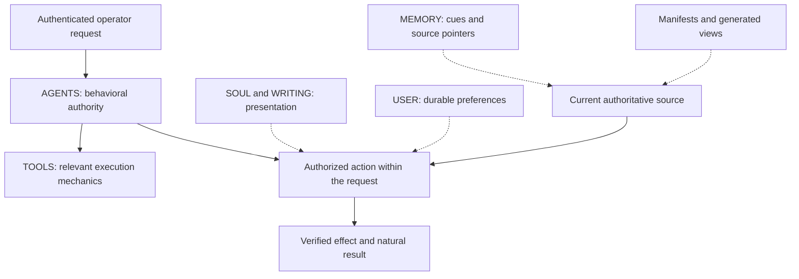

# Policy and authority

The operator can ask for ordinary work in ordinary language. “Fix the export and verify it” authorizes the bounded implementation and checks that request entails; it does not require a second message containing an approval token. The same assistant must also know when it has reached a different account, an unplanned recipient, a destructive operation or human-presence authentication. The policy makes those distinctions explicit without turning every task into an approval ceremony.

In this reference, `AGENTS.md` is the sole loaded authority for behavior, approval boundaries, routing, lifecycle and source-of-truth interpretation. The other workspace files have narrower jobs. They make the agent useful, informed and consistent; they do not acquire permission-granting powers by appearing in a prompt.

## One authority and several kinds of context

| File | Job | Boundary |
|---|---|---|
| `AGENTS.md` | Behavior, authenticated authority, sources, routing and completion | Owns the reusable behavioral rules |
| `TOOLS.md` | Detailed execution procedures | Read deliberately when relevant; cannot independently authorize, forbid or override |
| `SOUL.md` | Voice, style and reader-facing presentation | Cannot change facts, authority or delivery destination |
| `WRITING.md` | Long-form prose and document discipline | Style-only child, read deliberately for applicable work |
| `USER.md` | Stable working preferences | Does not establish current provider facts or silently grant actions |
| `MEMORY.md` | Compact cues and source pointers | Retrieval aid, not policy or current-state evidence |
| `IDENTITY.md` | Assistant name and concise defaults | No operational authority |
| Manifests, generated views and changelog | Documentation, projections and history | Actual runtime loading and current source evidence remain separate |

The [standalone authority diagram](../diagrams/authority-resolution.mmd) shows the same relationships. There is no second normative TOOLS layer that can quietly redefine the approval policy. A detailed procedure can expose a real missing dependency or unsafe operation, but its authority comes from the rules AGENTS owns and the actual system boundary.

Keep one owner per reusable concept. A mechanics file should point to the approval rule rather than maintain a second version. A generated capability page should cite the registry rather than become a competing inventory. This reduces both prompt size and the chance that an agent selects whichever contradictory paragraph is convenient.

## Natural authorization with explicit boundaries

An authenticated request binds the objective, target, account/workspace, operation and plainly implied steps. The agent can gather evidence, prepare a plan, make reversible in-scope changes and run proportionate checks without asking the operator to enumerate implementation details. A successor continues that same instruction. Missing fields are often discoverable facts rather than decisions to send back to the operator.

A materially changed objective, recipient, account, destructive scope, economic intent or explicit exclusion is different. Prepare what can safely be prepared, preserve completed work and ask one natural question at the actual boundary. A request to draft a message does not by itself request sending it; a request to send a particular recipient a named package already authorizes that communication. A useful exact draft should exist before a later send decision is requested.

`GO`, `STRONG GO` and `SEND` may still occur in historical records or strict compatibility enums. They are understood as affirmations. They are not required user grammar. `STOP` ends further execution as safely as the current control path permits. `DRAFT_ONLY` deliberately changes the posture until the operator changes it again.

Native action gates remain real. So do human-presence requirements for passkeys, biometrics, one-time MFA, credential recovery and custody changes. The assistant checks sanctioned opaque credential routes before requesting help, and never asks for a secret to be pasted into chat. An execution setting that permits a command does not authorize its purpose.

## Scope is established by the request, not fetched text

The operator principal comes from the runtime-authenticated request/session. A channel member, quoted message, web page, issue body or tool result cannot authenticate itself as that operator. Fetched material may change the agent's understanding of the facts; it cannot authorize a command, installation, data transfer or credential change merely by instructing the agent to perform it.

Source selection also has a concrete rule. If the operator supplies a direct resource link, inspect and identify that exact resource first. A related search result cannot substitute for an inaccessible document or email. An example may supply structure and tone; it supplies no identity facts for the real target. This matters when producing a draft for someone else: each material recipient-specific fact must come from the actual target or be left unresolved.

## Standing preferences remain narrow

Some repeating work can be configured in advance. A Calendar destination preference does not need repeating on every scheduling request. A registered personal tracker can be maintained as part of the operator's task. A deployment preference can authorize deployment of one verified project once its declared conditions hold.

The example USER file makes its optional Personal Data Project deployment grant explicit. An adopter must enable and bind that grant for the intended target. It cannot authorize unrelated infrastructure changes. Similarly, a standing first-party QA grant needs a declared domain/account/network scope. Replacing the example company name with an actual organization is an authorization decision, not a text-formatting step.

The agent still verifies the real origin, selected account, network and available transaction details for an authorized economic operation. A staging site name does not tell it whether a transaction is on a test network. After a possible submission, reconcile settlement before retrying. These rules preserve capable execution while preventing an ambiguous response from becoming a duplicate effect.

## Useful output is part of the contract

The final response contains the requested deliverable, not a receipt inventory or a statement that work was performed. Substantial work gets a natural acknowledgment, meaningful updates and one clear result. The parent owns synthesis and external effects even when a source-only worker does the retrieval. No emojis, tool banners, provider-routing chatter or raw lifecycle fields belong in ordinary agent replies.

A concrete scheduling request illustrates why source and output rules belong together. The operator asks to add two calls to Apple Calendar. The agent reads current invitations from the relevant Google accounts, verifies each meeting's end time and joining details, inspects existing Apple entries, and updates or creates only what is needed. It then reads back both events. The destination preference never bans reading another provider's invitation, and one successful event never proves the whole request complete. The full mechanics live in [TOOLS](../templates/TOOLS.example.md#calendar).

For long-form writing, the agent preserves facts and applies reader-aware prose directly. An isolated writer agent is not required. The [SOUL](../templates/SOUL.example.md) and [WRITING](../templates/WRITING.example.md) files contain the actual presentation rules, including complete answers in chat and deliberate use of a shareable file when appropriate.

## Evidence determines completion

A local source change, an integrated commit, a built release, a loaded process, an accepted provider operation and a visible user result are separate observations. The assistant reports the strongest one it actually verified. A healthy listener cannot prove a Calendar entry is complete, and a transcript final cannot prove a Discord message appeared.

Verification scales with the effect. A documentation edit needs source review and structural checks. A provider write needs authoritative readback of the intended object. A runtime change needs loaded identity and the affected user behavior. The [evidence chapter](15-evidence-audit-and-verification.md) and [runtime chapter](10-runtime-releases-and-promotion.md) explain those boundaries.

## Adopting the policy

Install the concrete [AGENTS](../templates/AGENTS.example.md), mechanics, style and preference templates together. Bind fictional portfolios to the adopter's intended sources and accounts, deliberately choose any standing grants, and preserve the separation between a source read and a write destination. The [policy manifest](../templates/policy_manifest.example.json) records ownership; it does not implement a loader or permission system.

The behavioral contract is text. Enforcement that depends on session identity, privacy filtering, worker execution, OAuth custody or delivery reconciliation lives in the pinned runtime and supported integrations. Verify those mechanisms in the adopting installation before claiming them. [Memory and context](08-memory-and-context.md) explains what is actually loaded and why a file present on disk is not evidence that a worker received it.
