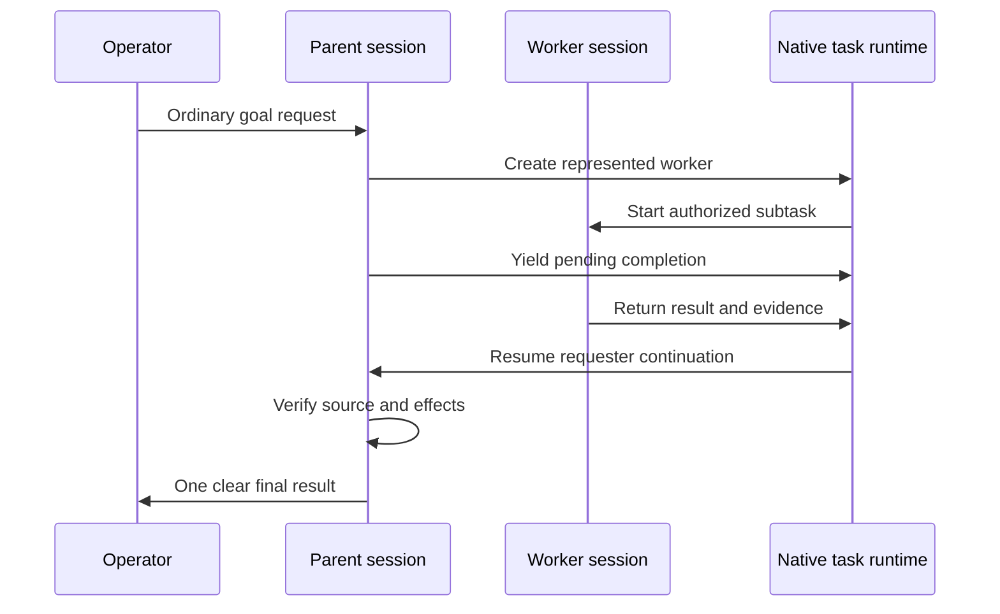

# Goals, workers and continuation

Substantial work should retain its objective and make progress without keeping the operator involved in every internal step. The current implementation uses OpenClaw's native session, task and goal ownership, with the supplied lane-contract integration for the relevant detached channel workflows.

Legacy lane terminology remains useful when describing an owned unit of work. It does not mean that an adopter must build a second scheduler from workspace JSON files.

## Direct work and delegation

A short request can complete in the current interaction. Delegate when investigation is independent, context separation is useful or a long operation needs a represented worker. A child inherits the authorized objective and boundaries; a broad question does not grant every worker permission to change every source.

Name one owner for each write surface. Workers can independently inspect separate sources while the parent owns a final mutation. Use separate project worktrees when implementation tasks would otherwise overlap. The parent checks the returned evidence before reporting completion.

## Native goals

A goal retains the objective and criteria used to judge completion. In Discord, use the registered native `/goal` command and select its start action with the goal text. The exact command options come from the installed version; see the pinned source's `docs/tools/goal.md` and `src/agents/tools/goal-tools.ts`.

The agent can continue across worker returns and model attempts without redefining the objective to match partial progress. A terminal model response is not by itself a completed goal. Conversely, an ended parent attempt can have yielded successfully while its represented child remains responsible for the next continuation.

Accepted usage is tracked against the relevant goal and run. Input, output and cache usage can accumulate across multiple accepted responses. These totals are not the current context-window occupancy, and later unrelated work must not be counted against an already completed objective.

## Yielding preserves a return path

The [durable work diagram](../diagrams/durable-lane.mmd) shows this ownership path. A yield may omit a separate acknowledgment argument, particularly when progress was already supplied. The patched dispatch path carries pending-continuation ownership through native command settlement so it is not misclassified as an empty failed response.

This does not excuse silence throughout a long task. Visible progress is a separate requirement: report material milestones and a real dependency when work cannot advance.

## Timeouts, cancellation and interruption

The configured timeout for an initial visible worker must reach the execution backend. The source package carries it through the spawn, session-creation, chat-dispatch and reply-option seams, including an explicit zero value. A timeout displayed in a task registry is not sufficient evidence that execution received it.

Different clocks can still measure different intervals. Approval waits, compaction grace and later turns can affect elapsed wall time. Do not promise that every observed duration will exactly equal the initial configured timeout.

When execution is interrupted, inspect native task/session state, its current handle and the destination effects before restarting anything. An observation request timing out does not prove that the underlying task timed out. A completed child does not prove that its result was externally delivered.

## Follow-up and recovery

Steering should attach to the existing work when the objective remains the same. A new independent request may justify a new task. Avoid launching a second mutation owner simply because the first task's narrative is incomplete.

A continuation checkpoint records the objective, completed and unresolved work, authoritative evidence, actual active handles, boundaries and next step. On resume, refresh source and effect state. The checkpoint is a map to the evidence, not a substitute for it.

A context reset clears the current goal/context boundary as defined by the runtime. Retained history or a stable session UUID may remain. Verify the reset event and compiled context instead of assuming that a new UUID is the only proof of a fresh context.

## Acceptance

Test a natural request through the actual channel. Verify worker representation, the yield result, requester continuation, goal completion and the visible final. Add separate tests for deadline expiration, failed children, interrupted admission and ambiguous delivery where those properties are required.

The relevant implementation lives in the runtime patch: `extensions/lane-contract`, native task/harness scope, goal accounting and reply dispatch. [Source changes](20-runtime-source-changes.md) identifies the files; [delivery](13-delivery-and-control-surface.md) explains the external boundary.
