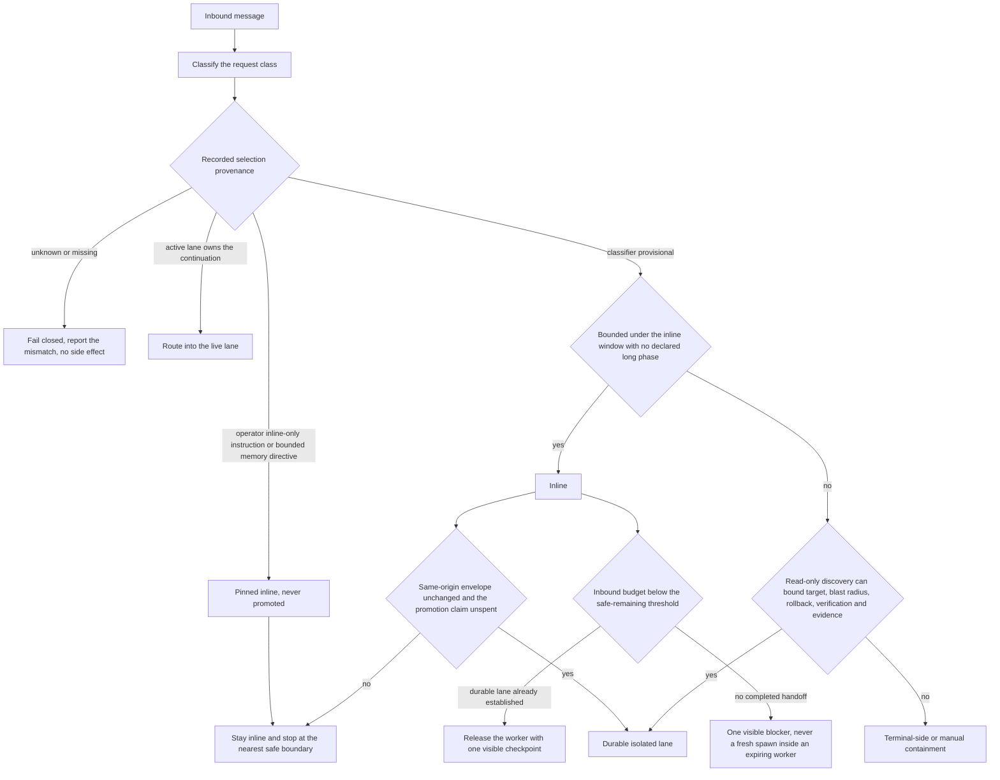
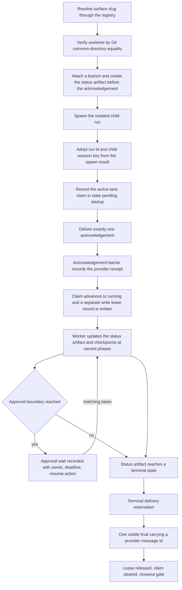

# Execution modes and durable lanes

This chapter solves one problem: deciding where a request actually runs before anything irreversible happens, and
making that decision auditable afterwards. A short reply turn is the wrong place for work that takes ten minutes,
rewrites a repository, or has to survive the runtime restarting underneath it, so that work is moved into a **durable
lane** — a separately spawned child run with its own identity, its own state file on disk, and its own isolated copy
of the repository to write in, while the conversation keeps only a summary view of it.

The failure this defends against is not a crash. It is a silent mode substitution: long or risky work running inside
a chat turn that cannot survive a restart, cannot be resumed, and leaves no record that it ran. The operator sees a
reply that stops mid-sentence and has no way to find out how far it got, what it changed, or whether anything is
still running. Read [policy and authority](05-policy-and-authority.md) first for the approval vocabulary assumed
here, and [a worked example](07-worked-example.md) afterwards for this machinery traced end to end on one request.

## The three modes

Exactly one mode is selected for a turn before any side effect, and modes are never silently substituted.

| Mode | Where work runs | When it is correct |
|---|---|---|
| Inline | The inbound reply turn itself | Bounded work that finishes inside the inline window and touches no declared long phase |
| Durable isolated lane | A separately spawned child run with its own identity, status artifact, and worktree | Anything long, resumable, or mutating beyond a trivial blast radius |
| Terminal-side or manual containment | Outside the agent, driven by the operator | Bounded execution cannot be established, the control path is itself unsafe, or the boundary is human-only |

Two of those terms are worth pinning down before they recur. *Blast radius* is how far an action's effects reach,
from local and contained to external and irreversible; together with reversibility it is what decides both the
execution class and the mode. And *terminal-side* means at the operator's own terminal — it is unrelated to a run's
*terminal state*, which appears later in this chapter with an entirely different meaning.

The third mode is a destination, not a refusal: somewhere for work the agent cannot safely own to land. The agent
still does the read-only preparation that makes the operator's own step short.

## Mode selection as a decision procedure

Selection is a procedure over recorded state, not a keyword lookup.



Source: [`diagrams/execution-mode-decision.mmd`](../diagrams/execution-mode-decision.mmd).

The decision is persisted, not implied. Without a written record, a deliberate inline run and a durable lane that was
supposed to start but never did look identical afterwards: in both cases the conversation contains a reply and
nothing else. One execution-mode record is therefore kept per conversation and origin message, with this shape.

| Field | Meaning |
|---|---|
| Selected mode | Which of the three modes the turn committed to |
| Mechanism | The machinery carrying it: inline, a native subagent spawn, an agent-control protocol call, direct execution, or terminal-side |
| Selection provenance | Why this mode was chosen, from the fixed vocabulary below. This is the field that decides whether the choice may later change without asking |
| Approval envelope | A string naming the bounded scope the operator approved, so a later step can be tested against it rather than against memory |
| Approval receipt reference | Optional pointer to the receipt for that approval |
| Promotion claim and outcome | Whether the one-time inline-to-durable promotion was claimed for this origin, and what came of it |

*Selection provenance* means the recorded reason a decision was made. The distinction is worth stating plainly,
because this chapter closes with a table about [capability provenance](03-capability-provenance.md), which is a
different idea entirely — that one is about how well a capability is proven, this one is about who or what chose the
execution mode. Six values are defined and they carry different powers.

| Provenance | Recorded when | Promotable without a fresh round trip |
|---|---|---|
| Classifier-provisional | The request classifier picked a mode on its own, as a working guess | Yes — the only one |
| Operator-pinned | The operator named the mode in their own message | No |
| Active-lane-pinned | A live lane already owned this continuation | No |
| Runtime-selected | The runtime resolved the mode from configuration rather than from the request | No |
| Provider-approved-switch | A mode change that had already been approved through the approval path | No |
| Adaptive-promotion | The record is itself the result of a promotion that already happened | No — the claim is spent |

Only an exact match on classifier-provisional permits promotion, and the reasoning generalizes: promotion is
unsurprising precisely when nobody has yet expressed an intention about the mode. Every other value records an
intention held by someone — the operator, a live lane, the configuration — and quietly overriding a recorded
intention is the substitution this chapter exists to prevent.

### The routing contract behind the classifier

Classification is not free-form judgement either. A machine-readable delegation contract declares the request classes
the system recognizes, named for the shape of the work rather than its subject matter — concise analysis, bounded
diagnosis, multi-pass research, substantial implementation, mixed research and build. Each class binds three things:
a default execution mode, a worker pattern, and whether a visible acknowledgement is required. The substantial
implementation row is the load-bearing one, because it declares inline execution disallowed and a durable lane
required. That single declaration is what stops the largest class of work from being routed into a chat turn by an
otherwise reasonable-looking decision on a busy day.

The same contract carries the inline time ceilings, the deadline-guard budget described next, the fan-out rules, and
the enforcement points where continuation is gated. Keeping them in one declarative file rather than scattered
through code is what makes routing behaviour reviewable without reading the runtime — and reviewable is the whole
point, since these are the parameters an adopter will need to change first.

Lanes may only be started or resumed through registered entrypoints. A worker-entrypoints contract names each
sanctioned entrypoint, its runtime kind, the helper implementing it, which modes it supports — `start`, `resume`, or
both — and its preconditions, such as requiring a tracked run, a planning note, or an expected delivery route. Every
entrypoint declares fail-closed as its failure mode. An unregistered way to start a lane is the same class of defect
as an unverified worktree: it produces a running worker that no supervisor knows to watch, and the first evidence of
it is usually a conflicting write.

## The inbound deadline guard

The process handling an inbound message is not durable and does not get to run indefinitely: the surface it answers on
expects a reply, and the worker holding the turn can be lost at any moment. So it runs against a hard wall-clock
budget, paired with a *safe-remaining threshold* — the point at which there is no longer enough time left to finish
anything worth starting. To make the shape concrete: a budget on the order of half a minute with a threshold at
roughly the last third of it is a workable illustrative pairing. Both numbers are contract parameters, not
constants of the design; an adopter reads the values that actually apply from the routing contract in their own
build rather than from this document.

The guard's important half is that it does not wait to measure. A declared list of long phase kinds — build, test,
install, gateway restart, long execution, process polling, coding session, model download, database cleanup, deploy,
push, external mutation, live verification, and approved high-risk execution — forces lane establishment *before*
execution begins rather than after the first slow step has already burned the budget. Detecting slowness empirically
is always too late: by the time a build has proven itself slow, the worker that could have handed it off is nearly
out of time.

Two endgame rules do the real work when the threshold is crossed anyway.

1. **With a durable lane already established**, the inbound worker is released after emitting one visible checkpoint.
   The work continues in the lane; only the short-lived worker goes away.
2. **With no completed handoff**, no fresh spawn is attempted inside the expiring worker. One visible blocker is sent
   and the turn stops. Spawning inside a worker that is about to be killed is the worst available outcome — the spawn
   may register a claim and then die before the child confirms startup, leaving an ownership record for a lane that
   does not exist and a conversation that appears to own work nobody is doing.

A visible checkpoint is not a durable handoff. Saying "this is running in the background" produces text; establishing
a lane produces a claim, a status artifact, and a resumable child. Only the second one survives the worker.

## One-time inline-to-durable promotion

An inline turn that discovers it is larger than it looked may buy exactly one promotion into a durable lane without a
second approval token. The concession exists because the alternatives are both bad: bouncing the request back for a
token the operator has effectively already given is friction with no safety value, and finishing inline means the
work dies with the worker. Since the request itself has not changed — only the estimate of its size — nothing the
operator approved is being enlarged.

One is the limit, and the claim is recorded and atomically consumed so it cannot be spent twice for the same origin.
A second promotion would mean the size estimate was wrong twice over, which is evidence that the envelope is not
understood — and an envelope nobody understands is the wrong thing to keep expanding without asking. All five
preconditions must be unchanged from the approved inline request: the objective, the target, the account or workspace
route, the mutation and risk class, and the stated exclusions. Any change to any of them is an envelope-boundary
change and re-enters the approval ladder in [policy and authority](05-policy-and-authority.md).

The spawn shape is fixed rather than improvised:

| Property | Value |
|---|---|
| Run mode | the durable run mode, not a nested inline call |
| Context | isolated child context |
| Cleanup | keep, so run state survives for resume and inspection |
| Sandbox | inherited from the parent |
| Agent, model, thinking level, working directory | inherited **by omission** — not passed at all |

Inheritance by omission is deliberate: per-spawn model or thinking overrides are forbidden on native durable spawns, so
worker defaults resolve from configuration rather than from whichever turn happened to spawn the lane.

## Pinned-inline classes that fail closed

Four classes are pinned inline and are never promoted. Each stops at the nearest safe boundary and reports the
mismatch instead of guessing.

| Class | Why promotion is refused |
|---|---|
| Unknown or missing inline provenance | The inline choice cannot be proven provisional, so promotion cannot be proven unsurprising |
| An operator-authored inline-only instruction | The operator already selected the mode |
| A bounded memory directive | The bound is the point of the directive |
| An active-lane inline continuation | A live lane already owns this conversation; promotion would open a second writer |

The general posture: when provenance, ownership, identity, or approval cannot be positively proven, the run refuses.

## Durable lane anatomy and identity



Related diagram: [`diagrams/durable-lane.mmd`](../diagrams/durable-lane.mmd), which draws the same
lifecycle as a state machine, with the collision and orphaned-lease branches named as states.

Preconditions are checked before the acknowledgement, never after, because an acknowledgement is a promise the
operator will hold the system to. Each one proves something different, and a lane that skipped any of them would be
running somewhere nobody could name afterwards.

| Precondition | What it proves |
|---|---|
| A *surface slug* — the registry's short name for one addressable repository or system — resolved through the topology registry | The lane is working on a declared surface rather than on a path somebody typed |
| A canonical source root that exists | The declared surface has a real root behind its name |
| A worktree whose Git common directory equals that source root's | The isolated write surface genuinely belongs to the intended repository, and not to one that merely sits at a similar path |
| A branch attached to that worktree | The lane's writes land somewhere with a name and a history, so they can be reviewed or abandoned as a unit |
| A status artifact created at or before the acknowledgement | The durable record exists before anything visible implies that it does |
| Exactly one visible acknowledgement | The conversation gains exactly one owner for this work — not zero, and not two |

Four conditions force *fail-closed*, meaning the lane refuses to establish rather than proceeding on a guess: an
unverifiable worktree, ambiguous branch or worktree identity, a missing or inconsistent resume target, and missing
approval. What they share is that continuing would produce work whose location, ownership, or authorization could
not be reconstructed afterwards — and unreconstructable work is worse than absent work, because someone will
eventually trust it. Worktree layout is covered in [source layout and
artifacts](09-source-layout-and-artifacts.md).

Identity comes from the spawn result. The lane and runtime run identifiers and the child session key are read back
from the spawn, never from a planning slug, a proposed branch name, or any pre-spawn placeholder. The worker may
append to or targeted-edit its status artifact but may never overwrite the identity fields; a mismatch produces an
identifier-propagation blocker rather than a delivery.

The status artifact is what a supervisor reads instead of reading the conversation. One file has to answer nearly
every question that can be asked about a lane from outside it, which is why everything later in this chapter gates on
it. There is one deliberate exception: write ownership lives in its own record, for the reasons given in the next
section, and that record points at this artifact rather than the other way round. The artifact itself is flat — one
level of keys, with structure only where a field is genuinely a set — so a supervisor or a recovery path can read the
one key it came for without walking a tree. The full shape is in
[`schemas/durable-status.schema.json`](../schemas/durable-status.schema.json)
and a completed instance in [`examples/durable-status.example.json`](../examples/durable-status.example.json).

| Field | Meaning |
|---|---|
| `schema` | Version of the record shape, so a file written long ago is read under the rules it was written under |
| `lane_id`, `runtime_run_id`, `child_session_key`, `origin_message_id`, `delivery_target` | Immutable after spawn: which lane, which run inside the runtime, which child session, which inbound message caused it, and where its result is owed. All of them are adopted from the spawn result rather than from a placeholder |
| `state` | Where the lane is in its lifecycle, from establishing through the terminal outcomes |
| `health` | A second, independent axis. Health is never inferred from lifecycle state, because a lane can be executing and unhealthy at the same time |
| `acceptance_level` | How strong the evidence behind the result is: not yet verified, verified locally, verified against the real external effect, or unverifiable |
| `scope` | The declared objective this lane owns, written before execution so a later step can be tested against it |
| `single_worker_reason` | Why fan-out stayed at one worker. Present whenever it did |
| `write_boundaries.allowed[]`, `write_boundaries.forbidden[]` | The paths this lane may and may not modify, declared before execution rather than reconstructed after it |
| `phases[]` of `{name, state}` | The named progress ladder with per-phase state, which is what a checkpoint is emitted against |
| `checkpoint_due_within_minutes`, `checkpoint_delivery_strategy` | When the next operator-visible update falls due, and how it will be sent |
| `owed_final_type` | What kind of terminal result this lane owes. The obligation is opened at acknowledgement time and clears only on a visibly delivered final or an explicit cancellation |
| `blockers[]` of `{code, impact, detail, source_route_exercised, next}` | Typed blockers rather than prose. `source_route_exercised` names the route that was actually tried, which keeps "the route was tried and failed" distinct from "the route was never attempted" |
| `diagram_artifact` | Where the diagram this lane produced was written, when it produced one |
| `delivery_state`, `delivery_message_id` | Whether the owed final has gone out, and the provider's own identifier once one confirms it did |
| `updated_at` | Last write. Staleness has to be measurable, not felt |

An older shape exists alongside it for chat-origin coding slices: the same identity keys carried as front-matter
fields in a Markdown file, plus result, acceptance, and verification blocks. Two shapes sharing one identity
vocabulary is a deliberate compromise rather than an accident — the parser derives the same identity, wait, and
delivery facts from either, so a supervisor never needs to know which shape it is reading.

Several facts a supervisor uses are computed by that parser at read time rather than stored in the file: whether the
identity fields verify against the claim, the wait signals unpacked later in this chapter, visible delivery receipts,
terminal-delivery flags, and the classified approval boundary. They are derived views, which is why they are absent
from the table above. Deriving rather than storing them keeps one authority per fact — a stored copy of a derived
value is a second answer waiting to disagree with the first.

## Write leases and the active-lane index

Two questions have to be answerable at any moment, and each has its own record. *Does this conversation already own a
lane?* is answered by the active-lane index. *May this run write to these paths right now?* is answered by the write
lease. They are separate because they fail separately: a conversation can legitimately own a lane that is not
currently permitted to mutate anything, and conflating the two makes the second question unaskable.

### The active-lane index

The index keeps one claim file per channel scope — one conversation surface — named by a hash of the scope
identifier rather than by the identifier itself. Mutations run inside a per-path serialization queue *and* an
advisory file lock with bounded retries and a stale threshold on the order of thirty seconds, and each write is
atomic. Two layers of exclusion sound redundant but are not: the queue serializes writers inside one process, and
the file lock serializes them across processes, which is the case a restart creates.

| Claim field | Meaning |
|---|---|
| Channel scope, origin message | Which conversation surface the claim covers, and the inbound message that opened it |
| Child session key, run id, runtime run id | The lane's identity, carried in three forms so a mismatch in any one is detectable |
| Status artifact path | Where the lane's durable state lives. The lease record sits beside it and names it by filesystem identity, so the artifact is found from the claim and the lease is found from the artifact's location, never from a field inside it |
| Recorded at | When the claim was written |
| Session generation | A monotonic counter distinguishing successive owners of the same scope |
| Provider acknowledgement receipt | Proof the visible acknowledgement actually reached the surface |
| Startup receipt | Proof the spawned child confirmed it was running |
| Worktree owner, write-set owner | Which lane holds the isolated checkout, and which holds the right to write the paths |
| Lease state | Either pending-startup or running, mirrored from the lease record, which stays the authority if the two disagree |

A claim counts as live only when three things hold together: the lease state is pending-startup or running, the
referenced status artifact is non-terminal, and that artifact's child session key and run id match the claim. Any one
of the three alone is forgeable by an accident — a leftover file, a stale state string, a recycled identifier — and
requiring all three is what makes a dead lane fall out of the index by itself rather than by cleanup.

Startup confirmation returns a typed result rather than a boolean, with eight named rejection reasons: claim missing,
lane run mismatch, runtime run mismatch, runtime ended, immutable-identity mismatch, provider acknowledgement
missing, write-lease collision, and claim persistence failure. The value of naming eight is diagnostic. "Lane failed
to start" sends an operator reading logs; "runtime ended" and "provider acknowledgement missing" each point at one
subsystem and one likely cause.

A companion origin-coverage index, expiring after about a day, records which inbound message a lane already covers,
so a redelivered or replayed message is recognized as already served instead of starting a second lane for the same
request. And a stale status artifact still reading "executing" is recovery evidence, never proof of a live lane. That
distinction is the whole difference between resuming work and starting a second writer on top of the first.

### The write lease

The write lease is a versioned compare-and-swap record: a writer reads the current version, and its write succeeds
only if the stored version is still the one it read. If another writer got there first the acquire fails instead of
overwriting, which is what makes concurrent mutation by two lanes structurally impossible rather than merely
discouraged.

The lease is its own record in its own file, written beside the status artifact rather than inside it — conventionally
`<artifact-root>/<lane-id>/lease.json` next to `<artifact-root>/<lane-id>/status.json` — and the status artifact holds
no reference to it at all. The binding runs one way: the lease names the artifact, and the artifact does not name the
lease. Two reasons make that separation structural rather than tidy-mindedness. The first
is that the lease binds the artifact it protects by filesystem identity, and no record can bind the file it lives in:
a lease nested inside the status artifact would be copied along with any replacement of that artifact and would then
certify the replacement as the file it was guarding, which is precisely the substitution the binding exists to catch.
The second is that the two records have to fail independently. A lane may legitimately hold a status artifact with no
live lease — parked at an approval boundary, released after closeout, or waiting for a successor to prove the previous
owner is dead — and a lease whose artifact has vanished is a diagnosable inconsistency rather than a lost lease. One
file cannot express either of those states about itself.

| Bound element | Meaning |
|---|---|
| Channel scope, origin message, root run id, child session key | The immutable identity this lease belongs to |
| Lease state: pending-startup, running, or released | Carried on the lease itself, so a released lease is a recorded fact rather than something inferred from a missing file |
| Generation and epoch | Monotonic counters. Generation increments on ownership handover, so a stale holder's write is rejected by its number alone |
| The protected status artifact as path, device, and inode | The lease names the artifact it guards by filesystem identity, not only by path, so a file deleted and recreated at the same path is correctly seen as a different file. This binding is the reason the lease is a separate file |
| Runtime owner: runtime run id, embedded session id, provider-authentication flag, heartbeat time | Which live runtime holds it, and when it last proved it was alive |
| Locked write sets, each as real path, branch, and lock id | The *write set* is the concrete set of paths one worker may modify. Each is additionally guarded by an operating-system exclusive lock file |
| Acquired and released times, a same-run reacquire marker, and a successor record when there is one | The lease's own history: when ownership began and ended, whether a resume reacquired it idempotently, and what admitted a takeover |

A lease under a running lane has roughly this shape. The full contract is in
[`schemas/write-lease.schema.json`](../schemas/write-lease.schema.json) and a completed instance in
[`examples/write-lease.example.json`](../examples/write-lease.example.json).

```json
{
  "schema": "write-lease/v1",
  "lease_id": "<lease-id>",
  "lease_state": "running",
  "channel_scope_id": "<channel-id>", "origin_message_id": "<origin-message-id>",
  "root_run_id": "<run-id>", "child_session_key": "<session-key>",
  "generation": 1, "epoch": 1,
  "protects_status_artifact": { "path": "<artifact-root>/<lane-id>/status.json",
                                "device": "<device-id>", "inode": "<inode-id>" },
  "runtime_owner": { "runtime_run_id": "<runtime-run-id>", "embedded_session_id": "<session-key>",
                     "provider_authenticated": true, "heartbeat_at": "<t4>" },
  "locked_write_sets": [ { "real_path": "<worktree-root>/scripts/",
                           "branch": "task/example-project-build-validation",
                           "lock_id": "<lock-id>", "exclusive_lock_held": true } ],
  "acquired_at": "<t1>", "released_at": null,
  "reacquired": "idempotent-same-run", "successor_record": null
}
```

Three rules make the lease load-bearing rather than decorative.

1. A colliding acquire performs **zero writes** and returns a typed collision, which becomes exactly one
   deduplicated blocker. A collision handler that wrote anything at all — even a diagnostic — would be the second
   writer it exists to prevent.
2. Identity is never repaired in place. A mismatch is reported, never corrected. Automatic repair here would mean
   guessing which of two disagreeing identities is real, and a wrong guess silently transfers ownership of live work.
3. Taking a lease from a dead owner requires generation N plus one, together with a recorded successor entry
   carrying proof the prior owner is dead, an inventory diff showing what the dead owner left behind, and a fan-in
   plan for reconciling it. A same-run resume needs none of that and is idempotent — running it twice leaves the
   same state as running it once — because nothing changed hands.

Colliding spawns are cancelled synchronously rather than left for an asynchronous cleanup pass. A session-label
collision is the observable signature of two live lanes, so the superseded run is written to a cancelled status
immediately — every second of delay is a second in which two writers are both live and both convinced they are
alone.

## Active-lane-first follow-up binding

While a conversation owns a live lane, every plausibly related operator message routes into that lane —
continuations, corrections, added acceptance criteria, scope refinements, status questions, and expressions of
frustration alike. The bias is deliberately aggressive because the alternative is worse in a specific way: an
operator who adds a requirement while work is running expects it to reach the work that is running. If that message
instead opened a second lane, two workers would be editing overlapping paths from different instructions, and the
operator would have no way to tell which of the two eventual results reflected the correction.

A second concurrent lane therefore requires explicit new, separate, second, concurrent, or parallel intent in the
operator's own current message, or an explicit override flag on the start path. Quoted assistant text never supplies
that intent, and neither does the system's own inference about what the operator probably meant — an inference that
opens a second writer is exactly the class of guess this chapter forbids everywhere else. A bare "continue" is
consequently not ambiguous at all: it binds to the live lane by construction, which is why the index is consulted
before classification as well as before spawn.

## The acknowledgement barrier and acknowledgement suppression

Public lifecycle vocabulary is fixed: **durable lane established** for the single acknowledgement, **durable lane
checkpoint** for non-terminal updates, **durable lane final** for the sole terminal result. Visible headings must
agree with the authoritative structured delivery metadata; a heading renders state, it does not assert it.

The barrier classifies deliveries into acknowledgement kinds and worker-visible kinds, resolves a lane's child
identity behind a short reservation lease so two workers cannot claim the same child, and asserts that a confirmed
acknowledgement exists before any checkpoint or final may be delivered — a missing or rejected acknowledgement
blocks those deliveries rather than permitting an unstructured fallback message. It also publishes a subscribable
visible-delivery event, which is how a confirmed provider receipt reaches lease and supervision state.

Suppression is the complement. The one-acknowledgement rule is enforced against repeat announcements for the same
lane identity, and cancelled or superseded runs own no worker-visible final at all — their late output is suppressed
rather than interleaved with a successor lane. Suppression never cancels an obligation: a delivery obligation
created at acknowledgement time clears only on a visibly delivered final or an explicit cancellation.

## Checkpoint discipline

Checkpoints are owed on meaningful boundaries, not on a timer, because a periodic update carries no information: an
operator cannot tell a lane making progress from one looping on a failure if both emit a line every two minutes.
Per-request-class rules bind a class to a trigger list — planning complete, worker established, repository
identified, blocker, destructive boundary, verification result, fan-in, ready for review — plus three limits.

| Limit | What it controls | Failure it prevents |
|---|---|---|
| Batch window | How long related triggers are collected before one update is sent | Three checkpoints in ten seconds because three phases happened to complete together |
| Maximum fragmentation | How many separate updates a run may emit at most | A running commentary that trains the operator to skim the one channel a blocker will arrive on |
| Timeliness target | How promptly an owed update must actually appear | An update that is technically owed and indefinitely deferred |

Higher-risk classes get more triggers and a larger fragmentation allowance, since there is more the operator might
need to interrupt. Low-risk classes are capped at a single coherent update.

Supervision supplies the deadlines: first checkpoint due within about five minutes, active-silence warning near
fifteen, hard silent-gap ceiling near eighteen, enforced by deadline timers with a visible fallback rather than busy
polling. Named phases are the content: accepted, implementation started, tests started, tests passed, commit and
normalize, closeout, blocker. A contentless progress ping is not a checkpoint, and bare placeholder labels are
rejected by the reporting path. An executing checkpoint states that the operator should wait, so silence after it is
a known state rather than an unanswered question.

## Approval wait as resumable same-lane state

An approval boundary parks the lane; it does not end it. The artifact's lifecycle state becomes `waiting-approval` or
`waiting-input`, and the parser resolves the park into a wait view with a fixed field set — five facts a supervisor
needs about any parked lane, whichever of the two artifact shapes it was read from.

| Derived field | Meaning |
|---|---|
| `waitSignal` | what class of wait this is |
| `waitOwner` | who must act — the operator, or an external dependency |
| `waitDeadline` | when the wait itself expires |
| `waitResumeAction` | the exact next atomic step on resume |
| `waitResumeRegistered` | whether the resume path is actually registered, not merely intended |

A non-terminal worker may park only on a receipt-backed approval or input wait, or a fully registered future
background wait. Parking on yield-looking output with nothing registered is not a wait; that enters bounded
same-child recovery without replaying side effects. The boundary is classified into six next-boundary classes — none,
executable under the current approval, executable under a bounded approval, human-only, blocked on an unavailable
external dependency, and an acceptance impossible as stated — onto which three approval tokens map.

When a matching token arrives the lane resumes automatically **in the same lane**: same run identity, same child
session, same write lease, next generation of work rather than a new claim. Phase-boundary honesty applies here too
— if a later phase leaves the current approval envelope, the run stops before it, names the exact boundary, and
offers three options: proceed with the approved subset, re-approve the bounded higher-risk plan, or stop.

## Single-writer completion and reconcile before duplicate

The status artifact must reach a terminal state before the visible final is sent, so the durable record is never
behind the message the operator has already read. Eight terminal strings are recognized, collapsing to the six
outcomes named in [policy and authority](05-policy-and-authority.md) because two of them accept a spelling variant,
and only the complete outcome counts as success-terminal here. When a worker lane delivers its own final, the
parent must not also send one unless a fresh read proves no equivalent final is visible, and any corrective parent
send must be plainly supplemental. One logical final is one message: a concise summary plus at most one attachment
under the same terminal identity; if that attachment cannot be prepared, the run fails rather than fragmenting.

Supervision reconciles before it duplicates. A lane at success-terminal with only its visible final pending gets a
bounded re-check window, for a bounded number of attempts, before any blocked escalation; if a blocked escalation was
already emitted and a confirmed receipt then arrives inside the post-escalation reconciliation window, exactly one
corrective checkpoint supersedes it and supervision stops. Failure-terminal escalation stays escalate-once-then-stop.
Those three windows are tuning parameters, tabulated as illustrative defaults in [delivery and the control
surface](13-delivery-and-control-surface.md#illustrative-tuning-defaults), which also specifies the exactly-once
ledger behind this.

## Fan-out and the worker ledger

Fan-out is constrained rather than encouraged, because parallel workers multiply precisely the things this chapter
spends its length protecting: identity, write ownership, and delivery ownership. The default worker budget is one,
with a safe ceiling of three. Two or three workers suit genuinely independent read-only partitions and not much else.

Staying at one requires a recorded single-worker reason. Writing the reason down is what keeps a lane that ran alone
on purpose distinguishable from a fan-out that silently failed to launch — from the outside those look identical.
Launching or resuming a broad lane requires either that reason or a worker ledger, one row per worker.

| Ledger field | Meaning |
|---|---|
| Worker id | The identifier this worker's records are filed under |
| Scope | The slice of the objective this worker owns |
| Source surface | Which declared surface it works on |
| Worktree or read scope | Its isolated checkout, or its read-only extent if it does not write |
| Allowed and forbidden paths | Its write set, stated in both directions rather than only as a permission |
| Shared resources | Anything it touches that another worker also touches, named in advance |
| Status artifact | Where its own state is recorded |
| Expected output | What it must produce for fan-in to be possible at all |
| Fan-in owner | The single named party responsible for merging this worker's result |

Four conditions forbid fan-out outright, and each has a distinct failure behind it.

| Condition | Why it disqualifies |
|---|---|
| Overlapping write sets | Two workers permitted to modify the same path will eventually do so at once, and the lease can only report that collision, not resolve it |
| A widened approval boundary | Splitting work is not a way to enlarge what was approved; if the split needs more scope, the approval is what has to change |
| Ambiguous delivery ownership | If two workers each believe they owe the final, the operator receives two finals or none |
| An unnamed merge owner | Parallel results nobody owns merging are not results — they are branches waiting to conflict |

Multi-worker runs reuse the same durable-slice briefs and the same status-artifact model rather than inventing a
parallel one, because a second worker-identity model would mean two vocabularies for one state and every supervisor
would have to learn both.

## Architecture acceptance before patching

Before a fix is accepted, the trace is followed end to end: entrypoint, wrapper, runner, injected dependency,
artifact writer, live boundary. A green test over a broken wrapper is not acceptance. After two failures of the same
class, blind patching stops and the boundary trace is produced.

The delivery-specific variant is stricter: after two failures with the same delivery symptom, a fix requires an
integration boundary matrix plus a failing end-to-end reproduction before any further change. A delivery path crosses
more owners than a single process does, so "it works locally" is no evidence about the boundary that failed.

## Capability provenance for this chapter

| Capability | Reference implementation | Stock runtime |
|---|---|---|
| Three-mode taxonomy, no silent substitution | runtime-backed | policy-only |
| Persisted mode-selection record and provenance | runtime-backed | policy-only |
| Inbound deadline guard | helper-backed, contract-parameterized | policy-only |
| One-time inline-to-durable promotion | runtime-backed | policy-only |
| Lane establishment and worktree verification | helper-backed | helper-backed |
| Spawn-derived immutable identity | runtime-backed | policy-only |
| Active-lane index and write lease | runtime-backed | not available |
| Acknowledgement barrier and suppression | runtime-backed | policy-only |
| Approval wait and automatic same-lane resume | runtime-backed | policy-only |
| Single-writer completion and closeout reconciliation | runtime-backed | policy-only |
| Fan-out limits and worker ledger | policy-only, with the ledger shape carried in a contract template | policy-only |

This table carries implementation levels only. Live-proven is a claim about evidence rather than about
implementation, and it is reached against one installation, so an operator asserting it for any mechanism above
would have to retain acknowledgement-barrier entries and durable-lane status trees produced by ordinary traffic
rather than by test fixtures — enough of them, spread across enough distinct runs, that the mechanism can be seen
carrying routine work and not just passing a demonstration — each dated and inside a declared freshness window.
Absent that record, the honest label is the implementation level shown above. See
[capability provenance](03-capability-provenance.md) for the taxonomy and [evidence, audit, and
verification](15-evidence-audit-and-verification.md) for how these claims are checked.

Where this leads. [A worked example](07-worked-example.md) traces one request through every mechanism above in
order, which is the fastest way to see how they compose. [Delivery and the control
surface](13-delivery-and-control-surface.md) specifies the exactly-once ledger that the final send depends on, and
[guards, health, and restoration](14-guards-health-and-restoration.md) covers what happens when a lane is found in a
state none of this anticipated.
