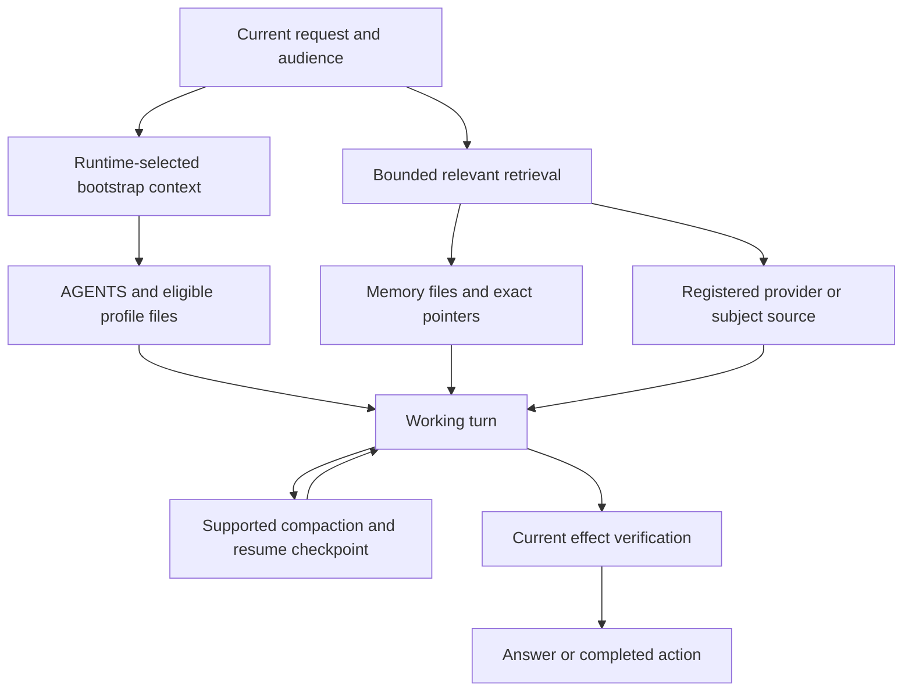

# Memory and context

A useful assistant needs continuity without treating its entire history as current truth. The reference keeps a small behavioral contract, a few stable working preferences, compact source pointers and a larger body of deliberately retrieved material. Current repository, provider and domain facts still come from their authoritative source. Memory helps find the answer; it cannot prove a meeting time, deployed version or transaction outcome has remained unchanged.

The runtime controls which files enter a model turn. Workspace manifests describe intended roles and aid review, but they do not load files, change a model or grant access. This chapter describes the actual filename and session filtering in the pinned source and the policy built around it.

## Three different kinds of continuity

| Layer | What it preserves | What it cannot establish |
|---|---|---|
| Working conversation and supported compaction | The active objective, recent reasoning context and task continuity | Fresh provider state or an external effect that was never read back |
| Durable memory files and registered subject/context sources | Useful facts, preferences, decisions and source pointers across tasks | Behavioral authority or permission to disclose into a different audience |
| Native session/task and effect records | Execution identity, current task state and relevant operation/delivery receipts | The quality of the final answer without source and user-surface verification |

The [standalone diagram](../diagrams/memory-tiers.mmd) includes the privacy boundary. These layers complement one another. A compact summary can say that an email was prepared, but the next turn must inspect the provider before concluding that it was sent or sending it again.

## What the runtime recognizes

The pinned source's `WORKSPACE_BOOTSTRAP_FILENAMES` in `src/agents/workspace.ts` contains `AGENTS.md`, `SOUL.md`, `IDENTITY.md`, `USER.md`, `BOOTSTRAP.md` and `MEMORY.md`. Recognized means eligible for the loader, subject to file presence, safe reads, session filtering, setup/continuation handling and context budgets. It is not a promise that the entire file appears in every prompt.

`TOOLS.md`, `WRITING.md` and `WORKER.md` are outside that recognized list. TOOLS remains a detailed mechanics reference opened when AGENTS routes a task to it. WRITING is opened for applicable long-form prose. WORKER, if retained, is a legacy generated reference. Extra-file configuration is not a universal bypass of accepted bootstrap basenames.

The `filterBootstrapFilesForSession` implementation applies two separate decisions: privacy filtering and the session-specific filename allowlist.

| Session classification | Relevant behavior |
|---|---|
| Native `subagent:` | Root MEMORY removed; only AGENTS retained by the allowlist |
| Cron | Root MEMORY removed; AGENTS, SOUL, IDENTITY and USER retained by the allowlist |
| Group or channel | Root MEMORY removed by the privacy filter; other recognized files remain subject to ordinary loading |
| Eligible private context | Recognized root memory may be available when present |
| Visible dashboard worker | Determined from its actual session/chat classification; a “worker” UI label is not itself the native `subagent:` rule |

Do not infer a worker's context from its name or a declared manifest profile. Inspect the actual compiled context when accepting a role-sensitive behavior. The public [bootstrap template](../templates/BOOTSTRAP.example.md) and [advisory manifest](../templates/policy_bootstrap_manifest.example.json) describe these boundaries without pretending to enforce them.

## Shared voice in a separate company workspace

A separate company agent needs an explicit voice policy as well as private-source
boundaries. It does not inherit the main agent's SOUL, IDENTITY or writing guide
merely because it uses the same bot name. Inspect the actual injected filenames
and truncation report before attributing generic replies to the model.

The [company workspace example](../examples/company-workspace/AGENTS.md) retains
useful team participation and authenticated operator authority. Its
[SOUL](../examples/company-workspace/SOUL.md) and
[WRITING](../examples/company-workspace/WRITING.md) preserve analytical voice and
substantial prose without importing a private USER profile or personal memory.
Its [TOOLS](../examples/company-workspace/TOOLS.md) describes capability-aware
retrieval. These are optional examples, not an automatically activated agent.
Adapt the guild and operator identifiers, source bindings and available tools.

Treat a mention as eligibility for a reply, not an obligation to sustain every
diversion. Use the surrounding discussion, quoted message and participants to
interpret intent. Brief banter can fit; repeated irrelevant bait usually needs
disengagement rather than a sequence of lectures or unrelated assignments.
Owner directions that restrict one discussion retain that scope. Permission to
answer colleagues does not grant them access to private records or spending.

Voice guidance shapes tone and argument, not factual accuracy or access control.
WRITING is still a deliberate read for substantial prose, not a bootstrap filename;
the company agent must actually have the file-read capability its policy assumes.

## Loading and retrieval expose different things

Omitting a file from bootstrap does not make every tool incapable of reading it. The agent must still respect the current request, source account and audience when retrieving. A private topic note, a source pointer and a provider record all need a reason to enter the answer. Distinct session keys are separate context boundaries unless the operator explicitly links them.

Keep detailed private records out of broad default profiles. The sample USER and MEMORY files use fictional portfolios and operating preferences. An adopter's actual files may carry substantially different sensitivity. Rate the content, not the filename, and preserve the runtime's private/shared distinction rather than assuming all main-agent sessions are private.

A pointer can disclose the subject of its target. A copied source list, hostname or account identity can reveal more than a paragraph that never names a person. Shareable work products therefore contain recipient-relevant facts and useful citations, not private file inventories or the agent's internal retrieval trail.

## Recall starts with the claim

Use stable conversation and memory for stable preferences. Use current sources for facts that can change. A request about Company Alpha's release should resolve that company's canonical repository and registered provider sources; it should not search every company account just because all accounts are connected.

The relevant portfolio can contain more than one mailbox or knowledge system. Query the bounded sources that could change the answer and retain their identities. A source-only team chat route can contribute evidence without becoming permission to reply in that team chat. [Integration routing](11-integrations-and-capability-routing.md) separates retrieval relevance from write destination.

Semantic memory search is optional assistance. If it times out or is unavailable, use exact pointers, indexed files, permitted recent conversation and the registered read-only subject/context route. Do not turn a successful fallback into a generic warning about memory. State a specific missing fact when it materially limits the answer.

Conflicting evidence is resolved by authority and freshness. “Not in the indexed notes” is a bounded retrieval result, not proof that something never happened. A historical daily aggregate and a fresh raw-data query may cover different windows or definitions. Preserve those distinctions rather than averaging incompatible records or inventing missing detail.

## Writing durable memory

The OpenClaw policy permits maintaining useful facts, preferences, decisions and source pointers as work progresses. Use the existing memory tools/files, retain source and audience boundaries, deduplicate and read back the result. A stable decision belongs in a topic note; current readiness belongs in its source/status owner. Secrets belong in neither.

Keep MEMORY compact. When a cue needs explanation, leave a pointer and move the explanation to its owning note. Do not reproduce a policy rule in every memory file, and do not promote a remembered recommendation into an adopted instruction. The [MEMORY template](../templates/MEMORY.example.md) provides a usable example without supplying fictitious personal history as fact.

These are OpenClaw's memory conventions. A separate coding harness or desktop assistant may have its own memory authorization and storage rules; copying this file does not override them.

## Compaction, warnings and resumption

Use supported compaction to preserve continuity without retaining redundant active context. At a material milestone or near the context limit, write a compact checkpoint: objective, completed and unresolved work, verified evidence, current workers/processes, constraints, blockers and the next atomic step. Detailed diagnostics stay in internal work product.

A context percentage, threshold warning or monitor message does not prove compaction ran. Completion requires an actual native compaction event/checkpoint or command result. Likewise, enabling an automatic notification preference does not prove every background producer emits start/end messages. Document and verify the exact owner whose behavior is being claimed.

The reference relies on native context-pressure and overflow compaction. It leaves
`agents.defaults.compaction.maxActiveTranscriptBytes` unset, so logical transcript
storage alone does not force a compaction. That optional byte guard also counts
runtime control records and can diverge from the content sent to the model.
The reference keeps its 120,000-token recent-tail budget, six recent turns and
summary quality guard; these retention choices do not change the model's window.
The recent-tail setting is higher than the pinned native 20,000-token default in
`src/agents/sessions/settings-manager.ts`. It retains more recent detail and leaves
less room for new retrieval between compactions, so measure that tradeoff on real
workflows before adopting the value unchanged.

Memory flushing is a separate maintenance step. The selected `memory-core` plugin
uses its native 4,000-token soft margin because
`agents.defaults.compaction.memoryFlush.softThresholdTokens` is unset. The explicit
8 MiB force-flush threshold remains. The soft margin can schedule a durable memory
checkpoint before blocking context pressure; it does not lower the compaction
threshold. The pinned sources are `src/auto-reply/reply/agent-runner-memory.ts`,
`src/auto-reply/reply/memory-flush.ts` and `extensions/memory-core/src/flush-plan.ts`.
[Configuration](../config/README.md) explains how to remove inherited overrides
when adopting this profile into an existing native configuration.

After compaction or handoff, inspect current source/process/effect state before mutating. Resume the same objective and account bindings. Do not replay a side effect merely because its earlier narrative was shortened. If the runtime can compact safely, continue; ask for a new conversation only when technically required.

The runtime's bootstrap cache refreshes before the next turn. An on-disk policy edit does not rewrite a turn already executing. Use a fresh session for isolated acceptance after a behavioral change and inspect its actual injected context. A stable session identifier alone is not enough to prove reset failure or success; verify the native reset boundary and the first compiled context.

## How to verify this design

Check the pinned source filename list and role filters, then exercise private, channel, cron and native-subagent cases in an isolated test setup. Verify deliberate TOOLS/WRITING reads separately from automatic bootstrap. Test a safe memory fallback with source/audience constraints and a resume that reconciles an already-finished effect without repeating it.

Measure token usage and latency at the actual request path. Smaller source files, a green search probe or a successful compaction command do not by themselves prove better answers or shorter end-to-end delivery. The acceptance claim should identify the role, operation and user-visible result it observed.
