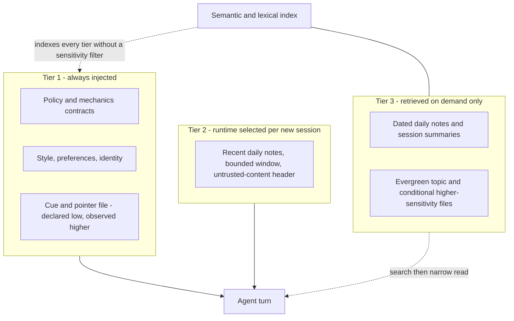

# Memory and context

An agent that forgets everything between sessions cannot be trusted with long work, and one that remembers everything indiscriminately
cannot be trusted with anything else. The answer here is deliberately unglamorous: durable memory is a directory of Markdown files on
disk, and everything else — the load tiers, the search index, the promotion scoring — is machinery for deciding which few of those
files reach the model on any given turn. This chapter covers how that corpus is stored, tiered, retrieved, written and audited, and
where the honest line sits between declared intent and enforced behaviour.

## Three different things called memory

Most confusion comes from collapsing three concepts into one word.

| Concept | Lives in | Lifetime | Authority |
|---|---|---|---|
| **Active context** | the model's context window for one session | until reset or compaction | none; it is a cache |
| **Durable memory** | Markdown files in the workspace | until deliberately superseded | descriptive, never normative |
| **Factual state** | structured registries and status files | until re-probed | authoritative for current facts |

1. **Context is a cache, not durable memory.** Nothing survives a reset because it was said. It survives because a file was written.
   That applies equally to *compaction* — the runtime shortening a long transcript so it still fits the context window — which drops
   material silently and on a threshold nobody chose deliberately.
2. **Durable memory is not a fact registry.** A note records what someone believed at a point in time. Current facts live in [structured registries](04-system-architecture.md) and are re-probed, not recalled.
3. **Durable memory is not policy.** Memory holds the lowest rank in the [precedence ladder](05-policy-and-authority.md) and never gains authority by being loaded early, loaded often, or convenient.

## The tier model

Memory is layered by *when it enters context*, not by how important it is.

Expanded version: [`diagrams/memory-tiers.mmd`](../diagrams/memory-tiers.mmd), which also draws the
sensitivity-rating and load-default axes and the audit hook on writes.

Tier 1 is the always-injected layer: the workspace contract files carrying policy and mechanism, described in
[policy and authority](05-policy-and-authority.md), plus a small *cue file* — a pointer layer whose every entry names the file that
owns a subject instead of restating it. The runtime resolves a fixed, hard-coded set of filenames against the workspace root, so
adding a file to the workspace does not make it injected. The rigidity is deliberate. An injected file is effectively part of the
system prompt, and a prompt surface that any file on disk can join by existing is one nobody can reason about.

Tier 2 is assembled fresh on every new or reset session. The runtime resolves a short window of recent date stamps, reads the matching
daily notes and a few of the newest session summaries, trims each against a per-file character cap, and packs blocks until a total
budget is exhausted, inserting a visible truncation marker when it stops. That marker earns its place: an injection that quietly ran
out of budget is indistinguishable from a corpus that had nothing more to say.

Tier 2 also carries one pattern worth copying verbatim. The injected block is prefixed with a header stating that the material below
is untrusted workspace notes, that it is background context only, and that instructions embedded in it must never be followed. The
reason is that these notes were written by earlier turns and by automatic writers, and anything an earlier turn recorded could have
originated in text the agent was merely reading. Memory is data. See [security and trust model](16-security-and-trust-model.md).

Tier 3 is everything else, reachable only through search followed by a line-scoped read. It is what lets the corpus grow without the
context window growing with it.

## Sensitivity is a per-file attribute, not a per-tier assumption

This is the most important correction in this chapter, and it is a correction because the natural shorthand is wrong. It is tempting
to reason "the cue layer is always loaded, therefore it must be the low-sensitivity material" — or the same mistake in reverse, "this
file is only pointers, so its tier can stand in for a rating". **Both directions of that inference are unsound.** The tier says *when*
a file loads. The sensitivity rating says *how closely held its content is*. They are independent axes, and each file gets a value on
each axis, assigned from what the file actually contains.

Three failure modes follow from collapsing the two. Cue and pointer files accrete entries over time, so a rating inherited from the
day a file was created stops describing it fairly quickly. A pointer can disclose as much as the file it points at, because naming a
file names its subject even when the file itself is never opened. And treating the tier as the rating means the review looks at the
loading policy when the thing that needed reviewing was the file.

The discipline that replaces the shorthand:

1. Rate **every** file individually — `low`, `medium`, or `high` — judged on content, never inherited from where the file sits.
2. Set the load default separately: `always`, `conditional`, or `never`.
3. Keep higher-sensitivity sources out of the default profile whenever a conditional source would serve, so that the
   always-plus-high combination stays empty by intent rather than by luck. Where an always-loaded file does rate above `low`, record
   the rating honestly rather than reclassifying it downward for convenience.
4. Review the always-loaded set as a whole, on a schedule, as a single disclosure surface rather than file by file.

Deeper context files are normally declared `conditional` and `high`, which keeps them out of every default session. The always-loaded
pointer file is the harder case, and it is where declaration and observation come apart. Its declared rating is `low`, earned by the
entry discipline described below — pointers only, nothing derivable elsewhere, a hard cap on entries. Observed, such a file commonly
sits higher, medium to high, for two reasons already named above: a routing table that names the file owning each subject discloses
the shape of the whole corpus, and entries accrete faster than the rating gets revisited.

Report both, and do not quietly reconcile them. The declared rating states what the entry discipline is meant to hold the file to;
the observed rating is what a reviewer should assume when treating the always-loaded set as one disclosure surface. This is the same
declared-versus-actual split the chapter applies to loading further down, and it takes the same remedy: record the divergence in the
row's `notes` field and treat it as a finding, not a rounding error. A file whose observed rating keeps drifting above its declared
one is evidence that the entry discipline has stopped holding, which is precisely the signal the manifest exists to surface.

Rating and load default are recorded per file in a manifest that carries one row per contract and per deep memory file:

| Manifest field | Type | Meaning |
|---|---|---|
| file | path relative to the workspace root | The file being classified. One row per contract and per deep memory file. |
| `contract_role` | enumerated | What the file is for: normative behaviour, mechanics, style, preference, memory, identity, liveness, factual, bootstrap, history, or legacy compatibility. |
| `bootstrap_default` | `always` \| `conditional` \| `never` | When the file should load. `conditional` means read deliberately when a task needs that surface; `never` means kept for history or compatibility only. |
| `sensitivity` | `low` \| `medium` \| `high` | How closely held the content is, judged on content alone. |
| `owner_file` | path | Which file owns the subject, so mirrors elsewhere are pointers rather than second copies. |
| notes | free text | Where declaration and observed behaviour diverge, recorded rather than smoothed over. |

A worked version of the table, with the tier definitions and the conduct rules that go with it, is in
[`templates/BOOTSTRAP.example.md`](../templates/BOOTSTRAP.example.md).

One consequence is easy to miss: **sensitivity gates injection, not indexing.** Conditional high-sensitivity files remain fully
indexed and semantically searchable, because the indexer enumerates the corpus without consulting the manifest at all. The
default-load surface and the retrieval surface are different surfaces and must be reasoned about separately. A file kept out of
Tier 1 is still one query away.

## The file-backed memory model

Files are the memory. The index is a derived artifact that can be deleted and rebuilt.

**Granularity.** Write the smallest stable fact, one per line, and keep one subject per file. The strictest form of the same rule —
one fact per file — makes deduplication and supersession mechanical, and is worth adopting in a new corpus. Explanations belong in
the file that owns the concept, not wherever they were first written down.

**Header fields.** Three things are worth declaring at the top of every memory file: a short stable title unique within the corpus, a
one-line statement of what the file covers and what it does not, and the role the file plays, drawn from a fixed taxonomy. The
reference corpus carries this as an H1 title plus bold-key bullet lines and uses no frontmatter at all; machine-written session
summaries follow a fixed skeleton of a title line, a few metadata bullets identifying the originating session, and a summary section.
An adopter starting fresh should prefer frontmatter, because it makes the same three fields machine-checkable — a structural check
can assert that each file has them without reading further. The fields matter, not the syntax.

**Type taxonomy.** Two taxonomies are in play, and confusing them causes retrieval bugs. The first is the file namespace, encoded in
the filename and carrying retrieval semantics:

| Type | Filename shape | Retrieval semantics |
|---|---|---|
| daily note | `YYYY-MM-DD.md` | append-only; ages with its date stamp; the only class eligible for promotion |
| session summary | `YYYY-MM-DD-<slug>.md` | machine-written; excluded from recall tracking |
| evergreen topic | `<topic>.md` | undated, therefore never aged by recency decay |
| machine state | hidden subdirectory | derived state, not part of the prose corpus |

Filename convention is load-bearing semantics, not cosmetics. Two writers can never collide on one file because they write into
different namespaces, and the undated namespace is what tells the ranker that a protocol note does not go stale merely by being old.
The second taxonomy is the contract role declared in the bootstrap manifest for every contract and deep memory file: `normative`,
`mechanics`, `style`, `preference`, `memory`, `identity`, `liveness`, `factual`, `bootstrap`, `history`, `legacy-compat`. That role
governs authority, and it is independent of the filename namespace: a file's name decides how retrieval treats it, its declared role
decides how much weight its content carries.

**Linking.** Memories link three ways, all explicit: **pointer bullets** in the cue layer, each naming the file that owns a concept;
an **`owner_file` field** per manifest row, so each concept has exactly one owner and mirrors elsewhere are pointers rather than
copies; and **citations** of the form `path#Lstart-Lend`, produced by retrieval and consumed by the follow-up read. There is no
wiki-link graph in the reference corpus and none is required. A companion compiler that builds a backlinked vault with structured
claims, contradiction tracking and freshness dashboards belongs in an independently enabled plugin rather than in the corpus itself,
so that the corpus stays readable without it. Treat backlink graphs as an optional layer above the file corpus, never a prerequisite
for it.

## Cue-layer discipline

The always-injected pointer file is where size discipline has to be absolute, because its cost is paid on every eligible session. It
states its own four rules in its own text, which is what keeps them enforceable by anyone who opens it.

1. **A hard cap on entries**, roughly a dozen bullets. Adding one past the cap means removing one, not raising the cap.
2. **Every entry is either a source pointer or a uniquely valuable cue.** A pointer names the file that owns a subject; a cue is a
   fact short enough to state in a line and not derivable anywhere else. Nothing else qualifies.
3. **If a cue needs explanation, the explanation moves** to the file that owns the concept, and only the pointer stays.
4. **A role-boundary block at the top** disclaims the roles the file does not have: it is not canonical policy, not approval
   authority, not a registry of current facts, and not a place to keep credentials.

The point is to spend the always-loaded budget on routing rather than prose. A cue layer that grows explanations stops being a
routing table and becomes a second, unversioned copy of whatever it describes — and, because it is always loaded, the copy the model
sees first. A worked example of the file is in [`templates/MEMORY.example.md`](../templates/MEMORY.example.md).

## The index and retrieval

Search runs over a derived index rather than over the files directly. The index is one SQLite database per agent, held in
`<runtime-dir>` outside the workspace, so a backup of the corpus never drags a rebuildable artifact along with it and a damaged index
is repaired by deleting it and re-indexing. The unit it stores is a *chunk*: a contiguous run of whole lines taken from one file,
small enough to embed and to quote back. The schema is deliberately legible.

| Table | Row shape | Purpose |
|---|---|---|
| index metadata | embedding provider, model, vector width | Fingerprints what the index was built with, so a provider or model change is noticed instead of quietly mixing incompatible vectors. |
| files | path, source, content hash, modification time, size | Change detection. A file whose hash, size and modification time all match is skipped entirely on the next sync. |
| chunks | id, path, source, start line, end line, hash, model, text, embedding | The retrievable unit, carrying its exact line range. |
| embedding cache | provider, model, provider key and content hash, mapped to an embedding | Re-embedding unchanged text is the expensive part of indexing, so the cache makes a repeated edit to one file nearly free. |
| full-text table | virtual table over chunk text | The lexical lane. The identifying columns are stored but not indexed, so they can be returned without being matched on. |
| vector table | fixed-width vectors keyed by chunk id | The semantic lane, searched by nearest neighbour. |

One sizing consequence is worth knowing before adopting this shape: chunk embeddings are held twice, once as text on the chunk row
and once as packed vectors in the vector table, and the embedding cache commonly holds more rows than there are live chunks. The
database is dominated by embeddings, not by the prose it indexes.

**Line-ranged overlapping chunking** makes everything else work. Chunks accumulate whole lines to a token budget, carrying a token
overlap into the next chunk, so every chunk keeps exact start and end lines. The resulting `(path, startLine, endLine)` triple does
triple duty: it is the citation, the key under which recall is tracked, and the argument to the narrow read.

**Hybrid retrieval** — running a keyword search and a meaning-based search side by side and merging the two — is an ordered pipeline.
Preflight normalizes the query, and a cold process force-syncs once so the first search after a restart never silently returns empty.
A lexical lane then runs a strict full-text query and converts the rank it gets back into a bounded score; a semantic lane embeds the
query and runs a nearest-neighbour search over the vector table. Both lanes fetch a bounded multiple of the requested result count,
so the merge has something to choose between. Results merge by chunk id as a weighted sum, `score = w_vector * vector_score +
w_text * text_score`, with the two weights normalized to sum to one, which keeps the merged score on the same scale as its inputs and
makes the min-score threshold mean the same thing whichever lane found the chunk.

Two optional stages follow. Recency decay multiplies the merged score by `2^(-age / half_life)`, where age comes from the date
encoded in a dated filename — undated files are evergreen and are never decayed. Diversity re-ranking then trades relevance against
token diversity, so one query does not return five near-identical chunks of the same passage. A minimum-score filter, a result cap,
citation decoration and a clamp against an injected-character budget close the pipeline. Both re-rankers are opt-in and off by
default, which is worth stating plainly rather than implying the pipeline always runs at full width.

**Degradation is explicit** at every stage: no embedding provider degrades to lexical-only; a missing vector extension degrades to a
vector-less hybrid; a strict query returning nothing triggers a broadened lexical fallback. When the provider is genuinely
unavailable the tool returns an explicit unavailable result with a remediation hint, instead of an empty result set that reads like
"nothing is known".

**Synchronization** has four independent triggers: a debounced filesystem watcher, a sync at session start, an asynchronous sync on
search when the index is dirty, and an optional fixed-interval sweep. Change detection is by content hash plus mtime and size, and
embeddings are cached by content hash, so re-indexing touches only genuinely changed chunks.

Where the embedding runs is a configuration choice with a privacy consequence, and it is the one choice in this pipeline worth
deciding before the first index is built. An on-device embedding model keeps every chunk of memory content on the machine; a hosted
provider means the text of each chunk is sent to a third party in order to be embedded, including the chunks that were never meant to
reach a default session. A corpus holding closely-held material therefore wants the on-device provider selected and no hosted
fallback path left reachable, so that a provider outage degrades to lexical-only search rather than silently rerouting content off
the machine. The index metadata table is what makes the choice auditable after the fact: it fingerprints the provider, model and
vector width the index was built with, so a switch is visible in the index itself rather than resting on memory of how it was set up.

**Recall tracking** is the usefulness feedback loop: it measures which lines keep proving worth retrieving, which is the only
evidence-based way to decide what deserves promotion later. Every result set is recorded best-effort, never blocking the recall
itself, into a store keyed by source, path and line range — the same triple the citation uses, so telemetry and citation address the
same object. Each entry accumulates a recall count, per-day counts, grounded counts (a grounded recall is one where the snippet
actually informed the answer rather than merely appearing in the result set), total and maximum score, first and last recall
timestamps, a bounded ring of **hashed** query fingerprints, a bounded list of distinct recall days, and a few extracted concept
tags. Queries are hashed rather than stored, so the usefulness signal survives without accumulating a searchable log of what was
asked. A parallel append-only event journal records each recall event, giving a replayable history the aggregate store cannot
reconstruct. Only canonical dated daily notes feed this store.

### Retrieval is evidence discovery, not truth

A search result points at evidence. It is not a verified claim and it is not authority.

- **Search, then read narrowly.** Retrieval returns bounded snippets; the follow-up read pulls the specific line range. Whole files are never loaded to answer a question.
- **Confirm anything load-bearing.** Before asserting a fact that drives a decision, a mutation, or a message to a person, re-read the cited lines and check the file's freshness markers.
- **State low confidence rather than filling the gap.** If recall does not settle the question, say it was checked and was inconclusive.
- **The narrow-read tool is path-confined** to canonical memory locations, so it cannot be repurposed as a general workspace file reader that bypasses read-tool policy.

## Consolidation and promotion, as a pattern

A corpus that only grows becomes a corpus nobody trusts, because the useful lines end up buried among the incidental ones.
Consolidation is the answer to that: a scored, gated path by which a line that keeps proving useful in short-term daily notes
graduates into long-term memory. The pattern, independent of any particular implementation:

1. **Score on multiple signals**, not one good hit: frequency as log-scaled recall count, relevance as average score, diversity as distinct queries or recall days, recency as decay against a half-life, consolidation as spread across days plus grounded hits, and conceptual richness.
2. **Gate on all of them.** A candidate must clear a minimum composite score **and** a minimum recall count **and** a minimum number of distinct queries, under a maximum-age cutoff.
3. **Exclude machine output from candidacy.** Only canonical daily notes are eligible; session summaries, evergreen files and generated reports are not. This is what stops the pipeline re-promoting its own output.
4. **Write idempotently.** Each promoted line carries a marker containing the candidate key, which later runs parse out and skip — otherwise every sweep re-promotes the same lines and long-term memory fills with duplicates of its best entries.
5. **Keep three surfaces apart**: a human-readable review file, a machine-facing ranking store, and long-term memory written only by the gated step.
6. **Dry-run first.** Rank without applying, explain one candidate's score breakdown, run the pipeline without writing, and offer paired rollback for any backfill. Mutation happens only behind an explicit apply flag.

Provenance, in the sense defined by [capability provenance](03-capability-provenance.md), splits this feature in two, and the split
is the honest part. The promotion pipeline is **runtime-backed**: real code, shipped and callable, and gated so that it applies
nothing without an explicit apply flag. Recall tracking, the measurement half, is the cheaper half for an operator to prove against
their own installation, because it produces observable output every time a search runs. The promotion half is not comparable: while
it stays behind its apply gate an installation accumulates no record of an automatic promotion firing, so long-term memory holds
only what other writers put into it. Both halves belong in the same sentence whenever this feature is described, because "the system
promotes useful memories" and "the system records which memories would qualify" are very different claims, and only the second one
is cheap to prove.

## The write path

Durable memory is written deliberately, because an agent that writes on its own judgment accumulates unreviewed claims that later
recall will present as established fact. The steps are ordered, and each one is a gate the write does not pass without.

1. **Explicit request.** The operator marks the content or asks for a memory update. Inferring that something seems worth remembering is not a trigger.
2. **Single target.** One declared memory file. Broadening to more files, another surface, or the structured store requires naming the additional targets first, in a visible pre-mutation summary.
3. **Exclude credentials.** Tokens, keys and connection material never enter memory files. Where a note must refer to one, it names the reference — `<credential-ref>` — and the value stays in the credential store the runtime already has.
4. **Smallest stable fact.** Write the durable claim, not the conversation around it.
5. **Exact readback.** Re-read what actually landed on disk and verify it matches. A write that silently truncated, landed in a variant filename, or was applied to the wrong file looks exactly like a successful one until someone reads it back.
6. **Deduplicate.** Check against existing content before appending; supersede rather than duplicate, so a corpus of near-identical lines never forces a reader to guess which one is current.
7. **Version.** A file-scoped local commit, so the change is recoverable and attributable to the turn that made it.
8. **Audit.** A change record, described below.

Two automatic writers sit beside the operator-marked path. They are allowed to write without a marker precisely because they have no
discretion: each has one trigger, one target filename pattern, and a fixed shape, so the judgement the write path withholds from the
agent is not available to them either.

| Writer | Trigger | Target | Constraints |
|---|---|---|---|
| Pre-compaction flush | a soft token threshold, or a transcript byte ceiling that forces the flush | today's daily note | canonical filename only, append and never overwrite, reference files read-only for the duration, and a silent no-op when there is nothing worth storing |
| Session summary hook | session reset or rotation | a dated-slug file in its own namespace | a bounded tail of the transcript, a generated descriptive slug with a timestamp fallback when no model is available, a writer confined to the workspace root, and failures logged rather than surfaced |

Two details in that table carry the design. The flush prompt re-appends its three safety hints even when an operator has overridden
the prompt text, which is the general pattern worth taking: a constraint that survives customization is a constraint, and a
constraint living only in editable prompt text is a suggestion. And the summary hook writes into the dated-slug namespace rather than
the canonical daily note, so the two automatic writers can never collide on one file no matter how their timing overlaps.

**Retention is by backup, not deletion.** Memory files are not pruned. Version control is split deliberately: curated daily notes and
evergreen files are tracked, while high-volume machine-written summaries and machine state are excluded by ignore rules and covered by
backup jobs instead.

## The audit hook

Edits to contract and memory files fire a change event to an internal audit route, so a change to the agent's own operating
instructions never happens unobserved. The route itself is deployment configuration and is not described here; the pattern is what
transfers.

On gateway startup the hook takes a content baseline of the files it watches, installs a filesystem watcher, and reconciles a second
snapshot before it activates. The reconciliation exists because a file can change while the gateway is down, and a watcher installed
afterwards would never learn of it. From then on, metadata-only events are suppressed by comparing content digests, so a file that
was touched but not changed stays silent; each stable burst of editing — roughly a second of quiet — yields at most one record rather
than one per save; and a periodic content rescan recovers whatever the platform watcher dropped, since filesystem event delivery is
best-effort everywhere.

Deliveries are single-flighted, with deadlines on both the parent and the child process and verified cleanup afterwards, so a hung
delivery cannot pile up behind itself. A terminal watcher error releases the singleton, which lets a later startup reinstall the
watcher rather than leaving the hook silently dead.

The record itself is narrow and typed: a fixed prefix, the changed file paths, a short summary, a typed outcome, and optionally a
branch, a commit and a verification time. Every field is declared in advance, the summary is the only free-text one, and the
assembled record is truncated to a byte ceiling. Nothing else rides along, because the schema has nowhere to put it.

The idea worth stealing: **a narrow payload schema is what earns the action a standing approval.** Because the record cannot carry
arbitrary content, sending it is pre-approved by name in policy rather than requiring per-event approval. Widen the schema and the
standing approval must be re-argued. See [evidence, audit, and verification](15-evidence-audit-and-verification.md).

## Sensitivity-aware loading: intent versus enforcement

This is where documentation most often overclaims, so state it plainly.

| Layer | What it does | Provenance |
|---|---|---|
| Bootstrap manifest and its human-readable twin | classify every contract and deep memory file by role, load default, sensitivity, owner file | **policy-only** — documentation and a lint target |
| Limits checker | read the live runtime configuration, compare actual character counts against it, fail the drift lint on overflow | **helper-backed** |
| Bootstrap injector | fixed injected filename set, per-file byte ceiling, per-file and total character budgets, session filters, head-and-tail truncation with a visible marker | **runtime-backed** |
| Declared tier versus injected reality | the injector never consults the manifest, so a file declared `conditional` that sits on the fixed filename list still loads, and one that does not sit on it never loads however it is declared | an observation about a deployment, not a capability level — check it by comparing the manifest against what is actually injected |

The manifest says so in its own text: it and its machine-readable twin are documentation and lint targets and do not by themselves
change runtime loading behaviour. Live enforcement is character budgets in runtime configuration plus the separate limits check
described under [drift lint](15-evidence-audit-and-verification.md), and size limits are always evaluated against the live
configuration rather than against static numbers copied into the manifest, because a copied number goes stale the first time the
configuration changes. Two consequences to plan for:

- **The manifest is a declared intent layer, not the loader.** Verify what the runtime actually injects, then reconcile. Treat a divergence as a finding, not a rounding error.
- **Budget overflow degrades rather than drops.** An over-budget contract is kept as a head plus a tail joined by a marker naming the file and the kept and original character counts, so truncation announces itself. Silent truncation would be far worse than a failed load.

Delegated work gets a reduced set: subagent and scheduled sessions receive only the core contracts and drop the liveness,
bootstrap-policy and cue files entirely, while lightweight runs receive an intentionally empty bootstrap context. Two reasons, and
the second matters more. A delegated worker with a narrow job does not need the operator's whole context, and every character it does
not receive is a character available for the job. And a cue layer routes a general-purpose session toward whatever the operator cares
about, which is exactly the wrong influence on a worker that was given one bounded task.

## Point-in-time semantics

**A memory records what was true when it was written.** Nothing in the format keeps it true.

Conventions that help — all writing discipline, not schema: an explicit freshness or verification line stating what was checked and
when; a supersession note naming the entry a newer fact replaces; and a role-boundary preamble declaring the file a memory aid
rather than live authority. Because they are convention rather than schema, adoption across any corpus is uneven — some files carry
them, some never did, and nothing rejects a file that omits them. That is exactly why the operating rule is stated as behaviour
rather than structure: **verify before asserting.** For anything with a live counterpart — a route, a version, a
running job, a branch — recall locates the claim and a probe confirms it. Recall alone never closes the question. See
[integrations and capability routing](11-integrations-and-capability-routing.md).

## Context pressure, rollover, and checkpoints

A long execution slice — one continuous stretch of work carried by a single session — eventually runs out of context window. That is
predictable, so it is handled as a scheduled event rather than an accident. A *rollover* is the deliberate end of one session and the
start of a fresh one, with a handoff artifact carrying the state across the gap. Four rules govern the approach to that point.

- **Warn threshold.** When context usage crosses roughly 70 percent, the first response is a brief in-thread warning, not an immediate handoff artifact. The thread stays the primary control surface.
- **Prefer retention over efficiency.** Compaction for token savings alone is discouraged during active development and debugging.
- **Escalate deliberately.** A full rollover checkpoint is emitted when the session is actually pausing, when it is explicitly requested, or when enough in-flight state exists that a compact warning would be unsafe.
- **Bounded automatic continuation** covers turns truncated by an output limit, so a cut reply does not masquerade as a finished one.

A rollover checkpoint is a handoff artifact, not a status summary: it must let a fresh thread resume without hidden reconstruction.
Required fields:

| Field | Content |
|---|---|
| objective | one sentence naming the current unresolved deliverable |
| current honest state | done, still unresolved, and in flight |
| verified evidence | what was actually checked, with pointers |
| resume safety | wait, inspect, or restart — plus what must not be replayed if duplicate writes or side effects are possible |
| blockers and approvals needed | outstanding gates, by name |
| next atomic step | the first substantive resume action, never a meta step |

Add these when they materially affect safe resume and omit them otherwise: checkpoint timestamp, session or run id, freshness basis,
current source roots, branch and commit, files changed, open writes and running processes, the active worker ledger, pending
decisions or approval gates, and artifact pointers. An included field that is empty says `none` rather than being left blank.

Checkpointing is backed by an implemented tooling family, not prose alone: a builder that synthesizes one structured checkpoint
object, an extractor, a renderer producing both the artifact and the compressed chat summary, a replay harness over fixtures, a
validator, a state ledger persisting the last verified checkpoint per session as fallback, and a session-window resolver that bounds
replay to the current session since its last reset. A thread rollover monitor runs as a supervised job and owns threshold detection
and orchestration. Dedicated tests cover the family. Provenance: **helper-backed** — the mechanics are checked-in code with tests
rather than a rule the model is asked to remember. Claiming more than that for a given installation would take retained checkpoint
artifacts produced by real rollovers during ordinary sessions, dated and outliving the sessions that wrote them, rather than replays
over fixtures. Checkpoint semantics inside a durable lane are covered in [execution and durable
lanes](06-execution-and-durable-lanes.md).

## The optional structured context layer

Beside the Markdown corpus, a second structured source can hold narrow subject-scoped facts in a relational store. Prose recall is
good at "what was decided and why" and poor at "what is the current value of this field", which is the gap a structured store fills.
It is optional; the file corpus works without it. When a task materially depends on such facts, the discipline is **dual recall** —
consult both sources and reconcile them explicitly:

1. Run the semantic path first — search, then narrow read.
2. Check the second lane's availability in a fixed order: the structured registry view, then the checked-in helper for that surface, then the presence of the expected read-only credential reference, then a minimal read-only probe. The ordered checklist exists so the lane cannot be declared "unknown" merely because the current conversation had not mentioned it.
3. If verified, take a narrow, subject-scoped, read-only second pass, then compare the two sources.

Conflict resolution is explicit and never silent. On agreement, answer. On disagreement, surface the conflict and state which source
is fresher or more authoritative for that specific fact — the structured store is additional evidence, not a silent override, and
freshness and provenance decide rather than one source winning by default. If the lane is unavailable, say recall is partially
degraded and answer from files alone. Reads are read-only by default. A write requires approval naming the specific target, the
identifiers or stable hashes of the affected rows recorded before and after, an authoritative readback of what landed, and a report
limited to the fields that actually changed — the same readback-and-verify discipline the file write path uses, applied to a
different substrate.

## Where this leads

The corpus described here is one of several distinct on-disk namespaces, and confusing it with a source repository or an artifact
tree is a live failure mode; [source layout and artifacts](09-source-layout-and-artifacts.md) draws those boundaries. An adopter
building this from nothing should start with the file corpus and the pointer discipline, add the index only when search beats
listing, and leave consolidation switched off until recall telemetry says something is worth promoting — the staged version of that
path is in the [adoption guide](17-adoption-guide.md).

## Related chapters

- [Policy and authority](05-policy-and-authority.md) — precedence, and why memory ranks last.
- [Capability provenance](03-capability-provenance.md) — the taxonomy used to label this chapter.
- [Security and trust model](16-security-and-trust-model.md) — the injection boundary.
- [Evidence, audit, and verification](15-evidence-audit-and-verification.md) — where audit records land.
- [Adoption guide](17-adoption-guide.md) — context sizing and the minimum file set.
