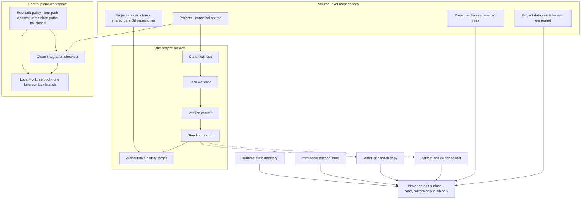

# Source layout and artifacts

This chapter answers one question: on a machine holding many copies of many things, which single location is
authoritative for a given edit, and where does everything a run produces go? Getting this wrong is how
split-brain starts — two divergent copies of one project, both plausible, neither declared. The cost is not
abstract. Work lands in a copy nobody ships, the same fix gets written twice and reverted once, and the
machine's answer to "what is running" stops matching any operator's account of what changed. The rules below
exist so that the authoritative location is always a single unambiguous answer, and so that everything a run
emits lands somewhere it can be found later without being mistaken for source.

## The four namespace roles

Storage is split into four distinct top-level authorities. A namespace here is simply the top-level parent a
directory sits under, and that parent — not the directory's name, and not what happens to be inside it —
decides what the directory is allowed to be. One more word recurs throughout: a **surface** is one
addressable repository or system that the control plane knows by name, and each surface has exactly one
canonical root at a time.

| Namespace | Holds | Editable as source |
|---|---|---|
| Canonical projects | Declared source repositories, one canonical root per surface | Yes |
| Mutable generated data | Working data, exports, caches, other regenerable output | No |
| Shared Git infrastructure | Bare repositories acting as authoritative history targets | No, push target only |
| Retained archives | Preserved trees kept for history, rollback evidence, cold storage | No |

Two further roots sit outside the taxonomy and belong to
[runtime releases and promotion](10-runtime-releases-and-promotion.md): the immutable release store
`<releases-root>` and the runtime state directory `<runtime-dir>`. Three rules make the taxonomy hold.

1. **Matching names across namespaces are different roles, not copies to keep in sync.** `example-project`
   under canonical projects, under mutable data, and under archives names three objects, not three copies.
   The failure this prevents is a well-meaning reconciliation: someone notices two directories with the same
   name holding different content, concludes one is stale, and copies across — destroying either live
   generated data or the archive, depending on which direction they guessed.
2. **Retired parents are registered explicitly**, so no alias can later be declared beneath a root that
   was migrated away from, and no guard hard-fails against a path that is no longer authoritative.
3. **The declaration is checked against the live filesystem** by validators that assert the physical
   layout still matches, plus a volume guard that fails closed when expected storage is not mounted. A
   declaration nobody checks decays quietly: a route keeps pointing at a parent that moved months ago and
   stays believed precisely because it is written down.

The declaration is a small family of machine-readable contracts plus one prose amendment, and its shape is
worth knowing because it is the first thing an adopter has to write. Each declared storage route carries a
route name, its canonical parent, the parents it may explicitly no longer be declared beneath, and a
reference to the validator that asserts the route still resolves. A companion digest file pins the verifier
itself, so a strict validator cannot be quietly swapped for a permissive one. An evidence subdirectory holds
one receipt per completed migration, recording which parent a route moved from, where it moved to, and what
proved the move finished. The prose amendment exists only for cases a schema cannot express and is
explicitly subordinate to the machine-readable rows.

Source: [`diagrams/source-namespaces.mmd`](../diagrams/source-namespaces.mmd).

## Source concepts

These eight concepts stay separate in reasoning, checkpoints, and completion records; collapsing any two is
the usual root cause of an edit landing in the wrong place. None of them is an abstraction: each is a named
field on the surface's row in the registry introduced in
[system architecture](04-system-architecture.md), and the field list appears below.

| Concept | Definition |
|---|---|
| Canonical root | The one declared source of truth for a surface, at a time |
| Active worktree | An editable materialization of that root on a specific branch |
| Standing branch | The branch a surface is healthy on; verified work is normalized onto it |
| Authoritative history target | The remote that preserves canonical history; mirror and rollback remotes are not it |
| Runtime release | A sealed, immutable build output; never a place to edit source |
| Artifact root | Where generated evidence goes; never mixed into a source root |
| Mirror or handoff | An operator-facing copy or sync target; not canonical unless declared and verified |
| Archive | Preserved history; evidentiary only |

A parent container is never canonical by implication, a nested repository is its own surface unless stated
otherwise, and a plain folder is not canonical source because it has the right name. Each of those three is
an assumption that is cheap to make and expensive to be wrong about, and each ends the same way: an edit
landing in a directory that merely resembles the target.

The registry row is where these concepts stop being vocabulary and become data. It is resolved before any
lane is established, and it has roughly this shape.

| Field | Type | Meaning |
|---|---|---|
| Surface slug | string | The short name everything else addresses this surface by |
| Canonical source root | path | The one declared source of truth for the surface |
| Operator checkout root | path or null | A second working checkout an operator drives by hand, where one exists |
| Standing branch | string | The branch verified work is normalized onto |
| Authoritative history target | remote reference | The one remote a push may go to |
| Mirror targets | list of remote references | Remotes that receive copies and are never treated as publication |
| Handoff root | path or null | The user-facing or build copy refreshed after landing, where the surface has one |
| Validation entrypoint | command reference | The acceptance check that decides whether this surface is healthy |
| Surface role | enum | What kind of surface this is — product, control plane, infrastructure, archive |
| Live binding reference | reference | The observed-state record this declaration is checked against |
| Last verified at | timestamp | When the declaration was last confirmed against the live filesystem |
| Evidence reference | reference | Where the confirming evidence lives |

A row is a declaration, not enforcement; the guard scripts and validators are what make it true. The paired
live-binding record in the observed-status layer is its counterpart, and disagreement between the two is
itself a finding rather than a formatting problem — see
[evidence, audit, and verification](15-evidence-audit-and-verification.md).

## Pre-edit identity proof

Run this in order before editing, running repo-scoped verification, or claiming repo completion.

1. Name the target surface, using the registry slug where the surface is mapped. If an alias is needed,
   declare `alias -> canonical slug` once and keep the canonical slug visible.
2. Resolve that surface through the registry to its canonical root, standing branch, and authoritative
   history target. A registry row is evidence, not permission.
3. Confirm the intended path is inside that repository or one of its worktrees.
4. Resolve the Git top level, current branch, and `HEAD`. Refuse detached `HEAD` or equivalent ambiguous
   state for non-trivial work.
5. Inspect remotes and classify each by role — authoritative, mirror, rollback.
6. Inspect worktree registration when several worktrees are involved. For a durable lane — a long-running
   unit of isolated work with its own child session, status record, and worktree, described in
   [execution and durable lanes](06-execution-and-durable-lanes.md) — verify that the worktree's Git common
   directory equals the canonical root's. A mismatch is a hard refusal, and it is what stops a lane writing
   into an unrelated repository that happens to have a worktree of the same name.
7. If more than one plausible root exists, enumerate the candidates and compare Git top level, remotes,
   branch, and recent commits.

**Stop if two roots remain plausible after step 7.** Emit one narrow blocker naming the candidates. Do not
pick the likelier one, and never patch all copies "for safety" — that manufactures the divergence the
checklist exists to prevent. Edit the declared canonical source only, then refresh mirrors deliberately.

Forbidden edit contexts, whatever else passes: ignored mirror folders, plain folders mislabeled as canonical,
broken or orphaned worktrees, file-sync handoff folders treated as source without explicit declaration,
ambiguous duplicate roots, output folders, and installed package output outside the canonical repository.

What those share is that an edit made in one of them looks entirely successful. The file changes, the editor
is happy, the tests may even pass — and the change never enters the history anyone else reads. The file-sync
handoff folder is the sharpest case, because a sync pass can later overwrite the edit from the canonical
side and leave no evidence that it ever existed.

## Worktree discipline

Non-trivial work does not happen directly on a standing branch. Use one task-scoped branch and one worktree
per material task, derived from the canonical root; that way an abandoned task is discarded by removing a
directory rather than by unpicking commits from the branch everything else depends on. A broken worktree is
repaired or replaced, never edited around, because a worktree whose registration is damaged can resolve its
Git directory somewhere unexpected — and an edit made in that state lands in a repository nobody chose.

### The control plane's own worktree pool

Product surfaces keep task worktrees under their own project root. The control plane is not an exception to
worktree discipline; it is the largest instance of it. The pattern is a local pool under
`<workspace-root>/.worktrees/<branch-slug>/`, one lane per task branch, with the workspace root kept as a clean
integration checkout rather than an accumulation point.

The pool is governed by a root-drift policy: a machine-readable classifier deciding what may live at the root
versus what must move into a task worktree. *Drift*, here, means tracked change sitting at the root that no
branch has claimed — not yet isolated, not yet landed, not yet reverted. Drift matters because the root is
supposed to be the one checkout whose state can be described in a sentence; once it carries unclaimed
change, every later question about what is on the root has to be answered by reading it rather than by
reading a branch. The policy declares the root checkout path, sets a `task-worktree-only` policy for
non-trivial work, names the protected lanes covered in the next section, and sorts path globs into four
classes.

| Path class | Meaning | Disposition |
|---|---|---|
| `safe-remove` | Generated residue | Delete during normalization |
| `root-local` | Wrappers and shims that legitimately live at root | Keep in place |
| `normalize-to-root` | Control-plane source authoritative at root | Land onto the standing branch |
| `retained-state` | Audit and memory kept outside source normalization | Leave untouched |

Two settings make it fail closed: the unmatched default class is `blocker`, and ambiguity is a hard stop, so an
unrecognized file halts the cleanup instead of being guessed at — the posture of
[policy and authority](05-policy-and-authority.md). The alternative is worse than it sounds; a classifier that
guesses will eventually classify something load-bearing as generated residue and delete it during a routine
cleanup.

Normalization may not be reported complete until a named closeout artifact pair exists: a Markdown record and
its machine-readable counterpart. A *closeout* is the end-of-work step that finalizes a slice's record — what
was verified, what landed, what evidence exists, what is still outstanding — and the pair requirement exists
so that the human summary and the machine record are written from the same moment, rather than one being
reconstructed later from the other. The policy also names the exact test invocation that gates release, so
"the validators passed" is a specific claim rather than a general impression.

Tracked root edits to policy, scripts, memory, or other control-plane files are real drift until isolated,
committed, or reverted; intentional drift is preserved on a dedicated branch before the root is reset. A slice
may be normalized while unrelated drift remains, but the closeout must then state separately whether the slice
landed, whether the root is globally clean, and what drift is left.

### Protected lanes and the prune preflight

A *lane*, in this section, is one task worktree together with the branch attached to it. A **protected
worktree** is any named lane backing a live process, a port listener, a scheduler entry, or an active
service baseline named in recent checkpoint state. Long-lived services run from an explicitly named standing
worktree, never a disposable task worktree — a disposable worktree is by definition something a cleanup pass
is entitled to remove, and removing it takes the running service's working directory out from under it.

Before pruning, deleting, resetting, or repointing any worktree or ref, resolve what actually depends on it:
service definitions and the arguments they pass; the command line and working directory of every running
process; open file handles under the candidate path; symlinks and runtime pointers that resolve into it;
scheduler entries and the commands they invoke; and the lane's dirty, merged, and divergence state.

**Compare resolved real paths, not path strings.** A workspace often sits behind a stable logical alias while the
physical directory lives elsewhere, and pointers are written in whichever form survives storage moves. A text
search therefore misses a dependency reaching the lane through an alias, a symlinked parent, or a wrapper.

If a lane is protected, or protection is ambiguous, default to preserve-and-inspect. If it is unmerged,
diverged, or historically ambiguous, archive it under an explicit tag before deleting any ref. Where several
active lanes exist, keep a refreshable lane index — an operational aid only: when it disagrees with live
process, scheduler, or Git evidence, live evidence wins. Once a lane is merged, normalized, or deliberately
archived and no protected dependency remains, remove the worktree and stale refs in the same closeout slice.

## Source closeout ordering

The order is fixed, and each step is a precondition for the next.

1. Verify — run the acceptance checks for the surface.
2. Commit the task lane, if there is anything to commit.
3. Land the verified content onto the standing branch. Fast-forward preferred; cherry-pick or local merge only
   to land verified slice content.
4. Push the standing branch to the declared authoritative history target, and only there.
5. Refresh the required handoff or build copy, if the surface has one and source changed.
6. Remove the merged local worktree and refs, when the prune preflight says it is safe.
7. Verify the resulting standing lane.
8. Report, naming the closeout state explicitly.

Each of those steps sits where it does because of a specific failure. Verification comes first because a
commit of unverified work makes the lane's history assert something no evidence supports. Landing precedes
pushing so the authoritative history target only ever receives content that already passed on the standing
branch. The handoff refresh comes after the push, because a handoff copy newer than the pushed history is
exactly the divergence this chapter exists to prevent — the consumer sees a change that no history contains.
Pruning comes second to last because a worktree removed too early takes with it the only place the work can
be re-run if the final verification fails. And the report comes last because the closeout state is a claim
about all seven preceding steps, not about the one that just finished.

An operationally authoritative fix landing first on a non-standing branch does not make the lane healthy:
normalize it onto the standing branch, or update the standing default in the registry and verification path.

## Artifact discipline

Generated reports, snapshots, manifests, audit bundles, handoff records, and exports live in designated artifact
locations, not mixed into source roots. The default output location is `<artifact-root>/<run-id>/` or an
established repository-local output directory. If a later step expects an artifact that was never produced,
report the missing producer step, not just the downstream file-not-found. Host-local operational data under a
control-plane repository is classified as tracked source, ignored operational state, or external artifact
output — there is no fourth, unstated option.

One property of the artifact root deserves stating because it is easy to break during an otherwise sensible
reorganization: **the root is an addressing surface, not a storage layout.** Receipts, status records, and
reports embed artifact paths and are read months after they are written, so any address once published has
to keep resolving. Reorganize the physical store freely — sorting older runs into family directories while newer
runs are written directly at the root is a reasonable layout — but never invalidate an address that some artifact
already carries; where a reorganization would move a published address, leave a compatibility link at the original
location so earlier references still resolve.

Non-trivial artifacts and retained diagnostics carry a metadata record. Without one, an artifact found later
raises questions nobody can answer — what produced it, what state it describes, whether it is still current,
and whether it may be deleted — and the safe answer to all four becomes "keep it forever", which is how an
artifact store stops being usable. The record carries these fields.

| Field | Purpose |
|---|---|
| Run id | Which run produced it |
| Producer | Which entrypoint or job wrote it |
| Source identity | Surface slug, canonical root, branch, and commit it derives from |
| Target identity | What it describes or was written against |
| Evidence freshness | When the underlying observation was taken, and its freshness class |
| Acceptance predicate | The exact condition this artifact is claimed to satisfy |
| Retention class | Storage intent, from the four classes below |
| Authority class | `authoritative`, `generated`, or `historical` |

The authority class keeps artifacts from drifting into policy. Generated views carry a machine-checked
do-not-edit banner naming their canonical source and are regenerated, never hand-repaired. Only what a
contract declares authoritative is authoritative.

| Retention class | Meaning |
|---|---|
| `retain_long_term` | Keep indefinitely |
| `retain_until_manual_archive_window` | Keep until an operator-run archive pass |
| `safe_to_prune_now` | No remaining obligation |
| `optional_cold_archive_only` | Not needed live; archive if convenient |

**Retention class records storage intent only.** It never grants source authority, never makes an artifact part
of the live source-of-truth path, and never overrides the current registry. Historical manifests, audit bundles,
and archived path strings are evidence about the past, not permission in the present. The same applies to backup,
rollback, and mirror layers: they are distinct systems, none of them live operational authority. And a deletion
conditioned on a backup is two gates rather than one — the backup must be shown to exist and to be readable,
and only then may the deletion proceed, because "a backup job reported success" and "the data can be restored"
are different claims. See [guards, health, and restoration](14-guards-health-and-restoration.md).

## The Git-first coding handoff rule

Code reaches its destination through Git, in the closeout order above: commit on the task lane, land on the
standing branch, push to the authoritative history target. A handoff or build copy is refreshed after that,
as a derived convenience — never as the delivery mechanism, never as a substitute for landing the change.

- **Handoff singularity.** Exactly one canonical handoff path per surface. No suffixed folders, no backup
  clones, no second sync copy created during an ordinary refresh. If duplicates are found, pause handoff
  writes for that surface until the keep-path is identified. Two handoff copies is a worse state than none,
  because the consumer reads one of them and nobody can say which one.
- **A copy is not completion.** A path existing, a marker string existing, a command being emitted, or a
  mirror folder being updated are none of them evidence of completion. See
  [evidence, audit, and verification](15-evidence-audit-and-verification.md) for what is.

The user-facing run path is the handoff root for that surface, not the control-plane workspace path. Source
root and handoff root are separate concepts; verify both when handoff matters.

## Capability provenance

| Mechanism | Provenance |
|---|---|
| Namespace taxonomy and retired-parent registration | helper-backed — declarations plus a topology validator and a volume guard |
| Pre-edit identity proof and protected-lane prune preflight | policy-only |
| Worktree verification at durable-lane establishment | helper-backed — a Git common-directory equality check that fails closed before the lane is established; the same check is reproducible on a stock runtime, so it stays helper-backed there too |
| Root-drift classification and fail-closed unmatched default | helper-backed — a classifier contract with named test validators |
| Source closeout ordering | helper-backed — the closeout gate refuses `complete` on unmet source state or missing standing-branch normalization |
| Artifact metadata records | policy-only — a documented field set, not enforcement |
| Retention classes | policy-only plus helper-backed — the classes and their protection predicates are declared in a retention manifest, and deliberately timid prune helpers act on them |

See [capability provenance](03-capability-provenance.md) for the taxonomy, and
[execution and durable lanes](06-execution-and-durable-lanes.md) for how a lane acquires its worktree.

## Where this leads

This chapter left one namespace deliberately closed: the immutable release store, which appears in the tables
above only as somewhere that is never a place to edit.
[Runtime releases and promotion](10-runtime-releases-and-promotion.md) opens it — why a release is sealed
rather than merely built, how one becomes the running runtime without any step being able to guess or retry,
and what the machine has to prove before it may report a promotion as live.
