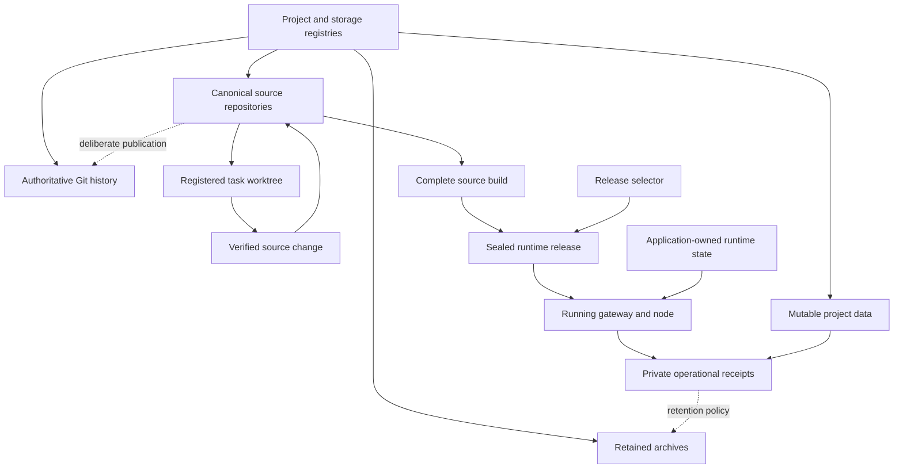

# Source layout and artifacts

A machine can hold a source checkout, several worktrees, an installed release and a recovery copy of the same project. Only the declared source repository owns edits. The other locations have different jobs, even when their directory names match.

The reference keeps OpenClaw runtime source separate from its control-plane Workspace. The runtime repository supplies the engine and its local changes. Workspace supplies operating instructions, registries, host helpers, integration wrappers and operational evidence. An external project remains a third source authority; placing a launcher in Workspace does not transfer ownership of that project's data or implementation.

## Storage namespaces

A project registry names each source root, repository, permitted worktree parent, data root, archive root and compatibility alias. A storage registry separately records where those paths physically live and how their bindings are verified.

| Role | Example location | Meaning |
| --- | --- | --- |
| Source and worktrees | `<volume>/Projects/<project>/` | Canonical repositories and their registered editable worktrees |
| Mutable data | `<volume>/ProjectData/<project>/` | Generated output, exports, caches and application work-product |
| Authoritative Git history | `<volume>/ProjectInfrastructure/GitRemotes/` | Local bare history targets, where configured |
| Retained archives | `<volume>/ProjectArchives/<project>/` | Preserved trees and historical evidence |
| Control-plane Workspace | `<volume>/Agent/Workspace/` | Its own source repository, not the parent of every project |
| Runtime releases | `<volume>/Agent/Releases/` | Complete built releases selected for execution |
| Runtime state | `<volume>/Agent/State/` | Application-owned databases, configuration and persistent state |

These are roles, not a required spelling. An adopter chooses paths once and uses them consistently in configuration, launch definitions, helpers and recovery instructions. Source, runtime state and backups can share a physical volume while remaining separate authorities; sharing a volume also means sharing its failure domain.

Source: [`diagrams/source-namespaces.mmd`](../diagrams/source-namespaces.mmd).

## Resolve identity before editing

Start with the registered project or surface. Confirm its Git top level, branch, current commit and common Git directory. An editable task worktree must belong to that source repository. Classify remotes by their intended role: authoritative history, publication, mirror or rollback. A remote's name alone does not authorize a push.

A registry row is a declaration that can become stale. Check it against the filesystem and current repository state. If two roots still plausibly claim authority, reconcile that identity before editing. Patching every copy creates the divergence this process is meant to prevent.

Use a task worktree for substantial source changes, then integrate the verified result onto the standing branch through the project's chosen workflow. The canonical Workspace is an integration checkout. Unknown tracked or untracked work must survive reconciliation until its owner and intended disposition are known.

The root-drift helper makes this practical through a path-classification policy: known disposable residue, legitimate root-local files, source to integrate, and retained state. Unmatched or ambiguous paths remain visible for review. The classifier is a maintenance aid; it cannot turn an arbitrary directory into disposable data.

## Protect live dependencies

A worktree or release is protected when a running process, listener, service definition, scheduler, selector or explicit retention record depends on it. Resolve complete physical paths, including symlinked parents. Searching only the literal directory name misses references through a stable home-directory alias.

Before removing a worktree or release, check its Git state and the active dependency set. A merged branch can still back a live service. A clean directory can still be the only rollback release. A source change is not globally complete merely because its own slice was integrated while other work remains active.

Runtime selection and stopped-state recovery belong to the [activation owner](10-runtime-releases-and-promotion.md). Cleanup does not select a replacement release, repair a failed activation, or invent a new rollback target.

## Stable logical paths and external storage

The reference uses stable logical entrypoints for several externally stored roots. Other applications use their supported location preferences instead. Those mechanisms should remain distinct:

- A compatibility symlink preserves an existing logical path while the physical root moves.
- An application preference changes where that application writes new data. The former default directory may legitimately be absent.
- A runtime selector chooses a sealed release; it is not an ordinary workspace alias.
- A volume contract verifies the mounted filesystem identity and expected routes. A directory with the right name is insufficient.

An external volume disappearing must not create a second state tree in a shadow mount or a historical fallback directory. Availability checks and any observer needed during a disconnect require an internal installation and an internal receipt destination. See [guards and restoration](14-guards-health-and-restoration.md).

## Artifacts and recovery copies

An artifact records what a run produced or observed. Give it a producer, timestamp, source/configuration identity, target, result and retention class. Keep a human-readable summary beside structured receipts where both are useful. Generated summaries point to evidence; they do not replace it.

Classify retention by meaning. Reproducible caches, signed build products, current databases, stopped-state snapshots, local recovery archives and independent backups are different classes. A cleanup policy for old generated files cannot be applied to all of them because they share a parent directory.

A filesystem copy is not automatically a consistent database snapshot. Use the application's SQLite backup owner or documented stopped-state capture method, including the applicable WAL handling. Likewise, a verified local archive on the source volume is useful recovery but does not provide independent disaster recovery.

## Example: a project change and its output

An operator asks for a change to a local service. The agent resolves the service's repository, creates a registered task worktree, edits and verifies the source, and integrates the result. Test reports and generated exports go under the project's data root. A complete build becomes a separate candidate release. The activation owner selects it only after its own checks.

The test report, release and source commit remain linked by identifiers, while each keeps its role. Later cleanup may remove an expired cache without touching source history, a selected release, or the recovery copy required by the current retention contract.

Related chapters: [runtime activation](10-runtime-releases-and-promotion.md), [scheduling](12-scheduling-and-background-work.md), [host operations and backups](19-host-operations-and-backups.md), and [evidence](15-evidence-audit-and-verification.md).

The public executable projection lives in [`workspace/scripts`](../workspace/scripts), with configured definitions in [`workspace/host-templates.json`](../workspace/host-templates.json). Source templates carry references; materialized files carry the adopter's actual paths. They must not be confused with an observed installed service or a successful scheduled run.
