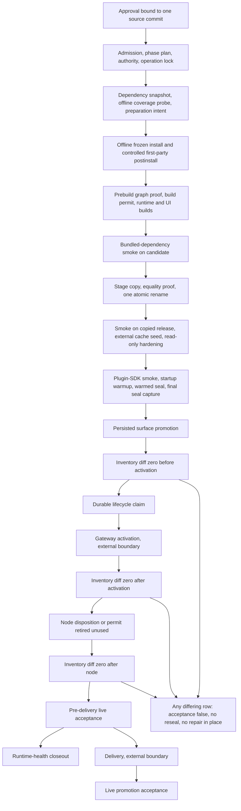
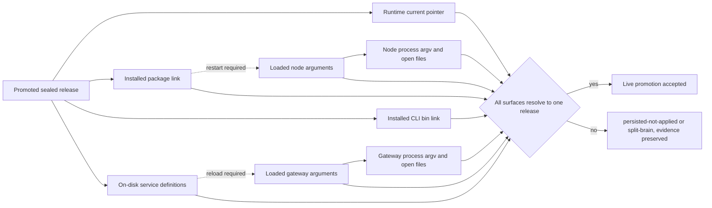

# Runtime releases and promotion

Replacing the code of a long-lived supervised agent runtime is live surgery, not a deploy: the
process being replaced is the same one that holds every channel connection, every session, and
every durable lane — the long-running units of isolated work described in
[execution and durable lanes](06-execution-and-durable-lanes.md). There is no second instance to
shift traffic to, and no moment when nothing is in flight. This chapter describes how a source
commit becomes the running runtime without any step being able to guess, retry or improvise, and
what the machine must prove before it is allowed to say the new runtime is live. The design rests
on one rule: **never rebuild in place**. A build happens somewhere disposable, a release is sealed
somewhere immutable, and only pointers move.

## Live service layout

The layout this chapter works from has two independent services under a host-level service
supervisor. They are not a cluster; they are two roles promoted together.

| Service | Role | How it resolves a release | Lifecycle action |
|---|---|---|---|
| Gateway | The runtime itself: channels, agents, control plane, session and task authority | Its service definition pins an absolute release path in both the command it runs and the directory it runs in | Its own promotion-safe restart subcommand |
| Node host | A peripheral device agent that connects to the gateway as a client in the node role | Its definition points at the installed package link, so it follows the symlink | Its own separately permitted promotion-safe restart action |

Both are set to start on boot and to be restarted on exit, and run a pinned toolchain shipped
inside the CLI directory rather than a system interpreter. The asymmetry in the third column is
the most useful fact in this chapter. Because the gateway definition pins an absolute path while
the node definition resolves through a link, **a promotion that only moves symlinks leaves one
service running old code**. The gateway definition must be rewritten and reloaded; the node definition
must be asserted byte-identical and left alone. Each service therefore has its own **permit** — a
durable, one-shot allowance to perform one irreversible action, specified later in this chapter —
its own **convergence** evidence, meaning proof that every surface naming the running release now
names the same release, and its own restart contract. See
[system architecture](04-system-architecture.md).

## The separation chain

A chain of distinct identities sits between a commit and a running process, and the last links in it
repeat per supervised service. Conflating any two of them is how promotions go wrong.

Two words recur below and are worth fixing first. **Admission** is the gate that turns an approved
request into a bound operation — every input pinned by content hash, every precondition checked,
a receipt written — before anything may be mutated; nothing downstream is allowed to renegotiate
what was admitted. **Sealing** is the step that makes a release immutable: after the copy is proved
equal to its source, the tree is hardened read-only and a full inventory of its contents is
recorded, so that any later change to it is detectable rather than invisible.

1. **Canonical source** — the fork's standing branch in `<project-root>`, read-only during a
   promotion; the target commit is hash-bound at admission.
2. **Detached candidate worktree** — a throwaway git worktree under `<project-root>/worktrees/`.
   Never installed from, never pointed at.
3. **Verified build** — the built tree inside that worktree, proved against a dependency closure
   and exercised by a bundled-dependency smoke before it may leave.
4. **Immutable sealed release** — a fresh unpublished staging root, proved byte-, mode- and
   symlink-identical to the candidate, then published by exactly one atomic rename into
   `<releases-root>/<release-id>`. Release names take the shape
   `<version>-a1b2c3d-<lane>-selfcontained`, where the middle element is a fragment of the source
   commit and `<lane>` identifies the promotion run that produced it — a *lane*, in this chapter,
   being one promotion operation's own directory of evidence. Naming a release after both the
   commit and the run means two builds of the same commit are still distinguishable, which matters
   when one of them failed halfway. Directories and files are hardened read-only.
5. **Current pointer** — a `current` symlink in the runtime directory.
6. **Installed CLI link** — the `bin` entry operators and health probes actually invoke.
7. **Loaded service definitions** — what the service manager has parsed and cached, which is not
   the same as what is on disk.
8. **Running processes** — the gateway and node processes as they are actually running, evidenced
   by their argument vectors (`argv`, the exact arguments a process was started with) and the files
   they hold open.

### Two install namespaces

The usual drawing of this chain is a single line: current link, then package link, then bin link.
Real installations are often not that simple, and an adopter can easily end up with **two separate
install namespaces**: a **runtime directory** holding the `current` pointer and a `releases` link,
and a **separate CLI directory** holding the installed package link and the `bin` link. In such a
layout the `bin` link may resolve **directly to a release directory** rather than through the
`current` pointer. Resolving directly is a defensible stability choice, but it carries a cost: the
installed link becomes a convergence surface of its own. A promotion that updates `current` but not
that link leaves the operator CLI — and therefore every health probe — executing the previous
release while the gateway runs the new one. Wherever two namespaces exist, both must be checked
independently.

The same care applies to where the store physically sits. Any part of the workspace, the artifact
root, or the release store may live on storage that can become unavailable — a removable or network
volume, or one reached through an intermediate link. Two invariants follow. First, every pointer in
the chain is written in a stable, location-independent form, so the arguments a service was started
with stay valid if the physical store is later relocated. Second, the guard that asserts such
storage is available must be installed off the storage it protects, and it must gate admission
rather than merely report, because a guard that becomes unreachable along with the volume it
watches proves nothing at the moment it is needed. See
[guards, health and restoration](14-guards-health-and-restoration.md).

## The ordered gate contract

A promotion is not a script run. It is an immutable, resumable, journaled operation defined by a
**named versioned contract** — revised repeatedly as failures were found, each revision closing a
specific gap the previous one left open — plus a **separately versioned action-gate manifest
schema**. Roughly two dozen ordered phases make up the contract, and the only permitted subprocess
path refuses any plan whose phase
names are not exactly the canonical tuple in exactly the canonical order. A flat list of those
phases obscures the structure; they form eight groups, each answering one question.

| Group | Representative gates | Question answered | Permits |
|---|---|---|---|
| Dependency and preparation | Offline dependency-store snapshot; offline coverage probe; preparation intent | Can this exact commit be built with zero network? | coverage, preparation intent |
| Build | Offline frozen install; controlled first-party postinstall; prebuild graph proof; build permit claim; runtime build; UI build | Does the target commit build reproducibly under isolation? | install, build |
| Candidate verification | Bundled-dependency smoke on the candidate | Does the built tree load its own bundled surface? | none |
| Sealing and release | Stage copy with equality proof and one atomic rename; bundled-dependency smoke on the copied release; external cache seed; read-only identity hardening; plugin-SDK smoke; read-only startup warmup; warmed-cache seal; final seal capture | Is there now an immutable release whose exact content is known? | none |
| Pre-activation verification | Inventory-diff-zero against the seal; durable lifecycle claim | Is the release still byte-identical at the moment of the restart? | gateway activation, claimed here |
| Activation | Persisted surface promotion; gateway activation; node disposition | Did exactly one supported restart happen? | persisted promotion and node disposition claimed; the gateway permit dispatched |
| Post-activation verification | Inventory-diff-zero after activation; inventory-diff-zero after node disposition | Did the running system write into its own sealed release? | none |
| Delivery and acceptance | Pre-delivery live acceptance; delivery; live promotion acceptance | Is the new runtime live, and was that reported truthfully? | delivery |

An **inventory diff**, which appears three times in that table, is a comparison of a tree's recorded
inventory before and after an action; a zero diff asserts that the action changed nothing it was
not permitted to change.

The groups are thematic, and one boundary between them is worth reading carefully rather than
assumed. The persisted surface promotion — the pointer and service-definition flip — belongs to
activation by nature but happens *before* the first zero-difference check, because what those three
checks bracket is the restart, not the flip. The exact phase order is the diagram below; the groups
are how to hold it in mind.

### What a failure costs, by group

Every gate can fail, and where it fails decides what has to be dealt with afterwards. Failures in
the first three groups cost only time: the candidate worktree and the run's dependency snapshot are
discarded whole, never repaired and never retried in place, because a half-installed dependency
store is exactly the state from which a reproducible build cannot be proved. A failure inside
sealing but before the atomic rename leaves an unpublished staging directory that is abandoned
rather than reused — the point of the rename is that publication happens once or not at all. A
failure after the rename leaves a fully sealed release that nothing points at, which is harmless,
retained, and eventually collected by the retention pass described at the end of this chapter.

Pre-activation verification is the last recoverable stop, and it is worth being precise about what
"recoverable" means there. By that point the pointers and the gateway service definition have
already been rewritten, but no process has restarted; the running system is still the old release.
Restoring the previous persisted surface therefore returns the machine to a coherent state — which
is exactly the possibility the rollback gate proved before the flip was permitted.

Once the restart is dispatched, failure is expensive. A one-shot permit has been consumed and
cannot be re-claimed, so there is no second attempt to make; the operation reports the state it
actually reached and stops, and the recovery path is rollback or adjudication rather than retry. A
post-activation or delivery failure does not undo the restart and does not attempt to: it sets live
acceptance to false, marks the consumed path stopped, and forbids resealing or repairing the
release in place.

### Two properties, and the isolation model

Two properties matter more than the contents of the phase list. The **coverage probe runs before any
durable intent is recorded**: full lockfile coverage must be proved with zero downloads before the
pipeline may want anything, so the pipeline proves it *can* build before it is permitted to try.
And the **same smoke runs twice**, on the candidate and again on the copied release, because a copy
that passes an equality proof can still fail to load if a symlink was rebased wrongly — equality of
contents is not the same claim as the tree still working from its new location.

Every non-external phase runs wrapped in an OS-enforced, deny-by-default sandbox profile whose hash
is bound into the action and which must appear as the literal prefix of the argument vector.
Offline flags and package-manager offline modes are necessary but never sufficient, and the
distinction is the whole point: a flag is a request the build can ignore and a dependency's install
script can override, while the profile is enforced by the operating system against the process
itself. Each profile starts from a global denial of network access and of all file writes, then
re-allows an explicit short list — the exact directories that phase class needs, plus the null
device for discarded child output — and nothing else. The live-acceptance profile is the narrowest
illustration: it permits one outbound loopback connection to the gateway and exactly one live
identity file, not the directory that file sits in. A profile that is present but broader than the
one bound into the action is a hard stop even when every expected path is also allowed. See
[security and trust model](16-security-and-trust-model.md).

### What the plan pins

The phase plan is generated once from the target commit and then treated as immutable input; a later
step that disagrees with it fails rather than adapting. What it carries is the minimum an adopter
has to reproduce for the rest of the model to mean anything.

| Pinned in the plan | The failure it prevents |
|---|---|
| The target commit | Two phases building subtly different things, and an expected dependency set derived from whatever the checkout happens to hold rather than from the commit |
| The toolchain: interpreter and package-manager locations, their content hashes, and an inventory digest of the whole package root | A build silently using a differently-versioned tool that happened to be first on the path |
| The complete environment for each command | A build inheriting an ambient variable — a proxy setting, an interpreter override — that changes its result invisibly |
| One named sandbox profile per phase class | Isolation becoming a property of how a command was invoked rather than of the plan |
| Predecessor evidence | A new operation starting while an earlier one is still unresolved |
| Initial counters, all zero | Permit accounting starting from whatever residue is on disk |
| The full ordered phase list, each non-external phase an exact argument vector with its receipt contract | A phase whose command is decided at run time, which is a phase nobody reviewed |

A separate verification step re-checks the plan before any authority document is derived from it,
and the producer refuses plans containing placeholder commands, live phases that only emit a receipt
without doing work, broad shell invocations, or raw service-manager lifecycle tokens. The profile
names are the useful summary of the isolation model, one per phase class: snapshot, coverage,
preparation, build, verification, publication, cache, hardening, persisted promotion, and live
acceptance — plus an external class that has no profile at all, because its phases deliberately run
outside the coordinator.

### What the only subprocess path refuses

Exactly one component in the whole pipeline is allowed to start a process, and it is deliberately
small: it runs one admitted command, once, with no shell and no retry. Before it runs anything it
refuses outright if any of the following holds.

1. The plan's phase names are not exactly the canonical tuple in exactly the canonical order.
   Reordering gates is how a verification ends up running before the thing it verifies.
2. The executable's basename is a shell, or the service manager's own command-line tool. Both are
   covered in the denylist table below.
3. Any element of the argument vector, anywhere, is a raw service-lifecycle token.
4. The environment is incomplete — a mandatory key missing, or a proxy or interpreter-override key
   present.
5. The exact sandbox invocation is not the literal leading elements of the argument vector, or its
   profile hash differs from the one bound into the action.
6. For the two lifecycle phases, the argument tail is not the exact permitted restart form.

A non-zero exit, a timeout, or any exception are all treated identically: the phase failed and its
outcome is ambiguous. There is no "probably succeeded" branch anywhere in the model.

Path comparison deserves one specific note. The coordinator walks each component of its own artifact
paths against the real directory entries
and requires an exact-case match. On a case-insensitive filesystem, two spellings of the same
directory resolve to the same physical place; without the check, one attempt could create its
exclusive lock under one spelling while a second attempt, using the other spelling, sees no lock and
proceeds — two writers in a model whose entire safety argument is that there is exactly one.

### The dependency store, and why it is cloned

"Build with zero network" only means something if the dependency store the build reads from is
itself known and unchanged. The canonical package store is therefore treated as read-only and never
handed to the package manager as a writable location. At the start of a run the store's resolved
real path, volume identity, device, inode and full normalized inventory are bound; every entry
except the store's own mutable subdirectories is copied into a fresh, run-unique snapshot root on
the same volume, preferring a copy-on-write clone and falling back to a byte copy; hardlinks and any
symlink whose target escapes the tree are refused. The build runs against the snapshot, and when the
run ends the canonical store's inventory must be byte-identical to what was bound at the start.

The ordering of the early phases carries as much weight as their content. A disposable probe
directory receives only the target commit's lockfile, its configuration and patch inputs, and every
tracked workspace manifest. An offline fetch against that probe must prove the lockfile is fully
covered with zero downloads before any durable intent exists. Only then is the preparation-intent
permit claimed, followed by exactly one offline, frozen-lockfile, scripts-disabled install against
the snapshot, a controlled first-party postinstall, a dependency closure proof, and a build permit
claimed immediately before the runtime and UI builds themselves.

A failed or ambiguous cycle consumes the snapshot permanently — it is discarded, not repaired. The
state being avoided is a store that is *almost* right, which yields a build that is almost
reproducible and whose difference from the intended one nothing downstream can detect.

### The contract end to end

Collapsed into one picture, the whole contract is a straight line with three inventory checks
bracketing a single restart and two points where control deliberately leaves the coordinator.

Related diagram: [`diagrams/runtime-promotion.mmd`](../diagrams/runtime-promotion.mmd), which draws
the same pipeline condensed to its phase groups and their fail-closed stops.

## Permits, denylists, and receipts

### Per-phase attempt permits

Eight phases consume a durable one-shot permit: coverage, preparation intent, install, build,
persisted promotion, gateway activation, node disposition and delivery. Each has a budget of
exactly one, and a recovery-cycle counter exists with a budget of zero, so "just run it again" has
no representation in the model.

- **Claim before dispatch.** The claim is journaled before the action starts, so a crash
  mid-action still leaves proof that the action may have happened.
- **Consumed on ambiguity.** A non-zero exit, a timeout, an interruption or an exception all
  consume the permit. Ambiguity is treated as "it happened".
- **Two-class resumability.** Permitless verification phases may fail and then succeed in the
  same journal; permit-bearing phases never repeat. On resume, a claimed phase with no
  completion receipt is refused and demands external adjudication.
- **Retirement without dispatch.** If the supervisor autonomously relaunched an already
  converged node, the unused node permit is retired rather than left ambiguous.

Stated as a state machine, a permit has four states and five legal transitions.

| From | Event | To |
|---|---|---|
| `unclaimed` | Claim written to the journal | `claimed` |
| `claimed` | Completion receipt written and validated | `completed` |
| `claimed` | Non-zero exit, timeout, interruption, exception, or crash | `consumed-without-receipt` |
| `consumed-without-receipt` | Resume attempted | Refused; external adjudication required |
| `unclaimed` | Supervisor observed to have already converged this surface | `retired-unused` |

There is no transition back to `unclaimed` from anywhere, and that absence is the entire design.
The practical consequence is worth stating plainly: after a crash, the question "did the restart
happen?" is answered from the journal and the receipts, never by looking at the system and
inferring. A claimed permit with no completion receipt means the action may have happened, and the
only correct response is to adjudicate it with evidence, not to try again.

### Exact argument tails for lifecycle actions

Only two lifecycle action shapes exist, one per service. Both invoke the product's own
promotion-safe restart path, and both must match an exact argument tail — the trailing arguments
are compared literally rather than pattern-matched, so a nearly-right command is a refused command.

| Phase | Permitted executable | Required tail |
|---|---|---|
| Gateway activation | the installed CLI entrypoint | the gateway promotion-safe restart subcommand, exactly |
| Node disposition | the installed CLI entrypoint | the node promotion-safe restart subcommand, exactly |

### Denylists, and why each exists

| Denied | Where | Why |
|---|---|---|
| Shell basenames as the executable | The only subprocess path | A shell reintroduces composition — chaining, expansion, redirection — and the exact-argument guarantee dissolves the moment an argument string can become a program. |
| The service-manager CLI as the executable | The only subprocess path | It can tear down and re-create a service outside the product's restart path, producing no machine receipt and no promotion-safe ordering. |
| Raw service-lifecycle verbs — whatever the host's supervisor calls registering a definition, removing it, and forcing a service to restart | Anywhere in the argument vector | The same effect can otherwise be smuggled through a permitted executable that forwards arguments. Denying the tokens closes the indirect route. |

The manual service-reload option is deliberately fail-closed: it emits no lifecycle command at all,
rather than a snippet an operator might paste.

### Semantic phase receipts

Every live phase declares in advance a receipt contract: the receipt kind, the required output
fields, and their expected values. The runner parses the command's stdout as JSON and rejects the
phase unless every declared expectation matches. **A command that exits zero but did the wrong
thing still fails.** Receipts are hash-chained to each other and bound to the operation lock path
and hash, so a receipt cannot be replayed under a different operation. The gateway receipt must
additionally show promotion-safe mode, exactly one restart attempt, zero or one primary definition
reload, and zero fallback starts.

## Quiescence and admission

*Quiescence* is the precondition that nothing else is working on the same things. A promotion is
admitted only when the host is quiet: zero queued or running durable work, and no colliding build
processes inside this run's collision roots — the specific directories this operation is going to
write, namely its snapshot, probe, candidate, release and artifact paths. Scoping the check to
those roots rather than to the whole machine is deliberate, because a check that blocks on any
build process anywhere never passes on a busy host. Processes outside the roots are recorded as
noise rather than treated as blockers, which keeps the record honest without making it useless.

Quiescence is **re-proved, not remembered**. It is checked at admission, again before the build
claim, and again as part of live acceptance, because scheduled jobs fire between phases: a
promotion spanning tens of minutes crosses cron boundaries, and a job starting mid-pipeline can
take a write lease — an exclusive, identity-bound claim over a set of paths — on the same tree; see
[scheduling and background work](12-scheduling-and-background-work.md).

Where an admitted operation stops matters more than how often it stops, and the two sides of that
line are worth naming separately. The genuinely pre-mutation stopping points all sit before the
restart is dispatched: a re-proved quiescence check, the offline coverage probe, the build gates,
the candidate smoke, and the pre-activation inventory diff. The first four halt with nothing
irreversible done at all. The last halts after the pointers and the gateway service definition have
been rewritten but before any process has restarted, which is still recoverable precisely because
the rollback gate proved the previous persisted surface restorable before the flip was permitted.

The post-activation inventory-diff gate and the pre-delivery acceptance gate are not in that set,
and it is misleading to count them alongside it. Both run after the restart has already been
dispatched, so a failure at either lands in the consumed-permit state: the one-shot activation
permit is spent, there is no second attempt to make, and the recovery path is rollback or
adjudication rather than a re-run.

## Resumability, locks, and residue

State lives in three places: an exclusively created operation lock, an append-only hash-chained
event journal, and a set of read-only phase receipts. Reading the journal re-verifies file naming,
sequence contiguity, chain linkage, per-event digests, the operation id and the authority hash, so
a gap or an edit is fatal rather than cosmetic. A single global owner record arbitrates across
lanes: succession requires a hash-bound terminal predecessor receipt plus the exact successor
nonce — a single-use value, published by the predecessor's own terminal receipt, that a successor
must present to take ownership — and the displaced owner is archived, never deleted. **Age is never
evidence of staleness**; an operation that looks old is not thereby abandoned, because the only
thing a timestamp proves is when a file was written.

These records are what a reimplementation actually has to get right, so their shapes are worth
setting out.

| Record | What it carries |
|---|---|
| Operation lock | The operation identifier; a content hash for every bound input — manifest, authority document, authority producer, coordinator, driver, phase plan, admission package; a conflict policy of "fail if another operation is active or owns this"; an initial-counters block; and a per-phase budget block |
| Journal event | A sequence number encoded in the filename; the event kind and its payload; the digest of the previous event; and its own canonical digest |
| Phase receipt | The receipt kind; the phase, operation and target it belongs to; every declared output field with its observed value; the digest of the previous receipt; and the operation lock's path and hash, with a flag recording that the lock was read back and matched |
| Terminal receipt | The final state; the completion scope; the journal's length and head digest at termination; and the successor transfer nonce |

Two structural choices in that table carry most of the weight. Binding the lock path and hash into
every phase receipt is what stops a receipt from one operation being presented as evidence for
another. And binding the journal's length and head digest into the terminal receipt is what makes
truncation detectable: removing the last few events no longer produces a shorter but self-consistent
history, because the terminal receipt still names the length and head the journal is supposed to
have.

### The residue trap

Receipts, journal events, locks and terminal records are created exclusively and then made
read-only. That is what makes a crash safe, and it is also the sharpest edge in daily use:

> A failed **pre-admission** attempt still creates its artifact directory and a blocker receipt.
> Those files now occupy the exclusive-create destinations the next attempt needs, so the re-run
> is refused before it starts.

The correct response is to **archive the residue into an adjacent retained location, never to
delete it**. Deleting it destroys the only record of what the failed attempt did or did not touch
— precisely the question the next operator will ask. A blocker receipt is evidence: it enumerates
what blocked, the fresh successor paths the attempt would have used, and the mutations it stopped
before.

## Identity convergence and persisted-not-applied

The state between the pointer flip and process convergence is real, common, and has a name. Until
every surface resolves to the promoted release, the operation reports **`persisted-not-applied`**
— never "live", never "done". Convergence is checked across every surface that names a release, and
those surfaces fall into two classes. The **persisted** surfaces are written to disk and outlive any
process: the runtime `current` pointer, the installed package link, the installed CLI `bin` link, and
the on-disk service definitions. The **live** surfaces are what the running system actually holds:
for each supervised service, the arguments the service manager has loaded, and that process's own
argument vector and open files. The persisted set is fixed by the layout; the live set scales with
how many services a deployment supervises, so the total is a property of the deployment rather than a
constant — which is why the check enumerates surfaces from the service registry instead of asserting
a number.

When those surfaces do not agree, the operation says so and stops, and which disagreement it is
matters. **`persisted-not-applied`** means the persisted side moved and the live side has not caught
up yet — ordinary, expected during a restart, and recoverable. **Split-brain** means two surfaces
positively contradict each other, such as a pointer naming one release while a running process
still holds files open from another; that is the dangerous case precisely because each surface
looks internally consistent when examined alone. Neither state permits another restart: the
activation permit is already consumed, so the available moves are rollback and adjudication. Both
states preserve their evidence rather than retrying into it. The flip that produces this state is
specified step by step later in this chapter, alongside the rollback gate that has to pass before
the flip is permitted at all.

Expanded version: [`diagrams/identity-convergence.mmd`](../diagrams/identity-convergence.mmd), which
labels each surface as persisted or live and adds the never-reported-as-live edge.

Version output or gateway reachability alone is explicitly insufficient: a service manager keeps
running a service with the command line it was launched with after a definition edit, so "the
definition names the new release" and "the process was started from the new release" are
different claims. Live acceptance therefore runs
through the **actually installed CLI**, in this order:

1. A bounded wait on the loopback readiness endpoint until it reports ready with no failing
   components. This gate was added after an incident in which authenticated probes raced a restarted
   gateway that had opened its listener but was still starting sidecars; an open listener is not
   readiness, and a readiness timeout consumes no probe retry.
2. Version, gateway status, health and deep status, run serially as JSON, each in its own process
   group. A timeout is reclaimed and diagnosed before at most one isolated retry, and any residual
   process group blocks acceptance outright. The per-probe process group exists so that a timed-out
   probe can be terminated as a whole; a probe killed without its children leaves processes that
   still hold connections and can still write output, and evidence gathered next to them is not
   evidence of a quiet system.
3. Convergence evidence: the persisted and live surfaces above, loaded plugin cache convergence, target-only open
   files, listener ownership, fatal-free recent logs, zero task pressure, non-retired session
   pointers, and retained rollback identity.

The result is an immutable acceptance receipt hash-bound into the operation lock; delivery is
unclaimable until it exists. Four gate booleans are reported independently — build complete,
release sealed, persisted surface promoted, live promotion accepted — with delivery as a fifth,
optional scope. A routine rebuild terminalizes at a **runtime-health** completion scope and leaves
the delivery permit unclaimed; see [delivery and the control surface](13-delivery-and-control-surface.md).

## Seals, inventory diffs, and rollback

### Copying a tree so that the copy is provably the same

Publication happens exactly once, and everything before it exists to make that one action safe. The
staging step walks the verified candidate tree building a complete inventory of per-entry byte
digests, file modes, and symlink identities. It copies each entry into a staging root that did not
previously exist, rebasing every internal symlink so it points inside the new root rather than back
at the old one, and refusing outright any symlink whose target escapes the tree. It then proves
candidate and staging equal on all three axes — bytes, modes, and symlink meaning — and proves the
destination's symlink closure is entirely internal, before performing a single rename to the
published path. Interrupted but idempotent filesystem calls may be retried under a very small
bounded budget; the publication rename itself has a budget of exactly one.

The component that does this cannot install, cannot build, cannot move a pointer, cannot touch a
service definition, and cannot invoke any lifecycle action. That narrowness is the point: it can be
reasoned about, and reviewed, entirely on its own.

### The cache that must not be part of the release

A read-only release cannot contain a cache the runtime needs to write into, so extension runtime
dependencies are seeded into a separate per-release cache outside the release — offline, from the
same target lockfile, under the same no-network isolation. Two details of that seeding are worth
copying. First, each bundled extension's mirror is addressed by the identifier declared in its own
manifest rather than by the directory it happens to occupy, and is materialized under every lexical
package key a loader might plausibly resolve, which makes the result independent of how any one
loader spells a lookup. Second, the cache is verified twice to an identical inventory, and the
smoke test that exercises it runs with both network access and source-tree fallback disabled — so a
pass proves the extension surface loaded from the physical cache mirror, and not from some path
that merely happened to still be reachable. A warmed-cache seal is captured before the final
release seal so that the two are never conflated.

### The final seal and the three zero-difference gates

The **final seal** is a full normalized inventory of the sealed release: per-entry byte digests,
modes, the complete symlink closure, device and inode identity, absence of runtime-generated
mutation paths, and presence of the expected entrypoints and public surfaces. It is captured only
after every smoke and the cache warm-up. Three zero-difference gates then bracket the single
restart: immediately before activation, immediately after it, and again after node disposition.
Any added, removed or changed row sets live acceptance to false, marks the consumed one-shot path
stopped, and forbids resealing or repairing in place. The failure being caught is a running system
writing into its own immutable release — invisible until some later promotion diffs the tree.
Because a snapshot comparison cannot see a transient create-then-delete, a filesystem-event write
guard, hash-pinned for the run, stays active through activation.

### The flip itself

The persisted-surface promotion phase is the moment the machine's idea of "the runtime" changes. It
runs under a claimed one-shot permit, in a fixed order.

1. Back up the existing gateway service definition, so the previous definition survives as a file
   rather than as somebody's recollection of what it said.
2. Record, for each of the three pointers — the runtime `current` link, the installed package link,
   and the installed CLI `bin` link — both the raw link target and its fully resolved path, before
   and after. Raw target and resolved path are recorded separately because a pointer can be correct
   in one form and wrong in the other, and only comparing both catches it.
3. Rewrite the gateway service definition so it names the new release.
4. Assert that the node service definition is byte-identical to what it was. The node resolves
   through a link, so its definition must not change; one that did change is evidence that something
   outside this operation edited it, which is a hard stop rather than a difference to wave through.

Pointers are written in the stable, location-independent form even where the release store is itself
reached through an intermediate link, so the arguments a service was started with remain valid if
the physical store is later relocated.

### Rollback

Rollback is a gate, not a hope: the exact previous persisted surface must be provably restorable
**before** any lifecycle permit is claimed, and retained rollback identity is a field in the
acceptance receipt. Restorable means three things at once — the previous release directory still
exists and still matches its own seal, the previous service definition exists as a captured file,
and the previous pointer targets are recorded in a form that can be written back without being
re-derived. Checking this before the claim rather than after the failure is what makes it a gate; a
rollback plan discovered to be incomplete at the moment it is needed is not a rollback plan. The
previous release is untouched by construction, and the separately mutable per-release dependency
cache lives outside the immutable release, so warming it cannot dirty the seal.

## Release retention as an ongoing cost

Immutability has a bill. Every promotion adds a complete self-contained tree — bundle, runtime
tree, dependencies, bundled extensions, skills, CLI wrapper — plus a per-release external
dependency cache. The reference implementation keeps a retained rollback window of several
releases, with their per-release caches held alongside; any adopter copying this model needs a
retention layer from day one.

The retention helpers are deliberately timid, because a cleanup pass is the one routine job whose
worst case is deleting the release the system would have rolled back to. Five constraints keep that
from happening.

1. They are dry-run by default, and take an explicit apply flag or environment variable to do
   anything at all.
2. They consider only direct children of known artifact roots whose names belong to admitted
   producer families, so an unexpected directory is skipped rather than interpreted.
3. They always retain the newest few entries, and anything younger than a minimum age, regardless of
   any other rule.
4. They consult operation-lock classification, so a release still referenced as a rollback target or
   still needed by an active dependency is protected.
5. They never restart a service and never delete anything outside their own root.

Evidence directories and sealed releases are pruned by separate helpers carrying different retention
classes, since promotion evidence is worth keeping long after the release it describes has been
superseded. See [evidence, audit and verification](15-evidence-audit-and-verification.md).

## Provenance

| Capability | Reference implementation | Stock OpenClaw |
|---|---|---|
| Ordered gate contract with permits | helper-backed | policy-only |
| Sealed immutable releases and pointer flip | helper-backed | not present |
| Identity convergence across persisted and live surfaces | helper-backed | policy-only |
| Promotion-safe restart action per service | runtime-backed | runtime-backed |
| Retention and cleanup | helper-backed | not present |

See [capability provenance](03-capability-provenance.md) for what these labels mean. This table carries
implementation levels only. Whether any of these mechanisms is additionally live-proven is not something this
chapter can state, because that level is reached against a particular installation: an operator claiming it would
need retained evidence from real promotions rather than rehearsals — gate journals and the permits they issued, a
sealed release rehashed and compared against its seal on both sides of activation, and convergence output naming
one release across pointer, installed link, service definition, loaded arguments, and live process — each dated
and inside a declared freshness window.

## Portable fallback without the helper family

An adopter on stock OpenClaw gets no coordinator, no journal and no permits. The phase separation
is still reproducible by hand, and it is the separation — not the tooling — that provides safety.

| Phase group | Manual equivalent |
|---|---|
| Preparation | Check out the target commit into a scratch clone. Record the commit. Confirm no queued or running work. |
| Build | Build in the scratch clone with the network disabled and a frozen lockfile. Never build in the directory the services run from. |
| Candidate verification | Start the built tree once, offline, and confirm it loads its bundled surface. |
| Sealing | Copy the built tree into a new, previously non-existent release directory. Write a checksum manifest of the copy. Make the tree read-only. |
| Pre-activation | Re-verify the checksum manifest. Confirm the current release directory is intact so rollback stays possible. |
| Activation | Repoint the `current` link **and** the installed CLI link. Rewrite any service definition that pins an absolute path. Restart through the product's own restart command, once. |
| Post-activation | Re-verify the checksum manifest. A changed file means the runtime is writing into its release. |
| Acceptance | Wait for readiness, then run the installed CLI status and health commands. Confirm the running process argv and open files resolve to the new release, not just that the pointer does. |

Two rules carry most of the value with no tooling at all: **one restart, no fallback restart**,
and **do not report a promotion as live until the running process proves it**.

## Related chapters

- [Source layout and artifacts](09-source-layout-and-artifacts.md) — where source, worktrees,
  releases and evidence sit relative to each other.
- [Guards, health and restoration](14-guards-health-and-restoration.md) — storage availability
  guards, continuity evaluation after an interruption, and the narrow recovery path available once a
  one-shot lifecycle action has already been consumed.
- [Evidence, audit and verification](15-evidence-audit-and-verification.md) — journals, receipts, and
  post-hoc audit of a promotion.
- [Architecture evolution](18-architecture-evolution.md) — how this contract replaced per-run
  hand-written driver scripts.
