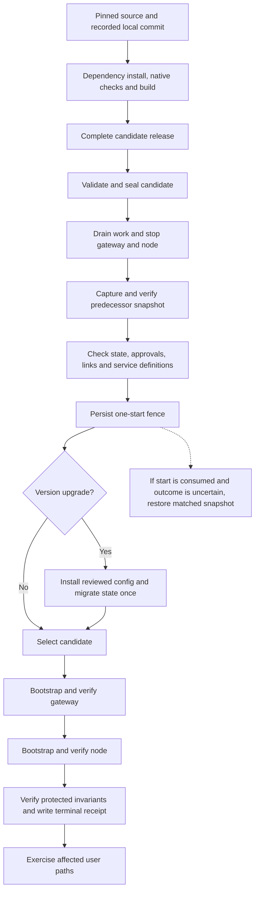
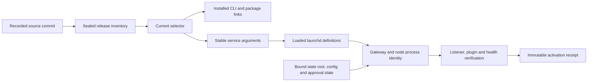

# Runtime releases and promotion

A release is a built, checked copy of runtime source. Activation makes that copy the
selected runtime and verifies the processes that actually started. The source checkout,
release, selected path, loaded service definition and running process are separate
identities. The current design checks each one.

The reference uses a single activation owner, `openclaw_runtime_activate.py`. It seals
candidates, captures a stopped predecessor, activates once and preserves a matching
recovery path. The earlier workspace phase-plan machinery has been retired. Native
OpenClaw task and state mechanisms remain the execution authority.

## From source to candidate

Reconstruct the pinned source using [the runtime package](../runtime/README.md). Record
the public tree under the adopter's own commit, install the pinned dependencies, run
the applicable native checks and build. The build must contain the required runtime
entrypoints, bundled plugins and a dependency closure that does not point back into a
disposable worktree or shared mutable store.

Build output is not automatically a release. Copy the complete validated closure into
a new release directory, inspect its file modes and symlink targets, and seal that
candidate. A seal binds the source commit, release identity and normalized inventory.
Keep the previous selected release and its compatible state available until recovery
and acceptance obligations are satisfied.

The [standalone promotion diagram](../diagrams/runtime-promotion.mmd) uses the same sequence.
The activation helper is designed for an already qualified predecessor installation.
The [first-install sequence](17-adoption-guide.md#6-establish-the-first-installed-runtime)
packages and seals the initial build, stages disabled service definitions, creates the
exact selector/support links, installs the reviewed definitions and starts each
service once. Actual process and user-path checks establish that predecessor. It
does not invent historical state or an activation receipt for first installation.

## What must agree before activation

The helper checks the candidate seal, expected source commit and stopped snapshot. It
requires the gateway and node to be stopped, the current selector still to name the
captured predecessor, and the support links and service definitions to match their
recorded bindings. Runtime state, configuration and native execution approval records
have their own checks.

Provider authentication is persisted native state. The activator checks the expected
profile-order count and digest and the usability of that order; these are
**adopter-derived inputs**. Copying another operator's values would reject the adopter's
valid accounts or falsely imply account equivalence. Secret token values do not belong
in an activation receipt or public configuration.

A same-version change preserves the protected runtime configuration and uses the same
state root. A version upgrade additionally binds an explicitly reviewed configuration
and invokes the candidate's native migration once. After migration it rechecks the
protected state, service definitions and semantic approval/authentication bindings.
The migration path is not a license to rewrite unrelated account state.

## One start and an inspectable outcome

The helper takes an exclusive operation lock. Before applying the change it writes an
immutable start-consumption record bound to the candidate seal and snapshot. It then
moves the current selector, bootstraps the gateway once, verifies it, bootstraps the
node once and verifies it. It checks the protected invariants again before recording
`activated`.

These are meaningful failure distinctions:

| Outcome | Meaning | Next step |
|---|---|---|
| `failed_before_apply` | Preflight rejected the operation before consuming the start fence. | Inspect and correct the actual precondition, then create a reviewed attempt. |
| `activated` | The bound activation and its process/invariant checks succeeded. | Verify the affected channel, tool or device behavior. |
| `snapshot_restore_required` | The one-start attempt was consumed, failed or has an ambiguous interrupted outcome. | Inspect the retained evidence and use the matched restoration procedure. |

Repeating the exact successful operation verifies its persisted bindings before
returning the existing result. Finding a consumed start fence does not permit another
blind bootstrap. A failed attempt and its evidence remain available; a later passing
check does not rewrite that history.

## Running identity and state

The [identity diagram](../diagrams/identity-convergence.mmd) separates persisted and
running identities. A correct symlink alone does not prove which process owns the
listener. A healthy gateway alone does not prove the node loaded the same release.

## Recovery and retention

Recovery couples a release with its matching state and service definitions. Selecting
old code against migrated current state is not an established rollback. The stopped
snapshot includes the protected runtime state, gateway and node definitions and
selector, with checked archive members and metadata.

Use the helper's `restore` procedure against the exact failed activation bindings.
Restoring after a successful activation is a distinct explicit mode because effects
may have occurred after startup. Never delete the result or start fence merely to
make another attempt fit the same namespace.

Release and promotion retention preserve selected releases, rollback references,
active operations and unknown layouts. Their dry-run reports must be read before
applying a deletion. Unknown ownership means preserve until resolved.

## What activation proves

For the Journal capture route, the configured activation guard preserves the
responsible executable identity and checks its exact TCC ScreenCapture grant,
including the stored code requirement. A stable grant is only a prerequisite.
Current capture readiness additionally requires fresh evidence from the actual
scheduler, Python and Peekaboo route; a process or activation change invalidates
the earlier behavioral evidence. The [manual acceptance procedure](../workspace/runbooks/runtime-activation.md#journal-capture-acceptance-and-permission-continuity)
provides that refresh without exporting, ingesting or replaying Journal data.
Scheduled synchronization remains a separate acceptance claim.

A successful activation receipt proves the checks represented in that receipt. It
does not establish every user workflow. After changes to delivery, run a real channel
request and inspect the visible message. After account changes, check the intended
identity and refresh path. After device changes, verify the actual device operation.
After backup changes, retain an independent restoration receipt.

These distinctions make upgrades slower than replacing a package directory. They also
make a failure explainable and recovery specific. See [evidence and verification](15-evidence-audit-and-verification.md)
and [host operations](19-host-operations-and-backups.md).
