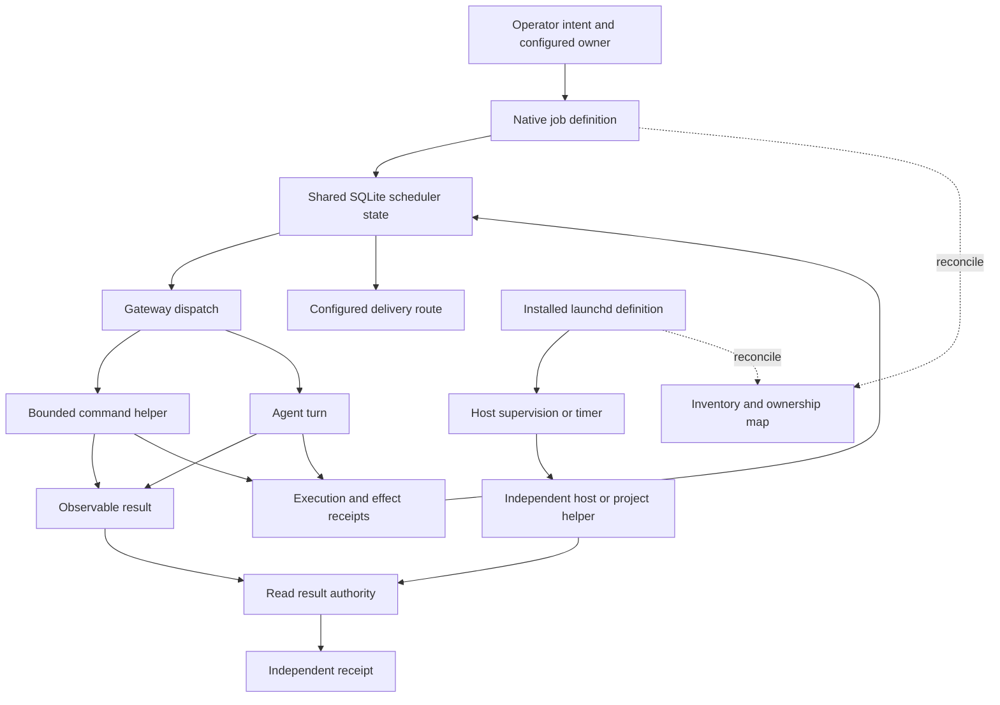

# Scheduling and background work

Scheduled work needs an owner, a defined effect and a delivery contract. A successful dispatch says that the scheduler started something. It does not establish that a backup completed, an expected record appeared, or the operator received the result.

The reference combines the native OpenClaw scheduler with macOS launchd. Each remains authoritative for its own definitions and execution state.

## Two scheduling layers

| Layer | Owns | Current authority | Availability boundary |
| --- | --- | --- | --- |
| Native OpenClaw scheduler | Recurring commands, agent turns, reminders and runtime-owned background work | Job definitions, runtime state and receipts in the shared SQLite state database | Dispatch depends on the gateway being available |
| macOS launchd | Gateway/node process supervision, independent host helpers and selected project timers | Installed service definition plus loaded job/process state | Depends on the relevant system or user service domain |

The native scheduler is not limited to model calls. Most routine host maintenance uses a `command` payload: a pinned interpreter invokes a checked helper, captures a bounded result and lets the runtime deliver it. An `agentTurn` is appropriate when a task needs reasoning and tools. Runtime-managed recurring work, such as memory consolidation, also has its own lifecycle.

The [upstream automation guide](https://docs.openclaw.ai/automation/cron-jobs) describes the native interface. This reference adds host-specific launch definitions, wrappers, result checks and operating conventions. Historical JSON files or exported lists do not become a second writable scheduler simply because they remain on disk.

Source: [`diagrams/scheduling-layers.mmd`](../diagrams/scheduling-layers.mmd).

## A job definition is an executable contract

A native definition records identity and enablement, schedule and timezone, payload, session target, time budget and delivery settings. Command payloads also bind argument vectors, working directory and required environment. Agent payloads bind their model/tool configuration where appropriate. Mutable last-run state remains separate from the intended definition.

For command payloads, explicit numeric `timeoutSeconds: 0` disables the wall-clock
timer in this pinned runtime. Omitting it retains the native ten-minute default;
a positive value sets a deadline in seconds. A separately configured no-output
limit and cancellation still apply. Zero does not make a process crash-resumable
or remove its owner's obligation to observe completion.

Keep exact time semantics with the job: the civil timezone, period being processed, catch-up policy and whether a late execution may write an earlier period. A timer firing after an outage does not by itself authorize backdating data.

A stored delivery route is part of the already-authorized scheduled task. Use its intended account, destination and message class. Do not choose a different recipient because the preferred route failed, or route a domain alert by guessing from its prose. Routine no-change checks can be silent; explicitly configured daily maintenance reports may report both success and failure.

## Inventory and ownership

Reconcile native job IDs and installed launchd labels with an ownership inventory. Record the canonical entrypoint, interpreter, environment, cadence, current enablement, intended effect and evidence pointer. The [nine maintenance definitions](../workspace/scheduler/maintenance-jobs.template.json) preserve the current command schedules as disabled native inputs. The [host manifest](../workspace/host-templates.json) selects the exact definitions to render; [the installation runbook](../workspace/runbooks/host-maintenance.md) explains registration and acceptance.

Preserve intentionally disabled and retired entries with their disposition. The existence of a plist or registry row is not a request to enable it. The actual native definition controls scheduled dispatch; launchd's loaded state controls a host timer. A classification registry may lag a renamed or replaced job and must be reconciled against those owners.

A reused job ID deserves particular care. If its payload changes from making a local archive to requesting a cloud backup, its earlier successful run still proves the earlier operation. Bind acceptance to the executed payload/configuration and scheduled period, not just the ID or latest green status.

## Pin the complete launch environment

A safety net can fail before it reaches the data it was meant to inspect. Service managers do not inherit the interactive shell's environment. Pin the interpreter, working directory, command arguments and required paths in the installed definition.

A helper that invokes OpenClaw must resolve the intended CLI and supported Node version, and select the same `OPENCLAW_STATE_DIR` as the running gateway. A correct executable pointed at another state root can read the wrong scheduler or fail to resolve protected configuration. A correct state root with an incompatible interpreter is equally insufficient.

Verify the installed and candidate environments with a read-only operation before enabling a timer. Check loaded state separately after installation. Keep credentials in the platform's protected credential mechanism; an environment binding should select the correct authority without publishing credential values.

For a project-owned producer, also bind its own source/configuration identity and data-access mode. The host control plane owns the launcher; the project owns whether the resulting data is acceptable. A personal-data pipeline is an integration example, not a required subsystem for adopting OpenClaw.

## Execution, effect and delivery

Interpret three facts separately:

1. **Execution:** the exact command or agent run ended with a recorded outcome.
2. **Effect:** an independent readback establishes the expected result for that target and period.
3. **Delivery:** the configured destination accepted the intended user-visible result.

A wrapper propagates child errors and treats missing or malformed required output as unknown. A job whose contract permits silence may succeed without a message; a required report with no delivery remains incomplete. Use each job's declared result contract instead of a universal rule that all empty output is success or failure.

The command wrapper saves private process evidence and emits concise human-readable output. The maintenance wrapper checks its child receipts before claiming overall success, even when an earlier child already changed files. For data jobs, inspect the authoritative record or artifact; a summary saying the run succeeded is insufficient.

## Source-change announcements

The operator Workspace's changelog collector is a helper-backed integration with
native scheduler delivery. The collector is not included among this repository's
exported helpers. Its coverage contract illustrates how a scheduled announcement
can avoid both dropped changes and duplicate messages.

The helper retains one covered source frontier and at most one prepared summary.
Preparation and staging do not advance coverage; confirmed native delivery does.
Ambiguous delivery retains the pending summary for reconciliation. A confirmed
silent run that never staged a summary can release its preparation while leaving
the source changes uncovered. The native scheduler owns sending and retries.

Forward source history is collected in bounded commit batches. A registered
source may also be deliberately rewound or replaced with a different history.
That transition needs an explicit comparison of the old and new endpoint trees,
introduced and retired commit counts, and bounded commit samples with visible
truncation. It must not silently reset coverage or mistake Git's valid
non-ancestor result for a failed read. Even an unchanged tree with a replacement
history retains transition evidence until delivery is confirmed. Missing source
objects, changed repository mappings, and a newly enrolled source that does not
descend from its pinned baseline remain unresolved conditions.

Preparation output also needs a byte limit: an upgrade can touch thousands of paths even when commit samples are bounded. Retain the complete evidence in a private, immutable file with its hash, and provide a bounded JSON projection with source refs, category counts and explicit omitted-detail indicators. Do not increase the command retention cap or parse a truncated JSON tail as complete evidence. Prepared coverage remains pending until delivery is confirmed.

A failed trigger can prepare evidence before its output is rejected, leaving an unstaged checkpoint. Releasing it requires explicit reconciliation bound to the exact checkpoint hash, a unique native pre-payload failure, and the same idle trigger/configuration and run identity. Preserve the failed receipt and old pending snapshot; do not advance source coverage, reset delivery records or send a replacement message. The existing natural schedule can then prepare the still-uncovered changes again.

## Independent safety nets

Put checks in a different failure domain where that improves coverage. A host timer can inspect whether an expected period's result exists even when the gateway scheduler did not dispatch it. An internal backup supervisor can still request a pause while external workspace storage is unavailable.

Independence is specific. A helper can avoid the model while still depending on the gateway CLI for one read. Its alert can depend on the same channel it is trying to report through. Document those dependencies instead of calling every second timer independent.

Detection and repair are separate choices. A read-only receipt guard checks the effect. An explicitly configured remediation path may take a bounded action when its own admission checks pass. Never turn a failed observation into an unrestricted retry loop.

## Interruptions and concurrent work

A timer may fire while another task is building, retaining files or changing a runtime release. Re-check required ownership and quiescence at the consequential step. Protect live worktrees, selected releases, rollback dependencies and active command processes.

Retain enough run identity to distinguish an interrupted attempt from a job that never started. After a restart, reconcile runtime records with any child/process receipt and the observed effect. A missing result is unknown; do not fabricate output or replay a potentially completed mutation simply to produce a cleaner history.

Background completion delivery and crash-resumable execution are distinct capabilities. The [execution chapter](06-execution-and-durable-lanes.md) describes native task and subagent lifecycles. A scheduler entry alone does not make arbitrary child processes safely resumable.

## Acceptance sequence

First validate the definition and its complete environment. Then exercise the exact helper in an isolated fixture or permitted manual run, verify its intended effect and delivery, and finally retain evidence from a naturally due execution. Manual success and a configured next-run time cannot prove unattended scheduling.

The [host operations chapter](19-host-operations-and-backups.md) gives the maintenance classes and a concrete workflow. [Guards and restoration](14-guards-health-and-restoration.md) covers containment when any of these checks fails.
