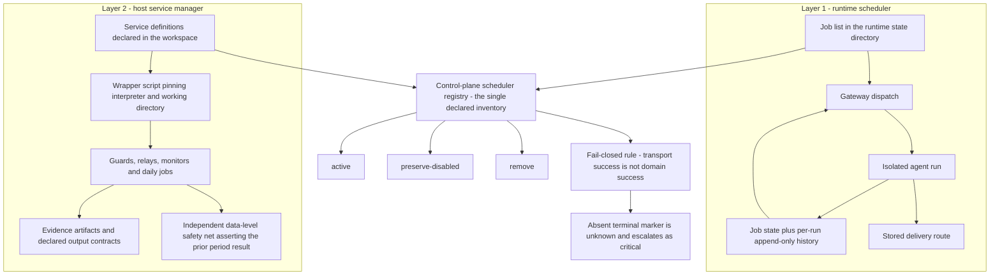

# Scheduling and background work

Scheduled work is where a control plane quietly fails. A job that stopped running still reports green, nobody notices for weeks, and the first sign of trouble is a gap in the data that nothing was watching. The cause is structural rather than careless: unattended work has no operator reading its output, so whatever is not checked by some other mechanism is in practice not checked at all. This chapter describes the two scheduling substrates the reference implementation runs, the registry that reconciles them into a single inventory, and the result-interpretation rules that keep a silent failure from reading as a success.

## Why there are two scheduler layers

Two genuinely separate schedulers exist, for different reasons, and neither can replace the other.

| | Runtime scheduler | Host service manager |
|---|---|---|
| Owns | Recurring agent turns | Guards, relays, monitors, daily report and sync jobs |
| Definition | A job list in the runtime state directory | Service definitions declared under `<workspace-root>/config/` |
| State | A job-state file plus a local job database | Process supervision by the operating system |
| History | Per-run append-only history files, one per job | Declared standard-output contracts and log files |
| Runs when | The gateway process is alive | The host user session is active, independent of the gateway |
| Provenance | runtime-backed | helper-backed, on the host's user-level service supervisor |

The last row uses this repository's honesty taxonomy: **runtime-backed** means the runtime itself enforces the behaviour, **helper-backed** means checked-in scripts and schemas do, and **policy-only** means nothing but instructions and operator discipline hold it up. The taxonomy is defined in [capability provenance](03-capability-provenance.md).

The division follows from what each layer can still do when the other is broken. A runtime job cannot supervise the runtime; a host service can, because it survives a gateway restart. Conversely, a host service has no session, no tools, and no delivery route of its own, so recurring agent work belongs in the runtime layer.

### What a runtime job actually contains

The runtime scheduler store holds the recurring agent jobs. Most target an **isolated session** — a fresh conversation created for that run alone, so a scheduled job cannot inherit or disturb the operator's ongoing thread. Each job definition binds:

| Group | Fields | Meaning |
|---|---|---|
| Identity | job id, agent id, name, enabled flag, creation time | Which agent runs it and whether it is live |
| Schedule | kind (recurring expression, one-shot at a time, or fixed interval), the expression itself, a timezone, an optional stagger | When it fires, in an explicit civil timezone |
| Session target | isolated or main, plus an optional session key, plus a wake mode | Where the run's conversation lives |
| Payload | kind (agent turn or system event), the message, model, thinking level, timeout in seconds, a reduced-context flag, and an allowed-tools list | What the run may do, bounded before it starts |
| Delivery | mode (announce or silent), destination channel, recipient, best-effort flag | Where the result goes, bound at definition time |
| Failure alert | threshold count, destination, cooldown, mode | When repeated failure becomes a message |
| Lifecycle | run policy, delete-after-run flag, mutable state | Whether the job is one-shot and where its state lives |

Mutable state is kept separate from the definition, which is what makes the definition safe to check and diff. The per-job state record carries last run time, last status, last duration, consecutive error count, last delivery status, next scheduled run, and the alert-dedupe fields — the last alert's delivery key, its fingerprint, and when it was sent. Those three dedupe fields are the difference between a job that alerts once about an ongoing problem and one that alerts every fifteen minutes until the operator mutes the channel.

A host service definition is a smaller object. Each one pins an interpreter, a working directory, a schedule, required environment, and its log destinations. The reconciliation registry asserts those same properties, so a definition edited on disk without a corresponding registry change is detectable drift rather than an invisible change.

## The reconciliation registry

Neither layer knows about the other, so a third artifact reconciles them: a control-plane scheduler registry that is the single declared inventory of every scheduled job on the host, including the ones that are deliberately switched off.

Each entry records, at minimum:

| Field | Purpose |
|---|---|
| Owner layer | Which substrate actually runs it — runtime scheduler or host service manager |
| Lifecycle state | `active`, `preserve-disabled`, or `remove` |
| Cadence or schedule expression | With an explicit timezone |
| Source definition | The file the definition is declared in |
| Configured entrypoint | What the definition says it runs |
| Child interpreter | The interpreter the wrapper hands work to |
| Failure signal | What a failure of this job looks like from outside |
| Evidence reference | Where the proof of its last run lives |

Additional fields cover the runtime contract: target-date semantics, whether catch-up is permitted, whether backdating is permitted, the declared standard-output contract, required environment, installed and loaded booleans, and a flag asserting the job does **not** point at a disposable task worktree. That last flag exists because scheduled jobs aimed at worktrees that later disappear were a recurring outage class.

Classification is explicit and exhaustive. Every entry is one of three states:

- **active** — running, with a canonical entrypoint and a live evidence reference.
- **preserve-disabled** — deliberately not running, kept in the inventory on purpose.
- **remove** — slated for deletion; nothing should re-create it.

**Preserve-disabled is a deliberate state, not neglect.** A disabled entry carries its containment history inline: why it was switched off, what would have to be true to switch it back on, and which successor job took over its purpose. Re-enabling is therefore a gated action against written activation criteria rather than a judgement call by whoever finds it next. Deleting the row instead would destroy exactly the information a future operator needs, and would let the job be silently rediscovered and re-enabled as if it had never failed.

The registry is JSON, with a hand-maintained readable mirror whose header declares the JSON canonical. A worked entry is [`examples/scheduler-entry.example.json`](../examples/scheduler-entry.example.json). Scheduler state is exported before any edit, so a botched change has a restore point — a scheduler is one of the few components where a bad edit is invisible until the next fire time, which may be a day away.

## The two layers and their reconciliation

Source: [`diagrams/scheduling-layers.mmd`](../diagrams/scheduling-layers.mmd).

## Result contracts: transport success is not domain success

A scheduled job has two entirely different questions attached to it, and conflating them is the origin of most false green:

1. Did the job get dispatched and did the process exit cleanly? — **transport**.
2. Did the work the job exists to do actually happen? — **domain**.

Policy requires interpreting a job's own declared result contract, never the transport status. A job that ran, reached the network, got a polite refusal, and exited zero is a **failure**, and must be reported as one.

A result contract is declared per job in the registry and is small: what the job's standard output must contain — typically one JSON object carrying a status, the period the run covered, and a terminal marker — and which of the two questions above that output answers. Writing it down is what makes domain success checkable by something other than the job itself.

The harder case is ambiguity. When a run finishes but emits **no terminal marker**, the outcome is genuinely unknown — and unknown must fail closed. It is interpreted as critical rather than demoted to a warning, because the alternative treats "I have no idea what happened" as "fine". Recovery from unknown emits the same transition as recovery from failed, so an operator never has to distinguish two shapes of good news.

## Independent safety nets

A scheduler must not be its own only monitor, and more generally:

> A monitor must not depend on the components it is proving.

A monitor that observes the transport and the terminal marker shares a failure domain with the job. If dispatch is silently denied upstream, that monitor reports OK forever, because the thing that would have told it otherwise is the thing that stopped. The structural answer is a second, independent detection path: a guard that runs on its own schedule, in the other layer, and reads the datastore directly to assert that an expected result exists for the period that just ended. Absence is an alert, not a pass. Nothing in the job's own chain — its dispatch, its bookkeeping, its terminal marker, its model — can suppress that guard, because the guard traverses none of them. It asks the only question that cannot be faked from inside: is the result there?

Two design notes carried from live operation:

- The safety net asserts **data**, not process health. "The row for yesterday exists" is checkable; "the job looks healthy" is not.
- Its **remediation capability is default-off**. Detection and repair are separated deliberately, so a misfiring guard cannot cascade.

## Per-run evidence retention

Each run leaves evidence, and the evidence outlives the run.

- The runtime layer appends one line per execution to a per-job history file, carrying timestamp, action, status, run and next-run times, duration, delivery status, session identifiers, model and provider, usage, and — on newer records — an execution id, trigger kind, scheduled-for time, and error.
- The host layer writes to declared output destinations named in its own definition, so where a job's output lands is part of its contract rather than an accident.
- Guard and report jobs write artifact trees whose records carry producer, target, freshness, acceptance predicate, and a retention class.

Retention is classed, not indefinite: history is what makes "this job has been failing since the fourth run" a checkable statement rather than a memory. Evidence handling in general is covered in [evidence, audit and verification](15-evidence-audit-and-verification.md).

## Scheduler-owned delivery

Outbound sends normally require a fresh operator approval, granted per send and never implied by permission to do the underlying work — the token model is in [policy and authority](05-policy-and-authority.md). Scheduled jobs carry one narrow, named exception, because a job that needed a human to approve each nightly report would not be a scheduled job at all.

**A job may deliver its own result without a fresh send approval only when the stored job definition already binds all of:**

- the exact destination route;
- the exact account or identity that sends it;
- the delivery mode — announce or silent;
- the message class.

The approval was given once, when the job was created, and it covers exactly that shape. Everything outside that shape is a different mutation and needs its own approval:

- **Editing the stored job** — changing destination, account, cadence, or payload — is a configuration mutation, not a delivery.
- **Expanding the payload** — attaching more, forwarding a broader result, or including content the stored job never described — is a new send, not the approved one.
- **Delivering somewhere else because the stored route failed** is not a fallback. It is an unapproved send.

Scheduled output is further disciplined by class. Every scheduled outbound message binds a destination, a message class — alert, transition, routine success, audit, maintenance — a severity, and an incident fingerprint before it is sent. The fingerprint is a stable hash over what the incident *is*, not over the text describing it, so the same underlying failure recognizes itself on the next poll even when the wording changes. **Routine success is silent by default**, because a channel that receives a message every time nothing happened trains its reader to skim past the one message that matters. An unchanged incident therefore produces bounded reminders rather than a fresh message on every poll, and the dedupe key plus the cooldown stored in job state prevent a flapping job from becoming the loudest thing in the channel. See [delivery and the control surface](13-delivery-and-control-surface.md) for the delivery substrate itself.

## Scheduled runs and durable lanes

Scheduled work does not wait politely for long operations to finish. A timer fires whenever it fires — which in practice means **between phases of a durable lane** (a long-running unit of isolated work spawned out of a conversation, with its own status record and its own write surface), during a runtime promotion, mid-checkpoint, or while a worker holds a **write lease**, the time- and identity-bound claim that makes it the only permitted writer of a set of paths.

This is why **quiescence** — the precondition that no queued or running work and no colliding processes exist before a stage claims exclusivity — is not checked once and remembered. Any operation that requires the system to be quiet re-checks that condition at each phase boundary. The failure this prevents is mundane and common: a check passes at admission — the gate that turns an approved request into a bound, executable operation — the operation then spends ten minutes building, a nightly job fires inside that window, and the operation goes on to claim exclusivity against a world that stopped being quiet nine minutes earlier. The related consequences:

- A scheduled job must never assume it is the only writer. Ownership is a claim it takes, not a state it infers.
- A long operation must never assume the world was still while it worked.
- A scheduled job that would collide with an active lane defers rather than forcing; the deferral is recorded so a skipped run is visible as a skipped run.

Durable lane mechanics, leases, and phase boundaries are covered in [execution and durable lanes](06-execution-and-durable-lanes.md).

## Job hygiene rules

The rules below are cheap to state and expensive to learn:

- **Active jobs target canonical paths**, never a disposable task worktree. A job pointing at a worktree dies the day the worktree is cleaned up.
- **Wrappers fail closed.** A wrapper whose entrypoint is missing must fail loudly, not exit zero having done nothing.
- **Child failures propagate.** A wrapper that ignores its child's exit status manufactures false green at the cheapest possible price.
- **Time semantics are explicit per job**: a timezone-qualified schedule, declared target-date semantics, and stated catch-up and backdating rules, so a late run cannot silently write to the wrong civil date.
- **Scheduled payloads name explicit provider and model identifiers** rather than aliases, and worker spawns take their defaults from configuration rather than per-call overrides, so a scheduled run is reproducible.
- **Scheduled and sub-agent sessions load a reduced context allowlist** — the core contracts only. A background job does not need the whole policy stack, and a smaller injected set is a smaller failure surface. See [memory and context](08-memory-and-context.md).

## Interrupted runs

Processes die. Reserving a run writes two things into job state: a timestamp marking the job as running, which blocks concurrent dispatch, and an in-flight record carrying the provenance needed to close the run out afterwards — the execution id, the trigger kind, and the time the run was scheduled for. The invariant that keeps interruption honest is that those two are **written together and cleared together**, in one operation. A marker that survives a restart is therefore, by construction, either accompanied by its provenance or identifiable as a legacy marker that has none.

Job state is merged from disk without schema validation, so the in-flight record is re-parsed defensively on read and a malformed one is treated as provenance-less rather than trusted. That is the conservative direction: a run that is closed out as "interrupted, details unknown" is recoverable, while one closed out from a half-parsed record is a fabricated fact in the history file.

At startup the in-process active set is empty, so every surviving reservation is by definition orphaned and is collected as interrupted. During normal operation that same active set is the only thing distinguishing a run this process still owns from one whose owner died. This is subtler than it looks, because a configuration reload rebuilds the scheduler service *inside the same process*: any reservation path that forgets to add its run to the active set leaves a live run indistinguishable from an abandoned one, and the next reconciliation pass will finalize it while it is still running. Legacy markers with no provenance are *unblocked only*, never reconciled into a fabricated terminal record.

One limit is stated plainly rather than papered over: **the output summary of an interrupted run is unrecoverable.** Only the fact of the interruption can be reported. An architecture that invented a plausible summary here would be worse than one that admits the gap.

## Timeouts

Two independent timeouts protect a run: a total wall-clock budget, and an idle watchdog that aborts when no output has arrived within a window. Scheduled runs without explicit timeouts deliberately disable the idle watchdog and defer to the scheduler's outer timeout, because a long, quiet, legitimately-slow scheduled job should not be killed by a watchdog tuned for interactive turns.

## What is proven versus asserted

| Capability | Reference implementation | Stock-runtime adopter |
|---|---|---|
| Runtime job store, state, and per-run histories | runtime-backed | runtime-backed |
| In-flight marker and interrupted-run reconciliation | runtime-backed | policy-only until built |
| Host service layer for guards and daily jobs | helper-backed | helper-backed |
| Reconciliation registry and three-state classification | helper-backed | policy-only |
| Scheduler result interpretation — result contract and fail-closed unknown | helper-backed guard scripts plus policy | policy-only |
| Independent data-level safety net | helper-backed, on a schedule of its own | policy-only |
| Scheduler-owned delivery exception | policy-only clause over runtime-backed delivery binding | policy-only |

## Adopting this

1. Write down every scheduled job you have, in both layers, in one file. The inventory is the deliverable; the fields come later.
2. Give each job three possible states and no fourth. Keep the disabled ones, with their reasons.
3. Define, per job, what its *own* result contract is — then stop reading exit codes as answers.
4. Add one monitor that shares no components with the thing it monitors.
5. Decide, once, what each job may send and where; treat any change to that as a new approval.

Where this leads: a scheduled job's result is worth nothing until it reaches a human, and the delivery path is its own machinery with its own failure modes. That is the subject of [delivery and the control surface](13-delivery-and-control-surface.md), which covers how a message is proven delivered exactly once.

Related chapters: [execution and durable lanes](06-execution-and-durable-lanes.md) for lane phases and leases, [guards, health and restoration](14-guards-health-and-restoration.md) for the health classes a failing job lands in, [integrations and capability routing](11-integrations-and-capability-routing.md) for the routes these jobs exercise, and [capability provenance](03-capability-provenance.md) for the labels used in the table above.
