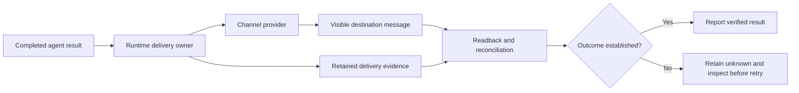

# Delivery and the operator interface

Discord and Telegram are interfaces for directing work, receiving progress and reviewing results. A useful interface should make the state of a task understandable without exposing its internal event vocabulary.

The agent's final answer and the runtime's terminal record serve different audiences. The first should satisfy the request. The second should help establish what executed and whether delivery succeeded.

## Separate three events

| Event | What it proves | What it does not prove |
| --- | --- | --- |
| Model response completes | The provider returned that response. | The goal is satisfied or the destination received it. |
| Task or goal completes | Its owner recorded a terminal outcome. | A visible message or external write exists at the intended destination. |
| Destination readback confirms an effect | The particular message, event or file is observable there. | Every other part of the workflow is correct. |

A transcript may retain generated responses and delivery mirrors. Counting final-looking transcript records is not a reliable way to count messages visible in Discord. Inspect the actual destination and the relevant delivery metadata.

## One clear result

The parent responsible for the request owns the operator-facing result. A child returns evidence to that parent unless a specifically supported route assigns delivery elsewhere. A late child result should not cause another copy of an already complete answer.

Long-form text may need several channel-sized parts or an attachment. Preserve the complete content, continue automatically when required, and verify the delivered artifact rather than assuming a local file proves delivery.

Use ordinary prose. Avoid emoji, internal tool banners, routing dumps and redundant terminal-status messages. A necessary limitation should explain its practical effect on the request.

## Progress should reduce uncertainty

During substantial work, post meaningful milestones and explain real dependencies promptly. Say what has been established and what the next step will resolve. Editing an old message is not always an adequate substitute for a new visible update during a long wait.

A legitimate yield is not a failed empty answer. The runtime patch preserves pending-continuation ownership through native Discord command settlement. That implementation supports the agent's progress policy; it does not remove the need for useful communication.

## Context notices

Compaction is a runtime operation, not a new operator objective. Native foreground notices can describe supported compaction paths when configured. A warning that context pressure is high is only a warning; it does not prove that compaction subsequently completed.

Background maintenance may compact without a separate channel notice. Manual compaction can produce an explicit command result, but testing it does not prove every automatic path sends the same result. Do not build a parallel warning monitor that leaves the interface permanently pending after the runtime has moved on.

## Ambiguous delivery

An external provider can accept a message even if the caller never receives its acknowledgment. Before retrying, inspect the destination and reconcile the retained operation identity. If delivery remains unknown, retain that uncertainty instead of claiming success or assuming nothing happened.

Internal deduplication and single-owner completion reduce duplicates. They do not justify an unconditional exactly-once promise across every provider failure. The [delivery diagram](../diagrams/delivery-path.mmd) makes the verification boundary explicit.

## Acceptance through the real interface

Submit a natural request through the channel, observe its progress, and check the final destination. Correlate the result with native session/task records where needed. For attachments, compare the delivered bytes or content with the intended artifact. Test normal completion, worker continuation and relevant failure paths separately.

The [worked example](07-worked-example.md) demonstrates the user-facing behavior. The [runtime source map](20-runtime-source-changes.md) locates the streaming, continuation and channel changes.
