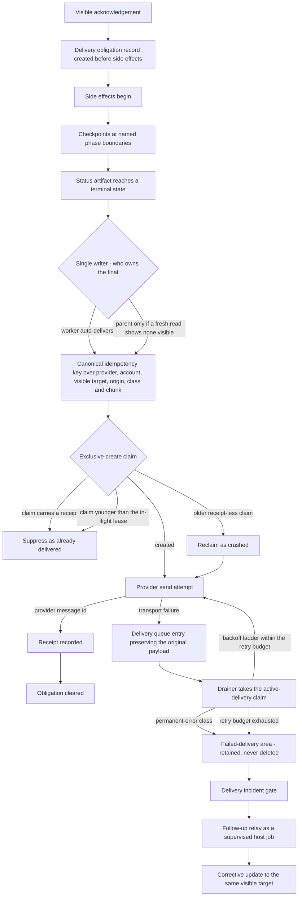

# Delivery and the control surface

An agent that finishes its work and says nothing has failed. It has failed in the way that is hardest to notice, because from the operator's side work that was done but never reported is indistinguishable from work that was never done. This chapter covers the surface the operator actually watches, the obligation that a single acknowledgement creates, and the on-disk machinery that turns "exactly-once delivery" from a claim into a property.

**Exactly-once delivery**, here, means the operator sees a unit of work's terminal result exactly one time: not zero times because a process died between finishing and sending, and not twice because it restarted mid-send and tried again. Both halves need machinery. Neither is achievable by instructing a model to be careful.

## Chat is a control surface, not an inbox

The chat thread is not where work happens. It is where work is *steered*: the operator issues intent, the system reports state, and the operator decides what happens next. Everything else — implementation, tool calls, tests, retries — happens in a **durable lane**, a long-running unit of isolated work with its own child session, its own status record on disk, and its own write surface, which the thread never sees directly.

That framing produces three message kinds and no fourth:

| Kind | Count per lane | Means |
|---|---|---|
| Acknowledgement | Exactly one | Work is accepted, the mode is chosen, and a specific next update is promised |
| Checkpoint | Zero or more | A named phase boundary, a blocker, or a scope change — never a progress ping |
| Final | Exactly one | The single terminal result for the whole workstream |

The public headings are fixed strings — **durable lane established**, **durable lane checkpoint**, **durable lane final** — and each must agree with the authoritative structured delivery metadata behind it. A heading renders state; it never asserts it. That is what makes the surface skimmable: an operator scrolling a thread can count acknowledgements and finals without reading a word of body text, and a second final is visible as a defect rather than as a helpful extra message.

Two rules keep the vocabulary from eroding:

- A missing or rejected acknowledgement **blocks** checkpoint and final delivery. It does not degrade into an unstructured message that happens to say roughly the right thing.
- Internal artifacts are not delivery. Async command-completion notices, worker completion events, tool output, and process logs are internal evidence. When one of them resolves an operator-visible task, it must be converted into an explicit operator-visible update.

The first of those rules is enforced by an **acknowledgement barrier**, and its implementation is worth stating because the rule is otherwise unenforceable. Every outbound delivery is classified on the way out into either an acknowledgement kind or a worker-visible kind — checkpoint, final, completion, blocker. Both kinds are recorded per lane in the runtime's own state, and a worker-visible delivery is refused unless an acknowledgement record for that lane already exists. Resolving *which* child run owns a lane's identity is itself contended, so that resolution takes a short reservation lease: two workers spawned from the same conversation cannot both claim to be the lane whose acknowledgement was delivered.

Lane mechanics behind these headings are in [execution and durable lanes](06-execution-and-durable-lanes.md).

## The obligation is created before side effects begin

The ordering here is the whole idea:

> A visible acknowledgement that promises fresh work creates a machine-checkable terminal delivery obligation **at acknowledgement time**, before the first side effect.

The obligation record names the target, the last visible update, the next owed update, and the completion path. It clears on exactly two events: a visibly delivered final, or an explicit cancellation. It does not clear because the run ended, because the worker exited cleanly, or because the closing message was carefully worded to avoid the word "done". Avoiding completion language is not a discharge; it was, before this rule existed, a loophole that let a slice close with nothing delivered.

The complement matters as much: a successful acknowledgement must not by itself synthesize a false "you owe a final" blocker on work that is already terminal-delivered. An obligation system that cries wolf is switched off within a week.

## Delivery is proven by receipt

Internal completion is not delivery. The predicate is **visible delivery**: a provider-confirmed message id for a message that landed on the operator's visible target, or an authoritative readback proving the artifact is where it was promised — the readback discipline for external systems is in [integrations and capability routing](11-integrations-and-capability-routing.md).

The consequences run through the whole of closeout — the end-of-work step that finalizes a lane's record and evidence before anything may be called done:

- Closeout gates keep failing while an obligation is open and no delivered-message id or readback receipt exists.
- A send that returned an error, a link, or a plausible-looking success body with no id is not a receipt.
- Ordering is fixed: the status artifact must reach a terminal state *before* the visible final is sent. Terminal means one of complete, blocked, failed, cancelled, superseded, or preserve; of those, only complete counts as success-terminal, and cancelled or superseded runs own no visible final at all — a superseded lane that sends a final is announcing the result of work another lane took over.

A confirmed receipt is not left where only the sender can see it. It is published as an event carrying the lane identity, the message kind, the delivery kind, the terminal outcome, the delivery time, the provider message id, the channel, the originating message id, and the owner. Write-lease state — the record of which run currently holds exclusive write ownership — and lane supervision both subscribe to it. That is how "the operator has actually seen this" becomes a fact the rest of the system can read, rather than something each component re-derives from the same ambiguous evidence — and it is what stops supervision from escalating a lane whose final has already landed.

## The delivery path



Source: [`diagrams/delivery-path.mmd`](../diagrams/delivery-path.mmd).

## The substrate that makes exactly-once real

Exactly-once is a property of machinery, not of intent. A policy sentence saying "send the final once" is unenforceable: the process that would obey it is the process that dies. Four pieces provide the property instead, and an adopter who copies only the sentence gets none of them.

**1. The terminal-delivery ledger.** Only terminal delivery classes — final, completion, blocker, and their variants — may reserve terminal ownership; a checkpoint reserves nothing, because there is no harm in two checkpoints and real harm in a checkpoint blocking a final. For those classes a canonical **idempotency key** is computed: a value derived from the *identity* of the message rather than its content, so two attempts to send the same logical result compute the same key and the second one loses. Its shape:

```text
terminal-dispatch:<provider>:<account-route>:<hash-target>:<hash-thread-slot>:<hash-origin>:<delivery-class>:<index>of<count>
```

Reservation is two-tier: an in-process map with a lifetime of a couple of minutes, then a persistent claim file created with exclusive-create under the runtime state directory, at restrictive file and directory modes, retained for a few hours. The in-process tier is fast and covers the common duplicate; the file tier is the one that survives a restart, which is the case that matters. Three key-design choices are deliberate and worth copying:

- the target canonicalizes to the visible destination, so a parent-channel send and a direct thread send collapse into one slot rather than producing two visible finals;
- message text is excluded from the key, so a partial final that is later corrected cannot become a second visible final;
- chunk coordinates *are* included, so an intentionally multi-part final stays multi-part.

Arbitration between a crash and a duplicate is explicit: a claim carrying a completion time and a provider message id suppresses for the retention window; a claim younger than a short in-flight lease suppresses; an older claim with no receipt is reclaimed as crashed rather than suppressing the real final for hours. If the claim store cannot be read the code **fails open**, on the stated judgment that a dropped real final is worse than a rare duplicate. That is the one place in this architecture where fail-closed is not the answer, and it is a judgment call, not an oversight.

**2. The store-and-forward queue.** Outbound messages that cannot reach the provider become JSON entries in an on-disk delivery queue rather than exceptions in a log. Each entry preserves the original pre-transform payloads plus session context and caller scopes, so recovery replays the transforms rather than re-deriving a message from a partially-mutated one — replaying a transform over preserved inputs is deterministic, while re-deriving a message from a half-transformed copy is not. A claim wrapper ensures only one drainer owns an entry at a time. Recovery walks a fixed backoff ladder that widens sharply — each step several times the previous one, so an outage of minutes is not answered with hundreds of attempts — across a bounded attempt count, after which the entry is not retried again. The ladder and the cap are tuning parameters rather than design constants; they are collected with the rest of them in the tuning table below. A matched class of permanent errors, such as an unknown conversation, a removed or blocked sender, or an empty destination, short-circuits retries that cannot succeed.

**3. A failed-delivery area, not a delete.** Anything past the retry budget or classed permanent moves to a retained failure area rather than being removed. A queue that deletes its failures cannot be audited, and the entries that survive there are the raw material for the incident gate. On a healthy host this area is small, old, and boring — which is exactly the signal it exists to give.

**4. The incident gate and the follow-up relay.** The gate reads the failure area and decides whether an undelivered obligation is an incident that must be surfaced. The relay is a supervised host job that carries out the surfacing: it re-attempts or converts the owed update into a visible message on the original target. It runs in the host service layer deliberately, because a relay that lives inside the runtime cannot deliver anything when the runtime is the thing that failed. Its per-run state records when reporting was armed, the follow-up interval, and a relay block holding the last sent hash, route, message id, and the idempotency keys it has already consumed — so the relay itself cannot become a duplicate source.

A queue entry is deliberately more than a message. Its field groups:

| Group | Holds | Why it is kept |
|---|---|---|
| Identity | Entry id and enqueue time | Ordering, retention, and de-duplication |
| Destination | Channel, target, optional account, thread, and reply anchor | The visible target must survive the restart, not be re-derived |
| Payloads | The original pre-transform payloads | Recovery replays transforms as stateless functions |
| Session mirror | Session key, agent id, text, and any media references | Enough context to reconstruct the send without the live session |
| Attempt state | Retry count, last attempt time, last error | Backoff, classification, and the audit trail of why it failed |

A worked receipt covering the key, the reservation, the provider confirmation, and the arbitration outcome is [`examples/delivery-receipt.example.json`](../examples/delivery-receipt.example.json).

### Who is allowed to send the final

The ledger prevents a duplicate from *landing*. Two ownership rules prevent one from being composed in the first place, which is cheaper and produces better messages.

The first is **single-writer ownership**. When a worker lane is expected to deliver its own final, the parent must not also send one unless a fresh read proves no equivalent final is visible on the target. If the parent does send after that check, the message must be plainly supplemental rather than a second attempt at the same result. Without this rule the common outcome is not silence but two finals disagreeing slightly about what happened, which costs the operator more time than no message would have.

The second is **no fragmented finals**. One logical result is one concise message plus at most one attachment, under the same terminal identity. If the attachment cannot be prepared, the correct behaviour is to fail *before* sending anything rather than to send the summary now and the attachment later. A half-sent final is the worst state available: it consumes the terminal slot, so the completed version can no longer be delivered as the final.

**Provenance.** The terminal-delivery ledger and the store-and-forward queue are **runtime-backed** — the runtime enforces them in code, rather than a contract asking a model to be careful. Delivery obligation tracking is **helper-backed**: an obligation record plus a closeout gate that refuses completion until a receipt exists, which is a decidable predicate a script can settle and therefore does not need runtime code. Whether either of the runtime-backed pair is additionally live-proven is not something this chapter can state; that level is reached against a particular installation, and the evidence it would take is terminal claim records and terminally-failed queue entries left behind by ordinary traffic rather than by a fixture. The incident gate and the follow-up relay are **helper-backed**: enforced by checked-in scripts running under the host's user-level service supervisor, which is weaker than runtime enforcement because a script that is not installed enforces nothing. On a stock runtime none of this exists, and exactly-once there is **policy-only** — it holds exactly as long as no process dies at the wrong moment, which is another way of saying it is not a guarantee. The taxonomy is defined in [capability provenance](03-capability-provenance.md).

That gradient is the honest summary of this chapter. The vocabulary and the obligation record are portable to any runtime. The ledger is not: an adopter who cannot modify the runtime should verify what their delivery path already guarantees before writing "exactly-once" anywhere.

## The inbound side of exactly-once

Duplication is symmetric: a provider that redelivers an inbound message after a reconnect can cause the same work to run twice. The inbound path is therefore queued and receipted too.

Messages that arrive while the session store is locked are persisted as pending records carrying a queue id, hashed account and session identifiers, a replay key, state, retry and wait-retry counters, lock diagnostics with observation timestamps, and a recovery classification. On success a receipt is written asserting exactly-once delivery along with latency and retry counts, and acceptance reports whether the message was newly created, already pending, or already receipted. **A replayed message is recognized by its receipt rather than re-processed.** Receipts are retained for about a week and pruned on a schedule, which is long enough to cover any realistic redelivery and short enough that the directory stays small.

## The inbound deadline guard tells the truth about time

The inbound worker that handles a chat message runs against a hard wall-clock budget, with a safe-remaining threshold set some way inside it — both tuning parameters, listed in the table below. When the threshold is crossed, the guard has exactly two truthful endings:

1. **A durable lane is already established.** Release the inbound worker with one visible checkpoint saying so, and let the lane own everything that follows.
2. **No completed handoff exists.** Do **not** attempt a fresh spawn inside an expiring worker. Send one visible blocker naming the missing handoff and stop.

Both are steer notices: they tell the operator the real state and the narrow next step. Neither is a fabricated timeout, and neither is silence. The rule that makes this honest is small and easy to get wrong: **a visible checkpoint alone is not a durable handoff.** Announcing a handoff while nothing owns the work is a worse outcome than saying nothing, because it discharges the operator's attention against work that does not exist.

## The corrective-checkpoint rule

Supervision must be able to escalate a lane that has gone quiet, and escalation must be retractable when it turns out to have been early.

The sequence, in order:

1. A lane sits at a success-terminal state with only its visible final pending. Supervision does **not** escalate immediately; it re-checks on a bounded window, for a bounded number of attempts, because the contract requires the artifact to be terminal *before* the final is sent, which opens a legitimate gap.
2. If the final still has not landed, one blocked escalation is sent.
3. If the confirmed final receipt then arrives within a bounded post-escalation reconciliation window, supervision sends **exactly one corrective checkpoint** superseding the escalation, and stops.
4. Failure-terminal escalation has no corrective path: escalate once, then stop.

The asymmetry is intentional. A premature "blocked" over work that actually succeeded must be corrected in the same surface where it was claimed, once, and then closed. Repeated corrections would be a second failure mode wearing the first one's clothes.

The re-check window, its attempt cap, and the reconciliation window form a *supervision triple*, and they are tuned together rather than individually: a re-check window shorter than the gap between a terminal artifact and its final produces false escalations, while a reconciliation window shorter than the time a stalled send takes to confirm leaves a false "blocked" standing after the work has landed.

## Illustrative tuning defaults

The numbers below are illustrative starting points that show the intended *ratios*, not required values and not a description of any particular installation. Every one of them is a parameter in the delivery and supervision contracts, so an adopter reads the values in force from their own build and tunes them per host — provider latency, session volume, and how long the slowest legitimate build takes all move these.

| Parameter | Illustrative default | What it trades off |
|---|---|---|
| Queue backoff ladder | Four steps, each roughly four to five times the previous, from seconds to minutes | Fast recovery from a blip against retry storms during a real provider outage |
| Queue attempt cap | About five attempts, then the entry moves to the failure area | Persistence against letting a doomed entry hide a real incident |
| Inbound wall-clock budget | Tens of seconds, matched to what the answering surface will wait for | Room to finish short work inline against holding a turn that is already lost |
| Inbound safe-remaining threshold | Roughly the last third of the budget | Starting work that can finish against handing off early enough to be honest |
| Supervision re-check window | Low minutes | Escalating a genuinely stuck lane against escalating a lane that is one second from delivering |
| Supervision re-check attempts | A small handful | Same trade, spread over time rather than in one look |
| Post-escalation reconciliation window | Low tens of minutes | Correcting a premature blocked report against re-opening an incident nobody is still watching |
| In-process reservation lifetime | Minutes | Cheap duplicate suppression against holding stale reservations across a restart |
| Persistent claim retention | Hours | Surviving a restart against a claim outliving the work it describes |
| Inbound receipt retention | Days | Covering realistic provider redelivery against an unbounded receipt directory |

## Scoping follow-up obligations

A follow-up mechanism that fires on already-finished work produces false blocked reports, and a false blocked report is more corrosive than a missed one — it teaches the operator to ignore the channel. Three scoping rules keep it narrow:

- **Terminal-delivered work is skipped.** If a terminal claim with a receipt exists for the workstream, no follow-up is owed. The receipt is the authority, not the age of the record.
- **Obligations arm on the same trigger that creates them.** The reporting-armed timestamp is written when the acknowledgement is delivered, so the follow-up interval measures from the operator's actual last visible update rather than from process start.
- **Obligations expire on a retention window.** Claims and obligation records carry a bounded lifetime measured in hours, so a record left behind by a crashed run ages out instead of generating a report about work nobody remembers requesting.

## Suppression markers and send dedupe

Two small mechanisms prevent the delivery layer from talking over itself.

A **reply-suppression marker** lets an agent turn end without producing a visible message — used by internal housekeeping turns that have nothing to report. It is the delivery-side mechanism behind the *quiet-success token* named in [policy and authority](05-policy-and-authority.md): the policy grants a routine step permission to stay silent, and this marker is how the turn exercises it. The outbound path filters that marker out of the text before send, and the filter matches *residue* forms rather than one exact literal, because a model that wraps, quotes, or pads the marker still means "say nothing". A marker that reaches the outbound boundary at all is a defect signal worth counting: it is the difference between a silent turn and an operator seeing an internal token in a chat channel.

The second is **dedupe against assistant text**. When a turn both calls an explicit send tool and returns assistant text, the two can be the same message twice. Outbound sends are deduplicated against the assistant reply so one logical message stays one message.

## Formatting rules that keep mechanics out of chat

The control surface is for operator decisions, so operator-facing text carries operator-relevant content only.

- **No internal narration.** Once a durable lane exists, progress chatter is suppressed. The default next visible message is a checkpoint, a completion, or a real blocker.
- **No internal paths or process detail.** Helper script paths, workspace-internal locations, and execution-order commentary do not belong in a chat message. A run path an operator cannot act on is noise that hides the line they can act on.
- **Credentials never appear in status or debug output**, by default and without exception.
- **Chat-native rendering.** Short sections and shallow bullets; fenced blocks for multi-line commands; inline code reserved for short commands, flags, and identifiers. Long, wide, or dense deliverables become one attachment or artifact pointer rather than a wall of message text.
- **A closeout blocker is not deferred to the final.** If implementation and verification succeeded but a closeout step is blocked, an immediate visible checkpoint states implementation state, verification state, closeout state, the exact blocker, and one narrow next decision.

## What is proven versus asserted

| Capability | Reference implementation | Stock-runtime adopter |
|---|---|---|
| Fixed three-heading lane vocabulary | runtime-backed | policy-only |
| Obligation created at acknowledgement time | helper-backed — an obligation record plus a closeout gate | policy-only |
| Visible-delivery predicate and receipt propagation | runtime-backed | policy-only |
| Terminal-delivery ledger and idempotency keys | runtime-backed | policy-only unless the runtime supplies one |
| Store-and-forward queue with a failure area | runtime-backed | verify against the runtime; otherwise policy-only |
| Inbound queue with exactly-once dispatch receipts | runtime-backed | verify against the runtime; otherwise policy-only |
| Single-writer final ownership and the no-fragmented-final rule | policy-only, over a runtime-backed ledger that catches the miss | policy-only |
| Delivery incident gate and follow-up relay | helper-backed, supervised host job | policy-only |
| Inbound deadline guard endgame | helper-backed, contract-parameterized | policy-only |
| Corrective checkpoint after premature escalation | runtime-backed | policy-only |
| Formatting and narration discipline | policy-only | policy-only |

## Adopting this

1. Fix three message kinds and their headings before building anything. The vocabulary is free and it is most of the value.
2. Write the obligation record at acknowledgement time, not at completion time. If you build only one thing from this chapter, build this.
3. Make your closeout check fail while an obligation lacks a receipt. An obligation nothing enforces is a comment.
4. Put failed deliveries somewhere retained. You cannot debug a queue that deletes its own evidence.
5. Run the thing that reports delivery failures **outside** the process whose failures it reports.

Where this leads: everything here assumes something is watching for the case where delivery never happens at all. That watcher, its health classes, and the restoration paths it triggers are the subject of [guards, health, and restoration](14-guards-health-and-restoration.md).

Related chapters: [execution and durable lanes](06-execution-and-durable-lanes.md) for the lane whose final this chapter delivers, [policy and authority](05-policy-and-authority.md) for the approval that outbound sending requires, [scheduling and background work](12-scheduling-and-background-work.md) for scheduler-owned sends, and [evidence, audit, and verification](15-evidence-audit-and-verification.md) for how receipts are retained and read later.
