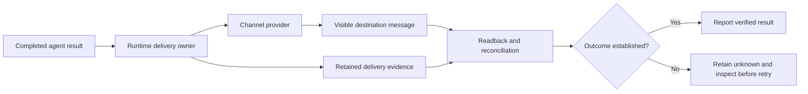

# Delivery and the operator interface

Discord and Telegram are interfaces for directing work, receiving progress and reviewing results. A useful interface should make the state of a task understandable without exposing its internal event vocabulary.

The agent's final answer and the runtime's terminal record serve different audiences. The first should satisfy the request. The second should help establish what executed and whether delivery succeeded.

## Separate three events

| Event | What it proves | What it does not prove |
| --- | --- | --- |
| Model response completes | The provider returned that response. | The goal is satisfied or the destination received it. |
| Task or goal completes | Its owner recorded a terminal outcome. | A visible message or external write exists at the intended destination. |
| Destination readback confirms an effect | The particular message, event or file is observable there. | Every other part of the workflow is correct. |

A transcript may retain generated responses and delivery mirrors. Counting final-looking transcript records is not a reliable way to count messages visible in Discord. Inspect the actual destination and the relevant delivery metadata.

## One clear result

The parent responsible for the request owns the operator-facing result. A child returns evidence to that parent unless a specifically supported route assigns delivery elsewhere. A late child result should not cause another copy of an already complete answer.

Long-form text may need several channel-sized parts or an attachment. Preserve the complete content, continue automatically when required, and verify the delivered artifact rather than assuming a local file proves delivery.

Use ordinary prose. Avoid emoji, internal tool banners, routing dumps and redundant terminal-status messages. A necessary limitation should explain its practical effect on the request.

## Progress should reduce uncertainty

During substantial work, post meaningful milestones and explain real dependencies promptly. Say what has been established and what the next step will resolve. Editing an old message is not always an adequate substitute for a new visible update during a long wait.

A legitimate yield is not a failed empty answer. The runtime patch preserves pending-continuation ownership through native Discord command settlement. That implementation supports the agent's progress policy; it does not remove the need for useful communication.

## September 22 native goal delivery repair

A native goal could acknowledge the command and retain a completed model answer without sending the final result to Discord. The direct channel owner claimed the pending final before the native command adapter invoked a second durable sender. That sender rejected the already-claimed record and suppressed delivery before any transport call. A completed goal or clean transcript therefore did not establish publication.

The repair selects the existing core durable route for continuing-goal finals and retains the actual command-target session identity. Private acknowledgements and ordinary slash responses keep their existing interaction hooks. Final preparation drains completed progress first; hooks may rewrite or cancel content, multi-part replies retain their delivery receipts, and an unsupported durable route reports failure without claiming that a message was sent.

The real adapter/channel-turn/queue regression reproduced zero physical final sends before the repair. Eighteen focused cases subsequently passed across custody, dispatch/adoption and goal progress, including hook cancellation, multi-part delivery and ordinary slash responses. Source `1fb1f66cfe29` activated on the originating gateway at 11:22:01.365523 UTC on September 22. Its signed app, build `2609000592`, is installed and connected on the originating Mini. A bounded native-goal final subsequently passed with exact Discord readback; that result does not establish longer-work progress or every completion path.

A later owned-handoff check delivered its final into an existing Discord thread, but the backend incorrectly reported missing visible delivery. Existing thread channels lacked canonical thread identity in the provider receipt. Source `085711060c84` records that identity from actual channel metadata in each chunk and the aggregate receipt. It leaves strict source matching, account authority and refusal handling intact. Fourteen producer and composed settlement cases pass, including nonthread, unknown-metadata, account, target, partial, progress-only and dry-run refusals. Transport and model/handoff boundaries are substituted in those tests; the successor activated at 12:37:05.013053 UTC. Its fresh diagnostic reached a provider rate limit before child creation, so actual live settlement remains pending. The qualified native companion is unchanged because this producer runs in the external Gateway.

## September 21 follow-up delivery incident

An observed “Yield failed” message was a runtime-generated tool-failure warning.
It did not mean Discord had rejected a message. The parent had sent follow-up work
to an existing child, but its current turn did not own a completion handoff. The
wait tool rejected the request. With no visible final answer, the generic warning
became the channel response while child work continued independently.

The repair binds eligible follow-ups to the current parent turn and
preserves the child's logical task across executions. Eligibility requires the
same requester, controller and child-session identity. An active child is steered
through its current execution owner; a completed child uses native reactivation.
The accepted receipt keeps execution and completion identities separate so both
supported harness paths can settle the correct obligation. A pending send or watch
alone is insufficient.

The handoff must also retain other results in the same completion batch. A delayed
callback from an older wait must not settle a newly claimed obligation or reuse its
delivery identity. These are lifecycle requirements, beyond changing the warning text.

The repair also explains a rejected wait in ordinary prose while retaining the
failure. It does not replace a useful final answer with a duplicate warning, claim
that work stopped, or promise an unconfirmed later response.

The [repair record](../runtime/README.md#september-21-follow-up-repair)
pins source `daf5771a7d868903ada1a99cf595a587027f018c`. Local source checks, 507 focused
suite tests, four filtered cases and 16 requester-wake end-to-end cases passed.
Fresh reconstruction matched all 39,499 tracked entries, except the two established
fixture-label substitutions. Two review findings were corrected and independently
inspected after correction.

The sealed release was activated on September 21. A bounded live diagnostic then
completed phase one in a native child, followed up in that same child with a stable
completion receipt, successfully yielded, and resumed the parent with phase two.
Exactly one final message was read back from Discord at 18:41:39.824 UTC,
35.974 seconds after acceptance. The first attempted wait had been skipped because
phase-one completion was already queued; this was one successful yield, not two.

That check establishes the exercised follow-up and delivery path. The
[hosted qualification](../runtime/README.md#earlier-september-21-qualification) subsequently
passed for `daf5771a7d86`. Broader workloads retain their own acceptance requirements.
The older results below retain their original source and deployment identities.

### Active-child follow-up and stale terminal warning

A later task exposed a distinct path: a follow-up targeted a child that was still
running. The owned follow-up helper forced a new agent-to-agent reply-delivery mode
onto that existing execution. Its validator correctly rejected the mismatch. The
parent continued useful work and successfully yielded to an owned continuation,
but the earlier send error became a final “Session Send failed” channel warning.
Child work was still running; the warning did not describe a terminal task failure.

The correction preserves the active child's admitted delivery mode and leaves
generic agent-to-agent restrictions unchanged. The shared terminal owner defers
that fallback warning during a successful, core-confirmed pause, regardless of
tool effect class. Error facts remain recorded; failed, cancelled or unowned turns
still expose unresolved errors. This behavior applies to both supported harnesses.

The [correction record](../runtime/README.md#active-child-follow-up-correction)
describes failing-then-passing regressions through the real execution validator
and payload renderer. The source is committed as `18b432ca2f83a107b1bc329cedf2221f20e61639`
and included in the patch. Its full build, activation and a bounded live check of
active and completed child follow-ups passed. That live check delivered one final
Discord response in 103.310 seconds, with one skipped wait and one successful yield.
A second live check retained a real failed `sessions_send` result through a
successful yield. The same child completed, the parent resumed automatically, and
Discord received exactly one final response in 117.275 seconds with no stale failure
warning. The nonzero shell exit in the first check was not used as tool-error proof.
Hosted qualification of the corrected source remains pending. The earlier completed-child
check did not cover this active-child mode mismatch.

## Additional Discord repair qualification

The additional repair has operator source commit [6e5890826b64df455be0c50756ef917aa6ee1211](https://github.com/josephbergvinson/openclaw-runtime-source/commit/6e5890826b64df455be0c50756ef917aa6ee1211). Local qualification passed 570 behavior tests and the native type, lint, import, state, security and dead-export checks. The aggregate build, release staging, candidate import, source seal and initial activation also passed. A private exact-message fetch passed after activation. The first live Discord retest nevertheless failed delivery acceptance; the deployed successor subsequently passed the bounded live checks described below.

The historical September 15 reference `3498293635372bd128eb4d3cddd520ffb0cfb6ae` retained these repairs and added the native Mac app/private-worker authentication change described in the [source map](20-runtime-source-changes.md). Its gateway remained on source `b3ee068c6c6b1fe4f90b5313c7b07a4cb0647a47`; its manifest separately identified the companion production delta and scoped acceptance. Its normalized tree was `4afd5efe52ae0ba136f738538477f4256500bc5a`. The current [runtime manifest](../runtime/manifest.json) separately records the September 22 source export and deployed gateway. The Discord results below retain their original revisions and do not qualify that newer source. The compact resolver change remains a workspace helper with its own fixture tests.

The baseline calendar request took 598.812 seconds from submission to its final Discord reply. Its trace contained 42 successful tool calls, no tool errors or timeouts, and no compaction. Broad searches, a full resolver result and an exact-message read that incorrectly returned channel history added large outputs to the context. These observations identify unnecessary input volume; they do not establish how much of the delay each output caused. The repair preserves model and reasoning settings.

Source inspection established that preview cleanup ran at a worker yield and that the resumed command path lacked continuation presentation. Later channel history contained no retained progress updates, but cannot establish whether a transient initial preview appeared before deletion. The fixes retain eligible progress at yield and give resumed work the existing native progress and typing path. Separately, a compact resolver fixture reduced output from 63,527 to 21,048 bytes, a 66.87% reduction. That measures output size, not an improvement in end-to-end latency.

| Boundary | Required behavior |
| --- | --- |
| Exact message read | Discord `read --message-id <id>` returns that exact message or an error. It must not silently become a channel-history read. Exact reads preserve target authorization and reject `--limit`, `--before`, `--after` or `--around` alongside the message ID. |
| Worker yield and resume | The original request keeps one delivery owner. Its visible preview survives a worker yield, and resumed milestones use the native channel presentation path. A retained transcript alone does not prove channel delivery. |
| Continuation typing | Typing follows the lifetime of the resumed turn, including time between tool work and a final response. It stops when that turn settles or fails; a partial progress update must not end it early. |
| Delivery-disabled heartbeat | A legitimate silent internal result must not trigger a retry demanding a visible answer. Ordinary requests still need a useful result or an explicit explanation of what remains. |

Qualify these paths separately with regression tests and actual destination readback. Measure the time to the first visible update and final result, observe preview retention and typing across continuation, and check for missing or duplicate messages. Keep runtime verification and live acceptance distinct from the compact resolver's fixture-only presentation tests.

### First live retest

An ordinary Discord request received a retained acknowledgment after 20.082 seconds. The agent generated an accurate two-meeting answer after 230.292 seconds, but that answer was absent from the observed interface and bounded Discord history during the initial observation window; only the acknowledgment was retained in that window. This was a failed delivery test, despite correct answer generation.

The trace showed a silent heartbeat with delivery target `none` and a prompt requiring only `NO_REPLY`. Native retry logic then demanded a visible answer and placed it in the shared transcript. The proper requester-settlement continuation subsequently produced `NO_REPLY` on three attempts. The observed classification was asynchronous command completion; the precise wake origin was not retained. It would therefore be incorrect to assert an exact wake source from this trace.

### Committed successor

The corrections are integrated in operator source commit [7fbb56e134a70c63d1404af547db71bd4870dc3c](https://github.com/josephbergvinson/openclaw-runtime-source/commit/7fbb56e134a70c63d1404af547db71bd4870dc3c), now published to the operator-owned private repository with the remote revision verified:

- An optional silent heartbeat result settles without a retry demanding a visible answer. The regression reproduced the failure before the fix.
- Heartbeat preflight and run admission recheck both durable and live requester ownership, preserving the owner of a yielded request.
- The announcement socket fallback requires the canonical native child task before dispatch, while preserving an existing silent CLI task row rather than treating it as the child task.

Separate behavioral runs passed 175 heartbeat/reply-context cases, 66 ownership/sibling cases and 54 admission cases. Registration qualification includes 149 passing cases, the corrected final store case, and an 18-case file rerun after mechanical test extraction.

An independent review found no P0–P2 issues within its scope. Production and test type checks passed, including the final affected test graph after extraction, along with the required lint, state, import, authorization and dead-export checks. The successor is deployed and native activation checks passed. Post-activation verification renewed current-process capture capability and confirmed that configuration, authentication state and scheduled jobs were preserved.

### Successor live retest

An ordinary calendar read delivered its final response after 52.933 seconds with two command executions; a follow-up calendar verification delivered after 58.361 seconds with one. Exact Discord REST readback matched the generated final response in each case. An independent destination-calendar read confirmed both existing entries retained their identifiers, times and joining links, with no duplicates. In both runs, a silent heartbeat returned `NO_REPLY` and settled successfully without a forced visible-answer retry. These fresh-run timings do not establish a comparable latency improvement over the earlier incident.

A document-retrieval request received steering after 21.377 seconds and continued in the same native run. It delivered one retained final response with the PDF after 88.633 seconds from the request, or 67.256 seconds from the steering message, using three successful tool calls with no compaction or timeout. The sent local PDF matched the independently retained original hash and 8,401-byte size, and provider attachment metadata matched. A CDN download returned HTTP 403, so destination attachment bytes were not independently hash-verified.

A controlled two-worker request retained its acknowledgment after 25.393 seconds and delivered its final answer after 343.825 seconds. The parent yielded, both canonical native child tasks succeeded, and native requester settlement resumed the parent and delivered the final response without an operator nudge. Exact Discord readback matched a retained worker progress message to its source commentary and confirmed the final response. No intervening heartbeat took over the parent. The final interface observation showed typing stopped; sparse observations did not capture typing during the brief resumed parent phase, so live resumed-typing acceptance remains unverified.

These four checks passed their observed delivery and calendar-state boundaries. The controlled worker test establishes the exercised yield-and-resume path; it does not establish blanket production readiness. The initial failure remains documented above, and the attachment-byte and resumed-typing limits remain explicit.

The operator Workspace has also adopted the [browser and app cleanup policy](../templates/AGENTS.example.md#browser-and-app-cleanup), now mirrored in the public templates. Actual cleanup behavior and memory savings remain unmeasured.

## Later ownership and access repairs

The current source addresses a separate memory-search lifecycle race:
background cleanup could close a shared manager after search returned but before
the tool finalized its status, exposing a false index/model mismatch. Search now
holds the existing manager lease through result and status finalization. Closing
waits for admitted work; the lease does not admit work after its callback ends.

Before automatic compaction, a foreground memory checkpoint can itself require
substantial work. That checkpoint now retains the existing reply-operation and
ingress-watchdog ownership, including deferred finalization, and can emit a native
checkpoint notice. This fixes a gap before compaction begins without increasing a
global timeout or adding another maintenance loop. The observed incident involved
an already large conversation; it does not show aggressive compaction of a fresh
short request.

The same source includes registered-project routing for visible source workers,
a run-bound Gateway context for delegated tools and an authenticated owner access
default. Accepted provider-profile and steering authority remain bound to the
admitted operation. The public templates use these controls and avoid inventing a
hard deadline for work the operator did not timebox. An explicit worker deadline
still takes effect; a deadline ending before handoff is distinct from lost delivery.

These are source repairs and operating-policy changes. Their focused regressions
and independent review do not replace activation or fresh destination readback.
The four live checks above remain attached to predecessor source `7fbb56e`.

### Discord host-context regression

Source `1f38d05` passed native checks, a full build and sealed-release activation.
Its subsequent ordinary Discord request failed before provider execution with
“embedded tool authority lost its source execution claim.” This was failed live
acceptance despite successful activation.

Discord preflight had omitted the host-provided `buildContext` function when
constructing its next processing context. The later raw builder therefore lost the
Gateway ownership binding required by the admitted reply operation. Successor
`b3ee068` forwards that existing builder through the preflight type and value fields.
It preserves the authority check: unbound and retired owners still receive no valid
Gateway binding. The three-case regression exercises ordinary Discord preflight
and message processing, and a downstream execution regression verifies the bound
tool route. No global fallback or broader permission grant was added.

The successor passed native checks, scoped review, a complete build and
sealed-release activation. The fresh live check below then established the exercised
Discord path; the earlier failure retains its original outcome.

### Activated successor check

On deployed source `b3ee068`, a request submitted through an existing Discord
session received its first visible progress update after about 29 seconds. A
follow-up arrived during the active run and was consumed by that same run with
explicit steering ownership. The final response was visible about 3 minutes
38 seconds after the initial request.

The task used a native helper bound to a registered project with the operator's
admitted access. Temporary notes in two registered project roots were written,
read back and removed. Parent execution, helper execution and requester continuation
succeeded, and the configured reasoning and fast-mode preferences were preserved.
No compaction or timeout was observed. Visible final delivery was checked in the
existing Discord interface.

This verifies the exercised authority, project-routing, steering, reversible file
effects and final-delivery path on the activated source. It is not blanket account
acceptance or a latency comparison with the earlier calendar request.

A separate request through the existing Discord session exercised the native
`typeSecret` route using a configured opaque alias. The source credential stayed
within its existing secure route; the exact origin and configured account matched,
and two application pages loaded real data. The first visible progress update
arrived after about 17 seconds. The result was delivered, and an explicit follow-up
verified the account and closed the test tab. Keeping that tab open for the original
requested handoff was appropriate. No timeout or compaction was observed, and the
configured reasoning and fast-mode preferences were preserved.

This verifies the exercised browser account route. It does not supply missing
credentials for other accounts or prove their login and application workflows.

### Hosted permission-fixture correction

The first hosted qualification of the deployed source passed all ten isolated
steering cases, but one of 539 focused ownership/cron cases failed. The permission
test changed only a shared session row, while runtime authority now follows the
permission captured for the admitted incoming turn. Its expected rejection therefore
exercised the wrong input.

Reference `a9aa626` sets the guarded permission on the incoming turn and retains the
rejection assertions. A separate case confirms that changing the shared row alone
does not replace admitted authority. The original failure was reproduced locally;
all 20 cases in the corrected file, its selected native checks and scoped review
passed. That test correction left runtime production files unchanged from deployed `b3ee068`, and
no second activation or repeated live acceptance is claimed for this test correction.
The manifest records the exact changed test path and both blobs separately from
the two existing privacy substitutions in another fixture. Consult the hosted
workflows for the exact reference commit being adopted.

## Context notices

Compaction is a runtime operation, not a new operator objective. Native foreground notices can describe supported compaction paths when configured. A warning that context pressure is high is only a warning; it does not prove that compaction subsequently completed.

Background maintenance may compact without a separate channel notice. Manual compaction can produce an explicit command result, but testing it does not prove every automatic path sends the same result. Do not build a parallel warning monitor that leaves the interface permanently pending after the runtime has moved on.

## Ambiguous delivery

An external provider can accept a message even if the caller never receives its acknowledgment. Before retrying, inspect the destination and reconcile the retained operation identity. If delivery remains unknown, retain that uncertainty instead of claiming success or assuming nothing happened.

Internal deduplication and single-owner completion reduce duplicates. They do not justify an unconditional exactly-once promise across every provider failure. The [delivery diagram](../diagrams/delivery-path.mmd) makes the verification boundary explicit.

## Acceptance through the real interface

Submit a natural request through the channel, observe its progress, and check the final destination. Correlate the result with native session/task records where needed. For attachments, compare the delivered bytes or content with the intended artifact. Test normal completion, worker continuation and relevant failure paths separately.

The [worked example](07-worked-example.md) demonstrates the user-facing behavior. The [runtime source map](20-runtime-source-changes.md) locates the streaming, continuation and channel changes.
