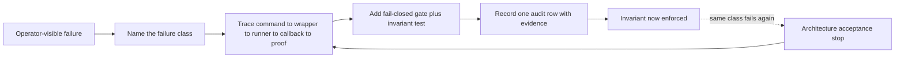

# Architecture evolution

This chapter explains how the operating model in this repository got its present shape, and — more
usefully for an adopter — which parts have settled and which are still moving. It is not history for
its own sake: every milestone below started as a failure that cost something, and reading them in
order shows why a rule that looks fussy in isolation is load-bearing in context.

One boundary is stated up front, because it is easy to read a milestone list as a finished design:
**evolution does not conclude.** The heaviest structural change in the record is also the one that
landed last, and several areas stay unsettled. Those are named in "open design questions".

## How the record is kept

An operating model that changes needs a changelog of its policy changes, and the format is worth
settling before any of the content is. Each change is **one strict row** of five pipe-separated
fields: `<date> | <status> | <scope> | 
 | <evidence>`. The date is the day the row was
appended, which on a `live` row is the day the change took effect; the status is `live`, `draft`, or
`superseded` as of that day; and scope names the contract files and subsystems touched. Evidence names the incident, fixture, worktree, or receipt that motivated the
change — not a justification, a pointer to something checkable. The file declares in its own header
that it is **historical audit only and never a normative source**, and it is classified as
never-default-loaded, so it is read deliberately rather than injected into every session. A copyable
skeleton is in [`templates/POLICY_CHANGELOG.example.md`](../templates/POLICY_CHANGELOG.example.md),
and the wider audit apparatus it belongs to is
[evidence, audit, and verification](15-evidence-audit-and-verification.md).

Two hygiene rules keep it honest. The file is append-only, so no row is ever flipped after the fact:
a change recorded as `draft` that has since gone live is answered by a later `live` row naming it, or
by a row naming the remaining gap, and the state of any rule is the newest row that names it. And a
superseded row is retained exactly as written while the row that replaces it carries the pointer back,
so reversals stay legible — a reversal that leaves no trace is indistinguishable from a change that
never happened.

Alongside it runs a discipline that appears part-way through such a record and becomes near-universal
after that: **ship the rule and its invariant test in the same change.** A policy sentence with no
executable counterpart is a wish, and the growth of the gate-script and test directories is the
clearest proxy for the shift from written policy to enforced policy.

## The loop that produced everything below

Every milestone below came out of the same cycle, and naming the cycle is more reusable than any
individual rule.

Two details make it work. The trace happens **before** the patch: the chain from command to wrapper
to runner to callback to proof is walked, so the fix lands where the defect is rather than where the
symptom appeared. And a repeated same-class live failure routes to a hard stop and an architecture
review rather than to another patch — the loop has a deliberate exit, which is what stops it
degrading into additive patching.

## Milestones by era

Three eras, in relative time. The first established **authority**, the second **discipline**, and the
third — still running — is about **proof and isolation**.

### Authority

**Instruction files became a precedence-ordered contract stack.** The problem class was contradictory
guidance: an audit of the loosely-related instruction files then in use found rules that disagreed and
files whose authority had expanded by accident. The response was a five-rank ladder with one owner per
rule class, a split between a behaviour contract and a mechanics contract, and cross-references
replacing duplication. *Invariant:* lower ranks never override higher ones, and nothing becomes
normative by implication or by being loaded. See [policy and authority](05-policy-and-authority.md).

**Facts moved into structured registries.** The problem class was prose drifting away from the
machine: a hand-maintained capability document had gone stale while still being treated as truth. The
response was JSON registries for durable topology and routes, a status layer for observed state, a
control layer for enforcement parameters, and rollups regenerated from all three and stamped as
generated. *Invariant:* a generated view loses to its source, and live evidence beats any index. The
resulting four-layer shape is drawn in [system architecture](04-system-architecture.md).

**Source authority became topological.** The problem class was split-brain editing — a convenient copy
of a repository treated as canonical because it existed. The response was a topology registry
declaring, per surface, a canonical root, standing branch, history target, permitted worktree roots,
live binding, and validation entrypoint, plus registration of retired roots. *Invariant:* canonical
source is resolved through the registry, never inferred from a copy, and no alias may be declared
beneath a retired parent. See [source layout and artifacts](09-source-layout-and-artifacts.md).

### Discipline

**The chat surface became a control surface with durable lanes.** The problem class was long work
behaving like a prolonged chat reply: a turn held open for many minutes, with no durable record and no
safe interruption point. The response was the durable lane — a unit of work that runs outside the turn
in its own child session, announced by one acknowledgement, reporting checkpoints, and closed by one
terminal final — backed by an on-disk status artifact, identity taken from the spawn result, and a
write lease: an exclusive, identity-bound claim over the write set, the exact paths that lane may
modify. *Invariant:* exactly one final per workstream; chat carries control, never state. See
[execution and durable lanes](06-execution-and-durable-lanes.md).

**Approvals became operation-based.** The problem class was keyword-shaped risk assessment, which both
blocked harmless work and waved through dangerous work whose phrasing was mild. The response was
classification by target, reversibility, blast radius, and control path; read-only bounded conversion
of broad requests into exact plans before any refusal; and approval envelopes with named boundaries.
*Invariant:* crossing a boundary stops and offers a bounded subset, a re-approval, or a stop — and the
agent's own summaries can never manufacture an approval gap inside work already approved.

**Closeout became part of implementation.** The problem class was work that was "done" in a task
worktree and invisible everywhere else. The response was a defined sequence: accepted source reaches
the standing branch, the history target is updated where policy allows, temporary lanes are removed
safely, and residual drift is reported rather than tolerated. *Invariant:* a passing branch is not a
finished task, and local-only closeout is prohibited once an integration boundary was crossed.

**Memory became layered, with sensitivity as a per-file attribute.** The problem class was context
that was either too large to inject or too sensitive to inject by default. The response was a
hard-capped pointer file over a large on-demand corpus, a bootstrap manifest classifying every file by
role, load default, and sensitivity, and durable writes only on an explicit operator marker.
*Invariant:* high sensitivity implies conditional loading, memory is a cache rather than an authority,
and a disagreement with a live source is surfaced rather than silently resolved. See
[memory and context](08-memory-and-context.md).

### Proof and isolation

**Integration routing became explicit.** The problem class was a ready default lane quietly satisfying
a request that named a different account or workspace. The response was hard route predicates over
named accounts, workspaces, drives, folders, domains, and owners; read-only probes that prove which
identity answered; and placement readback after every mutation. *Invariant:* a returned link is not
proof of placement, and an unverified route is a blocker rather than a best-effort attempt. See
[integrations and capability routing](11-integrations-and-capability-routing.md).

**Runtime maintenance became release engineering.** The problem class was in-place rebuilds inside the
installed runtime, followed by restart loops that destroyed attribution. The response was candidate
builds in a separate path; sealed releases, meaning a copy proven equal to its source and then made
read-only so nothing can be edited into it later; an atomic pointer switch; identity convergence
checks across every install surface; and retained rollback targets. *Invariant:* never rebuild in
place, and a promotion is accepted only when persisted state, loaded definitions, running processes,
and observable behaviour all agree — anything less is reported as persisted but not applied. See
[runtime, releases, and promotion](10-runtime-releases-and-promotion.md).

**Delivery became a durable substrate.** The problem class was the internally-finished worker that
never delivered: work completed, nothing visible, a closeout that passed anyway. The response was an
obligation created at acknowledgement time, an on-disk outbound queue with bounded retry and a
retained failed directory, single-writer delivery ownership recorded in the task payload, and
exactly-once claims over the final. *Invariant:* delivery is proven by a provider-confirmed message
identifier or a readback receipt, never by intent or careful wording. See
[delivery and the control surface](13-delivery-and-control-surface.md).

**Guards became a first-class pattern.** The problem class was preconditions that existed only as
prose and were therefore checked only when someone remembered. The response was a family of guards —
external volume availability, storage headroom, workspace isolation, execution slices, retired paths —
each installed as a receipted operation with an install plan, a receipt, and post-install verification.
*Invariant:* a guard is not installed until its verification record exists, and a guard whose subject
is unavailable fails closed. See [guards, health, and restoration](14-guards-health-and-restoration.md).

**Scheduling became two reconciled layers.** The problem class was scheduled jobs pointing at
disposable worktrees, firing in ambiguous time zones, and reporting transport success as domain
success. The response was one registry covering both the runtime scheduler and the host service
manager, with per-job lifecycle state, timezone-qualified schedules, declared catch-up and backdating
semantics, a stdout contract, and a flag asserting the job references no disposable worktree.
*Invariant:* absence of a terminal result is an alert rather than a pass, and a monitor may not depend
on the components it proves. See [scheduling and background work](12-scheduling-and-background-work.md).

**Control-plane primitives migrated out of policy and into the runtime.** The latest and by
far the heaviest shift, and the one an adopter most needs to know about. The problem class was
structural: discipline expressed as Markdown does not survive concurrency, crashes, or restarts,
because nothing outside the model's compliance enforces it. The response was to reimplement the
primitives inside the runtime — acknowledgement barrier and suppression, active-lane index, approval
boundary, closeout reconciliation, launch contract, message formatting, resume, status artifact, and
write lease, plus execution-mode, inline-destructive, and context-read guards, bootstrap budgets, and
announce idempotency.

In the same period the promotion pipeline went from a phase-separation convention to a **named,
versioned contract**, and four of its features are worth stating in full because each is a compressed
answer to a specific failure. Its gates are enumerated in a separately versioned manifest that names
every gate and the evidence each must produce; they run in a fixed order the driver refuses to
reorder, so no run can quietly skip a step. Every irreversible step first claims a **permit**: a
durable one-shot counter, recorded before the action is dispatched, so that a crash in the middle
leaves proof the action may already have happened and a resumed run refuses to repeat it rather than
guessing. The two
lifecycle commands the pipeline may issue must match an exact argument tail, with shells and other
executables rejected outright, so no step can improvise a command that was never reviewed. And every
externally executed step is bracketed by an **inventory diff** — a listing of the sealed release tree
taken before and after, required to come back identical — so a step that writes into the release it is
promoting fails acceptance instead of passing quietly. *Invariant:* a capability's provenance must be
stated — policy-only, helper-backed, runtime-backed, or live-proven — because the same sentence in a
contract file means something different depending on whether a runtime enforces it. See
[capability provenance](03-capability-provenance.md) and
[runtime, releases, and promotion](10-runtime-releases-and-promotion.md).

## Open design questions

Some parts of this model settle. The five-rank precedence ladder; the four-way split of policy,
durable facts, observed state, and enforcement parameters; retention classes; and the checkpoint and
rollover design all reach a shape that stops changing, and their specification documents become
historical rather than active work. A subsystem that stops generating changelog rows is one that
stabilized, and that is worth reading as a positive signal.

Other questions do not settle, and an adopter should expect to meet each of them rather than assume a
finished answer exists. These are the ones this architecture has not closed:

| Open question | Why it stays open | What it means for an adopter |
|---|---|---|
| Declared load intent versus what the loader loads | A bootstrap manifest classifies contracts by role, owner, load default, and sensitivity, while a runtime loader injects a fixed filename set under character budgets; the two disagree in both directions, so a file declared conditional can be injected and a file declared loadable can be skipped | Do not describe manifest classification as enforcement; reconcile the two by hand and treat divergence as a finding |
| Contract size pressure | A normative contract can outgrow its per-file budget and be head-and-tail truncated at injection, and reclaiming headroom is recurring work rather than a one-time fix | Budget the always-loaded set from day one; see [adoption guide](17-adoption-guide.md) |
| Thresholds for a complexity and refactor gate | Such a gate forces an explicit fix-versus-consolidation decision, but the trigger signals are far easier to agree on than the numeric thresholds that fire them | Adopt the trigger signals; treat any threshold as provisional until it has been tested against real work |
| Retirement lag | Retirement can be made a recorded operation with quarantined evidence and validators, and it still lags the introduction of a replacement, because introducing a path is cheaper than proving an old one is safe to remove | Expect parallel paths to coexist longer than the design implies |
| Reversing a rule legibly | Rules correct earlier rules as often as they add new ones: a rule written too restrictively has to be relaxed, one written too loosely has to be sharpened, and both look like instability unless the record explains them | Design for supersession with explanation; a rule that cannot be reversed legibly will be reversed illegibly |
| The cost of runtime enforcement | Every primitive moved into runtime code widens the gap between an enforced control plane and a stock build, and raises the maintenance cost of the code that holds the gap open | Plan for the adopter column in the provenance matrix, not the reference column |
| Migration as tracked state | An authority flip is an event with its own state — a cutover marker and a fresh-session requirement recorded in the generated index — rather than an instant | Contract edits do not reliably retro-apply to running sessions; start a fresh session after one |

## Schema markers on the example artifacts

The machine-readable examples in `examples/` are meant to be read by something other than a person, so
each one needs a way to say what shape it is. The convention is a **`schema` string** carried as the
record's first field: a stable record name, a slash, and a version suffix — `delivery-receipt/v1`,
`durable-lane-status/v1`, `project-layout/v1`. A consumer reads that single field first, decides
whether it understands the shape, and stops before parsing anything else if it does not. A name plus a
suffix is worth more than a bare version integer, because the name travels with the record: a file
copied out of its directory still identifies itself.

Two compatibility rules apply to that string.

1. **Unknown fields are ignored, never rejected.** A consumer that meets a field it has not seen skips
   it. This is what lets a record gain fields without a coordinated upgrade of everything that reads
   it, and it is why the schemas in `schemas/` constrain the fields they name rather than closing the
   record against any other field: a schema that rejected unknown fields would turn every additive
   change into a breaking one.
2. **A removed or redefined field forces a new suffix.** Moving `.../v1` to `.../v2` is the signal
   that an old consumer must not proceed. Redefining a field while leaving the suffix alone is the
   exact failure this convention prevents, because it produces a consumer that parses successfully
   and is wrong.

The convention is not applied uniformly, and the gaps are worth naming rather than papering over. The
records marked *unmarked* below carry no `schema` field, so a consumer holding one has no in-band way
to tell which shape it has and must infer it from the filename or the surrounding directory — which is
precisely the inference the marker removes everywhere else. Adding the field to those records is a
compatible change under rule 1, since a consumer that ignores unknown fields ignores a new `schema`
field too.

| Record | What it carries | Schema marker | Stability |
|---|---|---|---|
| Route record | Route id, system, credential reference name, default contexts, probe reference, notes | Unmarked — gap | Stable; probing deliberately delegated to the probe record rather than inlined |
| Probe record | Probe id, command, scope, safe lane, expected signal, freshness window, notes | `probe-registry/v1` | Stable |
| Capability record | State, support class, freshness class, last-verified time, evidence reference, constraint or fallback | Unmarked — gap | Stable |
| Project layout and per-surface live bindings | Surface slug, canonical root, standing branch, validation entrypoint, evidence reference, last-verified time | `project-layout/v1` | Stable |
| Known issue | Classification, containment, evidence, freshness class | Unmarked — gap | Stable |
| Scheduler entry | Id, kind, lifecycle state, owning layer, schedule with timezone, entrypoints, worktree-reference flag, result contract, failure signal, evidence | Unmarked — gap | Provisional; the result-contract block is the newest part |
| Durable status | Run and child identity, generation, phase, write set, owner, checkpoints, terminal state | `durable-lane-status/v1` | Provisional; the multi-key ownership fields are the newest part |
| Delivery receipt | Target, class, provider message identifier, claim key, obligation reference, time | `delivery-receipt/v1` | Stable |
| Promotion receipt | Contract version, phase, permit, seal reference, inventory-diff result, rollback identity, acceptance | `runtime-promotion-receipt/v1` | Provisional; tracks a contract that is still revising |
| Retention manifest | Artifact family, retention class, protection predicate, prune schedule, evidence path | `retention-manifest/v1` | Stable |

Provisional means the shape is expected to gain fields: consumers that ignore unknown fields survive
that, and consumers that validate strictly do not.

## Which runtime family this guidance targets

**A version string does not identify a runtime.** Two builds can report the same version and still
supply different control-plane guarantees, because the guarantees live in code that a version number
does not track. Where builds must be told apart, identify a release by version plus source commit plus
promotion-run identifier.

The guidance therefore targets a runtime *family* rather than a version. A build is in the family if
it supplies all of the following substrate assumptions, which every chapter makes:

1. Workspace contract injection from a fixed filename set, with per-file and total character budgets.
2. Sessions with an addressable key, a persisted transcript, and defined reset boundaries.
3. Subagent sessions with their own identity and a reduced injected contract set.
4. A scheduler subsystem with per-run execution history.
5. An outbound delivery path whose sends can be confirmed by a provider identifier.
6. An extension surface — tools, plugins, and an external tool-server protocol — with a policy
   pipeline in front of tool calls.
7. A separate peripheral or node role for device and shell execution, with its own approval scope.

Check each against the build in hand rather than assuming. Where one is missing, that capability drops
to the adopter column in [capability provenance](03-capability-provenance.md), and the honest response
is to substitute detection for prevention rather than describe the guarantee as present. Where an
upstream build later absorbs a behaviour that previously needed local runtime code, the stock column
grows and the adopter column shrinks — the intended direction of travel.

## Where this leads

Read this chapter as a warning about pace as much as a history: structural change classes keep
arriving, and every one of them was cheaper to adopt early than to retrofit. Start at
the smallest level in the [adoption guide](17-adoption-guide.md), and label every capability with its
provenance as you go, so the next reader of your own record can tell what was enforced from what was
merely written.
